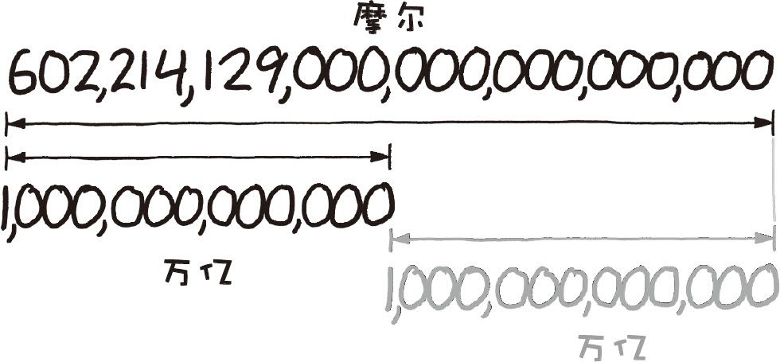
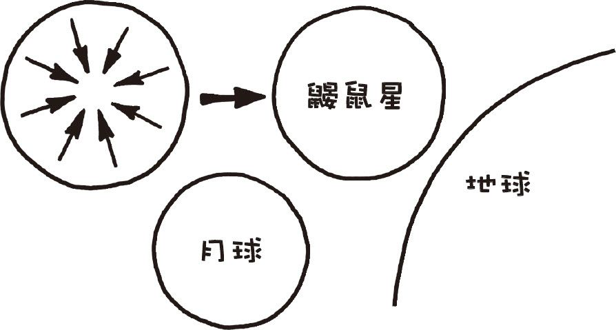
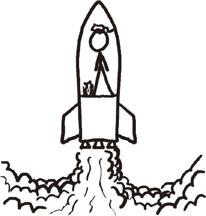

# 一摩尔鼹鼠
###### A MOLE OF MOLES
### Q．如果你把一摩尔的鼹鼠放到一起会发生什么？[^1]

——肖恩·赖斯

***
### A．有点可怕。
首先我们要弄清一些定义。

摩尔是一个计量单位，而不是典型的那些单位。它其实就是一个数字，就像“一打”或“十亿”那样。如果你有1摩尔的某种东西，那么这意味着你有 602214129000000000000000 个（通常写成6.022×1023）这种东西。这个数字无比巨大[^2]，因为它就是用来计算分子数的，而分子可是有许许多多的。

“Mole”也可以指一种会打洞的哺乳生物：鼹鼠。鼹鼠的种类有许多，其中有一些看上去非常吓人。[^3]

那么一摩尔（602214129000000000000000只）鼹鼠放到一起会是什么样的呢？

首先我们先从一些狂野的近似联想开始。很多时候我在拿起计算器进行计算之前，都会先在脑中想一想，这次就是一个例子，我想对这个数量有一个大致的概念。在这么大的数字面前，10和1与0.1之间的区别已经微乎其微，我们可以近似地把它们认为都是相等的。

鼹鼠的体形很小，我可以很轻松地把它们拿起来再扔出去。任何我能扔出去的东西重量都是1磅。1磅就是1千克。602214129000000000000000这个数字看起来有一万亿的2倍长，所以它大约有一亿亿亿这么多。我恰好记得一颗行星的质量也差不多是这么重。

`如果任何人提起这种计算方法，千万别说是我教你的。`

这也就意味着1摩尔鼹鼠的大小已经能和行星的大小相媲美了。这个估算相当粗略，可能多算或者少算了几千倍。

让我们用一些精确些的数字。

一只东部鼹鼠（拉丁学名：Scalopus aquaticus）重约75克，也就是说一摩尔的鼹鼠重：

（6.022×1023）×75克≈4.52×1022千克

这比半个月球还要重一些。

哺乳生物体内很大一部分是水。1千克的水体积为1立方米，所以那么多的鼹鼠的体积大约为4.52×1022立方米。你可能发现了我们这里忽略了鼹鼠间的空隙，稍后你就会知道为什么要这么做。

4.52×1022立方米的立方根是3562千米，也就意味着这么多鼹鼠能堆成半径2210千米的一个球，或边长2213英里（1英里≈1.6千米）的立方体。[^4]

如果这些鼹鼠被释放到地球表面，它们堆起来能够达到80千米高，差不多已经到了（之前定义的）外太空的最低高度。[^5]

这个吓人的高压肉柱会抹掉这个星球上绝大多数的生命，这会威胁到域名解析系统的完整性，所以在地球上这么干是万万不行的。

相反，我们可以把鼹鼠都堆在星际空间中。在重力的作用下，它们会慢慢聚集成一个球体。肉不怎么能被压缩，所以这个大肉球只会因重力作用而缩小一点，最后我们将看到一个比月球稍大一些的鼹鼠星。

鼹鼠星表面的重力加速度约为地球的十六分之一，和冥王星差不多。起初整个星球的温度都很均匀，差不多比室温高一些，随后重力收缩会使内部的温度上升几摄氏度。

之后事情就变得奇怪起来。

鼹鼠星说白了就是一个大肉球，其中蕴含着巨大的能量（鼹鼠星所含的卡路里足够目前全世界人口吃上300亿年）。一般来说，有机物被微生物分解时，会以热量的形式释放出大部分蕴藏的能量。但鼹鼠星大部分内核的压强在100兆帕以上，这么高的压强足以杀死任何细菌，并把鼹鼠的尸体都蒸熟。这样鼹鼠体内就不存在可以分解鼹鼠肉的微生物了。

在接近表面的地方，压强没有这么高，但还需要面临另一个难题：鼹鼠星的内部含氧量非常低。没有氧气，普通的分解过程将无法发生，只有那些厌氧菌才能在这种条件下继续分解。虽然厌氧分解效率很低，但这个过程仍会释放大量热量。这股热量最终会把整个星球都变成一个大蒸笼。

但分解产物又会反过来限制分解的继续进行。很少有细菌能在超过60℃的环境里存活，因而随着温度的上升，细菌逐渐死去，分解进程也就慢慢停滞下来。整个星球的鼹鼠尸体会渐渐变成富含有机质的油母岩。如果星球的温度继续升高的话，它们最终会变成石油。

鼹鼠星的外表面会向外辐射热量并冻结起来，冰冻的外壳就像给整个星球穿了一件毛大衣一样，会把星球内部和外太空隔绝开来，因而会减缓热量向外太空流失的速度。然而在液体内部，热传递的主要形式为对流，滚烫的肉浆和像甲烷（以及死去的鼹鼠肺中的空气）这样被困在其中的气体形成的气泡会在鼹鼠星的地壳里周期性地翻滚上来，从地表猛烈喷发出来并形成“死亡”间歇泉，将无数鼹鼠的尸体抛射出鼹鼠星球。

在经过数百万年的动荡之后，鼹鼠星开始慢慢停息下来，温度也低到整个星球都开始冰冻起来。此时由于鼹鼠星内部深处的压强如此之大，以至于在冷却的过程中，水结晶成了奇特的冰III和冰V形态，最终这些冰块都会变成冰II和冰IX形态[^6]。

总而言之，这个故事的结局相当凄凉。不过好在有一个更好的结局。

我手上没有全球鼹鼠数量（或者小型哺乳生物的总体生物质量）的可靠的数字，但我们不妨认为小鼠、大鼠、田鼠以及其他小型哺乳动物的数量约为世界总人口的几十倍。

在我们的星系中可能约有10亿颗宜居星球。如果我们将来去殖民这些星球，几乎一定会带着一些小鼠或大鼠。如果这些星球中有百分之一住着和地球上数目相当的小型哺乳生物，那么几百万年后（相对于整个宇宙的进化史来说已经很短了），所有曾经存活的这些小生物的个数将会超过阿伏伽德罗常数[^7]。

所以如果你想要有一摩尔的鼹鼠，得先造一艘宇宙飞船。

[^1]:英文mole的两个含义分别是摩尔（计量单位）、鼹鼠。
[^2]:一摩尔的数量接近于一克氢中所含的氢原子数。地球上所有的沙粒的数目也恰好很接近这个数字。
[^3]:http://en.wikipedia.org/wiki/File:Condylura.jpg
[^4]:这里有一个我以前从来没注意到的巧合：1立方英里约等于4π/3立方千米，因而半径为X千米的球的体积和边长为X英里的立方体的体积几乎一样。
[^5]:译者注：美国定义抵达离地50英里（约80千米）高度的人即可被称为宇航员。后来国际航空联合会规定抵达离地100千米（约62英里）高度的人才可被称为宇航员。
[^6]:相互之间没有关系。
[^7]:译注：每摩尔物质含有的微粒数，即6.022×1023。