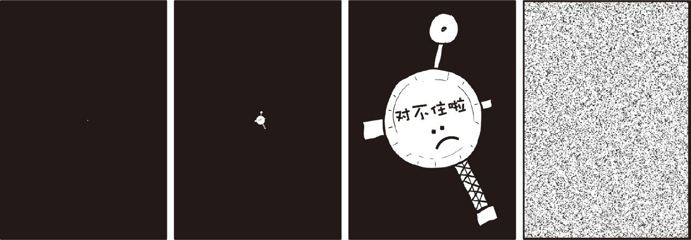

# 外星天文学家
###### ALIEN ASTRONOMERS
### Q．不妨假设在离我们最近的一颗适于居住的地外星球上有生命存在，而且他们拥有和我们人类相近的科技。如果他们现在朝我们这边看过来，会看到什么？

——查克·H

***
### A．

让我回答得稍微详细一点。首先我们来谈谈……

#### 无线电通信
《超时空接触》让许多人以为外星人在监听着我们的无线电通信。很遗憾，这事儿希望不大。

问题在于：宇宙太大了，相当大。

你当然可以计算星际无线电衰减的物理学[^1]，但光考虑这个场景的经济学就足够概括问题所在了——如果你的电视信号传到了另一颗星球上，这必定是赔本买卖。驱动一个发射机要花很多钱，而其他星球上的生物又不会买电视广告里的产品，要知道你是靠这些收入来支付电费的。

整个问题当然更加复杂，但底线是：随着科学技术的进步，越来越少的无线电信号会泄露到外太空中去。我们逐渐弃置了巨型传输天线，转而使用有线电缆、光缆和紧密排列的蜂窝网络。

就算外星人现在还能探测到我们的电视信号——虽然得花不少力气——但很快这个窗口期也要被关上了。就算在20世纪晚期，当我们电视和广播里放声高歌时，这些声音信号在传播了几光年之后就基本探测不到了。我们现在观测的可能的宜居星球离我们有好几十光年，所以他们不太可能听得到我们的老故事。[^2]

但电视和广播信号并非地球上最强大的无线电信号，早期预警雷达可以完爆它们。

作为冷战时期的产物之一，早期预警雷达由北极圈周围的一大堆路基和机载雷达站组成。这些功率巨大的雷达站全天候地发射雷达波，很多时候雷达波会被电离层反弹回来，而地面上的监听人员则像着了魔一样捕捉着敌人的任何蛛丝马迹。[^3]

一些雷达波会泄露到外太空去，如果雷达波扫过某一片天空时，附近的地外星球上恰好有外星人，那么他们很有可能会收到这些雷达波。但正如之前科技的进步淘汰了广播电视塔那样，早期预警雷达也受到了相似的影响。

如今的雷达系统——还在运作的那些——更加“安静”，最终可能会完全被新技术所取代。

地球上最强大的无线电信号来自阿雷西博天文台。这个位于波多黎各的巨型碟形天线就像雷达的发射机一样，向附近天体（如水星和小行星带）发射信号。它就像一个手电筒一样照向我们想更好地观测的其他星球（这听起来很疯狂，事实上也的确如此）。

但它只是不定期地传送一些信号，而且波束非常窄。如果一颗地外星球恰好被照射到，而且恰好他们又把接收天线对准我们这边，那么他们能收到的也只是一个短暂的无线电脉冲而已，之后便是一片寂静。[^4]

所以外星人应该不会通过无线电的方式观测地球。

但我们还有……

#### 可见光
这种方法更有前途。太阳其实非常明亮，它照耀着地球。其中的一部分光被以“地球反照”的形式反射回太空，另一些则会贴近地球，穿过大气层后继续向其他星球传播。这两种效应都很有可能被地外星球上的外星人探测到。

这些信号并不能直接透露出关于人类的任何信息，但如果你花足够长的时间观测地球，你就可以通过反射率来了解地球的大气层，你可以推断出我们的水循环是什么样的，而我们富含氧气的大气层也会让你想到地球上一定正在发生什么不寻常的事情。[^5]

所以到头来，来自地球的最为明显的信号恐怕并不是由我们发出的，它可能来自数十亿年以来使我们的星球地球化的藻类，而且它们还在影响着我们发向太空的信号。

`嘿，不早了，我们得走了。`

当然了，如果我们想发送一个更加明显的信号，我们是可以做到的，但不是靠无线电通信，因为当无线电信号到外星人那儿的时候，需要外星人去接收。

相反，我们可以让外星人注意到我们。在离子驱动、核脉冲推进或仅是巧妙利用引力弹弓效应的帮助下，我们也许可以发射一颗速度足够快的探测器，能够在几万年的时间里飞出太阳系并到达邻近的星球。如果我们能够研发出一套能够全程使用的导航系统（这可不容易），那么我们就可以把探测器送到任何一颗宜居星球上。

如果想要安全着陆的话，我们得减速，但减速需要消耗更多的燃料。喂，我们这么做的目的只是为了让外星人注意到我们对吧？

所以当某一天外星人仰望太阳系的时候，他们也许会看到这个……

[^1]:如果你真的想这么尝试的话。
[^2]:和某不靠谱网络漫画的声称相反。
[^3]:我只经历过那段时期中很短的一个阶段，但就我听到的来说，当时的风声有点紧。
[^4]:我们在1977年就收到过这样一个信号，它被人们称为“哇”（Wow）信号，但信号源头一直不得而知。
[^5]:译者注：指地球上存在光合作用。