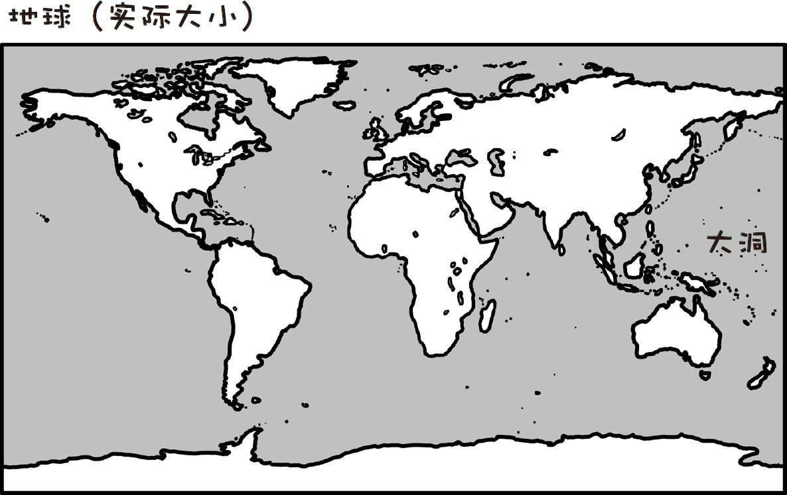
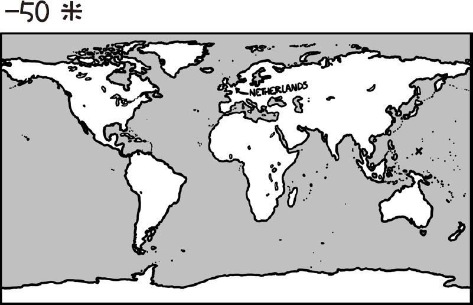
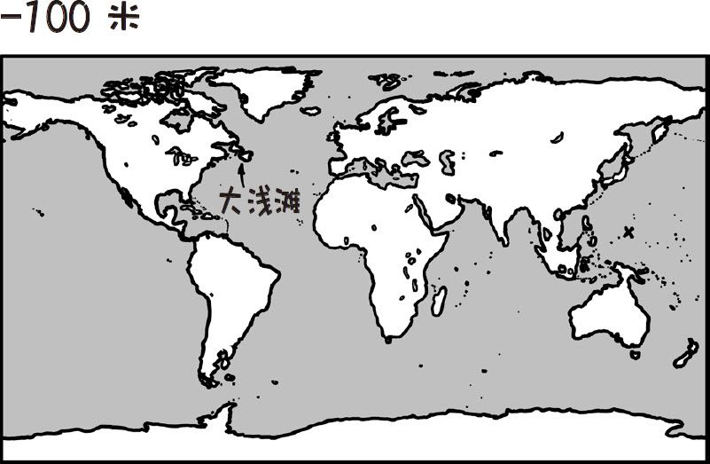
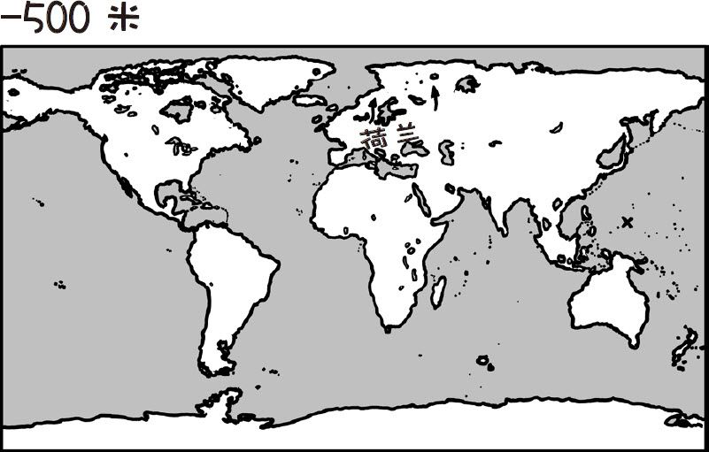
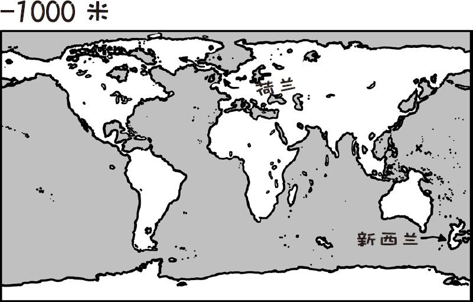
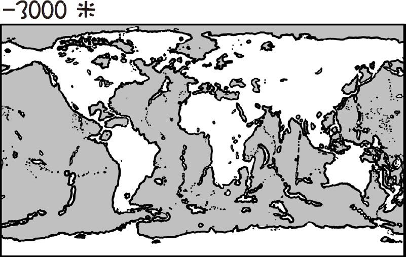

# 把海水抽干
###### DRAIN THE OCEANS
### Q．如果在海底最深处——挑战者深渊——挖一个半径10米且通向太空的圆形传送门，那么海水会以多快的速度漏出去？海水一点点被抽干了，地球又是怎样一番景象呢？

——特德·M

***
### A．首先说一点。
我粗略地估算了下，如果航空母舰沉没了而且又恰好卡在这个排水口，那么洞口处的压强足以轻松将其折断，然后把它吸进去。哈哈哈哈！

那你要把洞的另一头放在那里呢？如果它太靠近地球，那么海水又会掉回大气层。在海水下落的过程中，它的温度会不断升高，然后变成水蒸气，而水蒸气最后又会冷凝成雨，最后还是会落回海洋。只是在这个过程中，对大气层的能量输入足以彻底搅乱地球的气候，这还没考虑高空巨量水蒸气带来的后果呢。

所以我们得把洞的另一头放得远一点——比如放到火星上。（其实我很想把它放到“好奇号”火星探测器上面，这样我们就终于能有火星存在液态水的确切证据了！）

那地球上会发生什么变化呢？

变化不大。事实上要等上几十万年海水才会全部漏完。

虽然这个洞比篮球场还宽，而且海水将以极高的速度从这个洞流出去，但是记住海水是非常非常多的。一开始，海平面每天下降的高度不会超过1厘米。

而且海面上还不会出现酷炫的漩涡——因为洞太小了，大海太深了。（这也是为什么浴缸里的水在刚开始流出去时不会产生漩涡，至少要等一半的水流出去时才会有。）

但不妨假设为了让水漏得更快些，我们丧心病狂地挖了更多的洞。[^1]

然后我们来看看世界地图会发生怎样的变化。

一开始看起来是这样的：

  
`方格投影图`[^2]

这是海平面下降50米时的景象：

 

这两张图看起来挺相似的，但其实还是有些区别的。斯里兰卡、新几内亚、英国、爪哇岛、婆罗洲现在和它们的邻国有陆地连通了。

阻挡海洋2000年后，荷兰终于高出海平面，变成旱地了。没有了灾难性洪水的持续威胁，荷兰人终于可以把精力放在向外扩张上了，于是他们立即倾巢而出，对新暴露出来的土地宣示主权。

 

当海平面下降100米后，加拿大新斯科舍省海岸边上出现了一个巨大的岛屿，而之前这里还是大浅滩。

你可能注意到了一些不同寻常的地方：并非所有的海洋都在缩小。比如说黑海在缩小了一点点之后就不再变小了。

这是因为这些水体不再与海洋相连。随着水平面的下降，一些盆地露了出来，切断了它之中的水与大海的联系。流出这些盆地的水可能会“挖”出一条比盆地更深的海峡，这样水就能继续流出去了，不过这取决于海床的构造。但大多数盆地里的水就这样被大陆给围住了，也就不会再流出去了。

 

当海平面下降200米时，世界地图看上去就有些奇怪了。新的岛屿不断出现，印度尼西亚连成了一大坨，荷兰人控制了欧洲大半地区。

 

日本现在成了连接朝鲜半岛和俄罗斯的地峡。新西兰又新添了一些岛屿。荷兰人继续向北扩张。

 

新西兰变得越来越大了。北冰洋已经孤立，水位也不再下降。荷兰人跨过新形成的大陆桥来到了北美。

 

海平面已经下降了2000米了。新的岛屿左一个右一个地冒了出来。加勒比海和墨西哥湾马上就要与大西洋分离开来了。我不知道新西兰在干啥。

 

当海平面下降3000米时，许多洋中脊的顶峰——洋中脊是世界上最长的山脉——开始露出水面。许许多多长条形的新大陆开始出现。到现在为止，世界上大部分的海洋彼此之间已经不再连通了，排水孔也渐渐地没有水了。至于新出现的内海的准确位置和大小很难预测，上图只是一个大概的估计。

 

上面这张图就是能流的水都流完后世界地图的样子。现在还是有许多水没流走，虽然大部分都是非常浅的浅水，但还是有深达四五千米的海沟。

抽空海洋一半的海水会对气候和生态系统造成无法估计的影响，但可以肯定的是生态圈会崩溃，大量物种会灭绝。

我们人类还是有可能幸存下来的，但我们将不得不直面这样的景象：

 

[^1]:记得每隔几天清理一下滤鲸网。
[^2]:参考：[xkcd.com/977](./imgs/map_projections.png)
