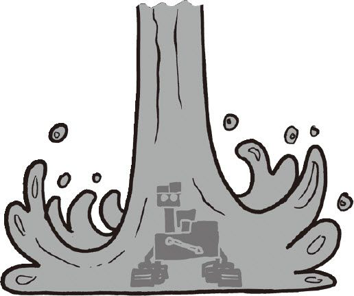
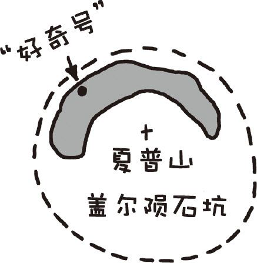
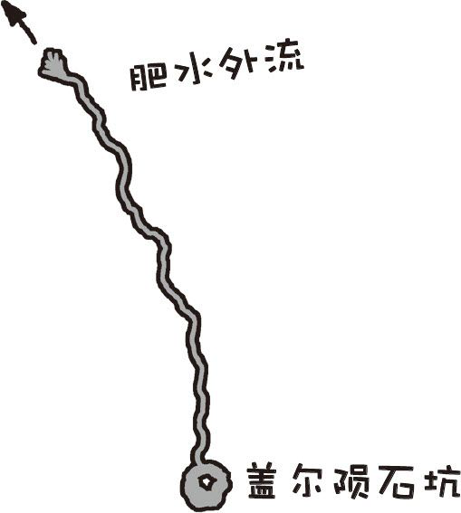
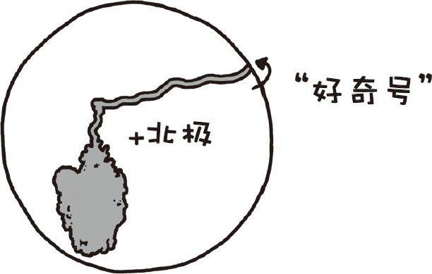
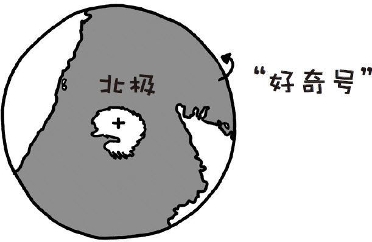
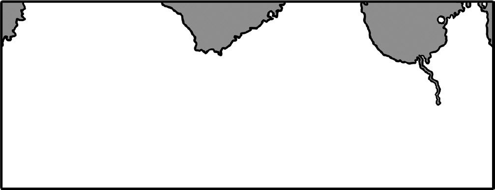
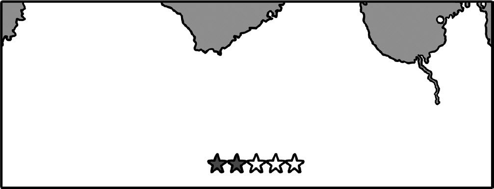
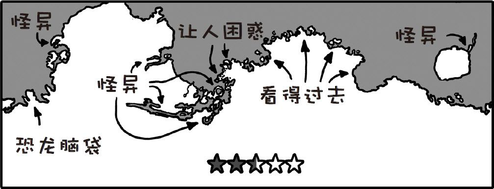
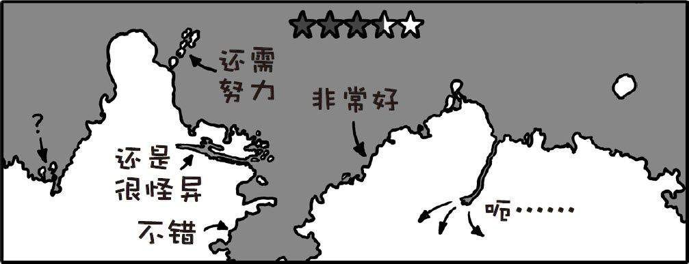
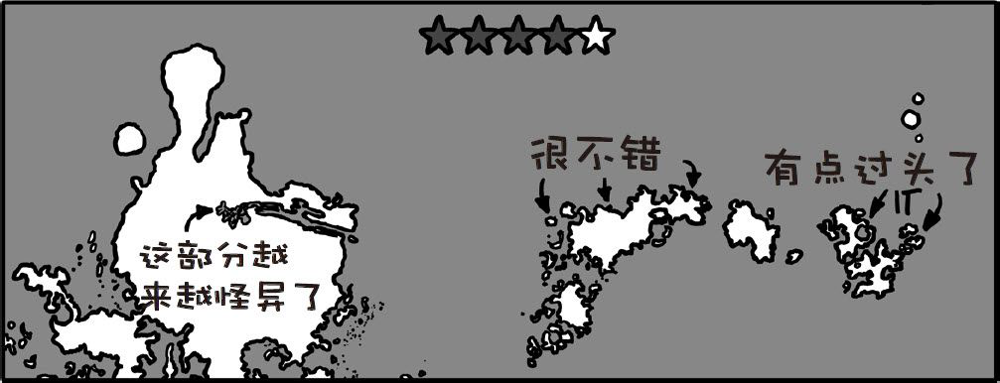

# 把海水抽干（续集）
###### DRAIN THE OCEANS：PART II
### Q．如果你像上一期里所说的那样把海水都抽走，浇到“好奇号”火星探测器上，那么随着浇的水越来越多，火星会发生什么变化？

——伊恩

***
### A．在前一篇文章中，我们在马里亚纳海沟底部开了个洞，海水可以从那个洞流走。
至于要把海水抽到哪里去这个问题，我随手就选了火星，因为“好奇号”探测器一直在苦苦寻找火星上有水存在的证据，所以我想把海水抽到火星上应该能让“好奇号”轻松一点吧……

“好奇号”目前在火星一处叫作盖尔陨石坑的低洼地上，洼地的中间有一座小山，人们喜欢叫它“夏普山”。

火星上其实有很多水，但问题是它们都是以固态形式存在的。液态水在火星上维持不了太长时间，不是因为那儿温度太低，就是因为那儿空气太稀薄。

如果你在火星上泼一杯温水，它会先沸腾，然后结冰，最后升华，而这三个过程几乎是同时发生的。看上去在火星上水似乎觉得除了液态怎么着都行。

可问题是我们在以极快的速度往火星上灌水（而且水温都在零上若干摄氏度），因而水没有时间结冰、沸腾或升华。如果你的传送门足够大，涌进来的水会把盖尔陨石坑填成一个大湖，就跟在地球上一样。我们可以用美国地质勘探局发布的很赞的火星地形图来记录水位上涨的过程。

一开始盖尔陨石坑是这样的：

随着越来越多的水涌进来，很快“好奇号”就被淹没在几百米深
的水下：

最终，夏普山变成了一个小岛：在水位没过夏普山之前，海水就会先从陨石坑的北边流出去，然后蔓延至整个沙地。

有证据表明，由于火星表面时不时会有热浪产生，火星土壤中的冰会时不时地融化，并像液体一样发生流动。这种情况发生时，涓涓细流走不了多远就会蒸发完。不过别忘了我们手上可是有大把大把的海水的。

海水开始灌进北极盆地：

慢慢地海水会填满整个盆地：

不过如果我们在火星赤道地区（有好多火山）看的话，其实还是有许多陆地离海水很远的：

`墨卡托投影图，不包括极点`

坦白来说，我觉得这张地图有点无聊：没有太大的变化，有的只是上面的陆地，还有海洋。

`差评！`

可是我们手头上的海水还远远没用完呢。虽然在上篇的结尾处，地球从地图上看上去还有许多蓝色的地方，但它们都十分浅，大部分的海水已经不翼而飞了。

而火星又比地球小很多，因而同样体积的海水会形成更深的海洋。

此时此刻，海水漫进了水手号谷，并形成了许多不同寻常的海岸线。这张图看起来就有趣多了，但大峡谷附近地区的形状有些奇怪。

海水现在刚好淹没“勇气号”和“机遇号”。最终它会涌入海勒斯陨石坑，火星上的最低点就在这个陨石坑里。

在我看来，剩下的地图变得越来越好看了。

随着水位继续给力地上涨，现在地图上只剩少数几座大岛（还有数不清的小岛）了。

海水很快就淹没了绝大多数的高原，现在只剩为数不多的几个小岛了。

最后，我们断水了！因为地球上的海洋都已经干了……

现在让我们仔细看看这些主要的岛屿：

所有火星探测器都已经被淹了奥林帕斯山和其他一些火山依然坚挺地露出了水面。令人惊讶的是，它们离被淹没还远着呢。奥林帕斯山比新的海平面高出10千米以上，火星上还是有巨型山脉的。

这些惊人的岛屿是海水涌入诺克提斯迷宫（注：火星上位于水手号谷和塔尔西斯之间的区域，因其类似迷宫、深而陡峭的峡谷而得名）的产物，这些奇形怪状的峡谷围成了一个找不到起点的诡异迷宫。

但火星上的这个海洋不会存在太长时间。在消失前，火星上可能出现短暂的温室效应，但说到底火星还是太冷了。最终海洋会彻底结冰，然后被灰尘覆盖，然后逐渐移动到极点成为永久冻土。

这个过程要花很长很长时间。不过一旦真的变成这样了，火星会变得更加有趣。

考虑到跨越两个星球的传送门运输系统已经有现成的了，那么以下结果就是不可避免的了：

