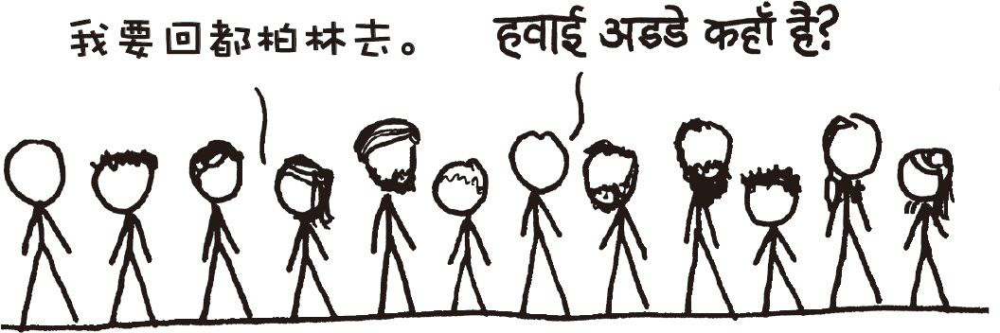

# 大家一起跳
###### EVERYBODY JUMP
### Q．如果地球上的所有人都尽可能挤在同一个地方，一起跳起，然后全部在一刹那间同时落地，会发生什么？

——托马斯·贝内（还有很多人）

***
### A．这个问题是所有提交到我的网站中的问题中问得最多的问题之一。
之前ScienceBlog．com和Straight Dope[^1]都曾分析过这个问题，运动学的部分他们已经讲得很明白了，我这里就不再重复一遍了。不过他们并没有告诉你事情的全部。

我们不妨来仔细分析一下。

首先，全球的人口都被魔法运输到了同一个地方。

整个人群的面积和罗得岛的面积相当。不过我们为什么要用“和罗得岛的面积相当”这种含糊的说法呢？这是我们的场景，我们说了算。我们就让所有人都真的来到罗得岛上好了。

随着正午的到来，大家一起跳起。

和其他地方讨论得到的结果一样，这个举动对地球一点影响都没有。地球的质量是所有人类质量的10万亿倍以上。正常人良好发挥时平均可以垂直跳起0.5米左右的距离，即使地球是刚体[^2]并能瞬时做出响应，它也只会被向下推不到一个原子宽度的距离。

接下来所有人都落到了地上。

严格来说，落地这个过程确实会传递给地球巨大的能量，但是受力的面积太大了，产生的影响最多也只是在好多花园里留下一堆脚印而已。一股轻微的压力波会穿过北美大陆并消散掉，几乎不会产生任何影响。所有人落地时产生的巨大声响可能会持续几秒钟。

最终，一切都安静下来。

几秒钟过去了。大家都开始四下环顾。

尴尬的目光。一些人开始咳嗽。

一个人掏出了手机。几秒钟后，余下的50亿人都拿出了手机。所有的人，即使手机兼容当地网络的那些人，都将看到手机屏幕上有一句相同的话：无信号。所有的手机网络都在史无前例的重压下崩溃了。罗得岛外，没人操纵的机器开始慢慢地停了下来。

罗得岛上位于沃里克的T．F．Green机场每天能够处理的旅客吞吐量只有几千人。即使我们能够把一切安排得井井有条（包括派出队伍寻找并运回燃料），机场以500％的运力持续运行数年，也不会有任何可见效果。

就算周围所有机场一起来帮忙，事态也不会有任何缓解，加上当地的轻轨系统也是杯水车薪。绝望的人们爬上停泊在普罗维登斯深水港的集装箱船，但搜集长途海上航行所需的食物和淡水又是一个巨大挑战。

人们征用了罗得岛上50万辆私家车帮助疏散，用不了多久，I-95、I-195和I-295公路上将出现史上最严重的交通拥堵。绝大多数汽车中都塞满了人，有一小群幸运的人逃出了罗得岛，开始沿着废弃的道路网去往其他地方。

在汽车耗尽燃油前，一些人把车开到了纽约或者波士顿。由于此时几乎是不可能有电力供应的，因而与其花功夫去找一个还能工作的油泵，还不如直接抛弃这辆车再去偷一辆车。没有人能阻止你，所有警察都还在罗得岛呢！

岛上的外围人群开始向邻近的马萨诸塞州和康涅狄格州涌去。任何两个相遇的人几乎都不可能说同一种语言，也几乎没有人熟悉这片区域。整个州变成了由时分时合的社会阶层组成的、混乱无序的群体。暴力随处可见，每个人都又饥又渴，杂货店早已被洗劫一空，淡水资源难以获取，有效的分配机制也无法建立起来。

不出几周，数十亿人将在罗得岛上死去。

幸存者们散布在世界各地，努力尝试在旧文明的废墟之上重建新文明。人类不至于灭绝，但人口将会锐减。讽刺的是，地球的轨道没有受到丝毫影响，仍然像人类惊天一跳之前那样默默旋转着。

但至少我们知道了后果。

[^1]:《芝加哥读者报》上的问答专栏。
[^2]:译注：在任何力的作用下，体积和形状都不发生改变的物体。