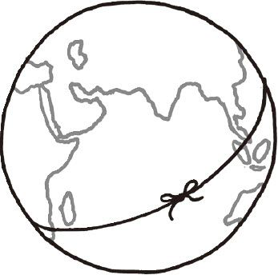
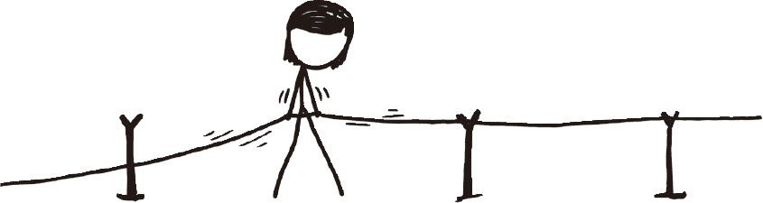
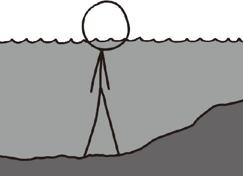
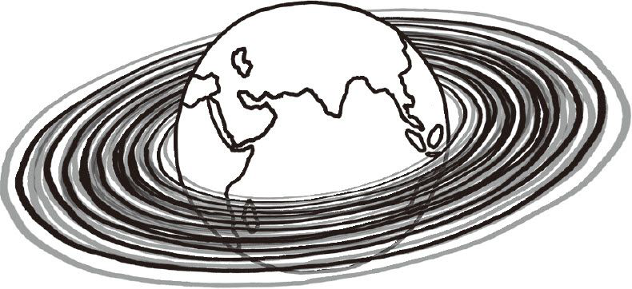

# 地球扩张
###### EXPANDING EARTH
### Q．如果地球半径现在开始以每秒1厘米的速度扩大，要花多久人们才能意识到他们自己变重了？（假设岩石的平均构成不变。）

——丹尼斯·奥唐奈

***
### A．地球目前并不在扩张。
一直有人主张说地球也许在扩张。在20世纪60年代[^1]板块漂移学说被证实之前，人们就已经发现了不同大陆的海岸线能够互相吻合。于是人们想出很多个解释方法，其中有一个认为，地球本是一个十分光滑圆整的球，而海洋盆地则是地球不断扩张产生的裂缝。这个理论从未变得十分流行[^2]，但它的身影不时在YouTube上出现。

为了避免出现大地裂痕，我们不妨假设地球上从地壳到地核的所有物质都会均匀扩张。为了不让之前发生的“榨干海洋”惨剧再度发生，我们假定海洋也会扩张。[^3]所有人类建筑都会保持原样。

#### 1秒后

当地球刚开始扩张时，你可能会感觉到一些颤动，甚至会暂时失去平衡。不过别担心，这只会持续很短一段时间。因为你是以每秒1厘米的速度匀速上升，你不会感受到任何由此产生的加速度。在这一天剩下的时间里，你什么也不会注意到。

#### 1天后
1天后，地球已经变胖了864米。

重力增长得非常慢。如果你在扩张伊始是70千克，那么第一天结束时你将是70.01千克。

那么道路和桥梁呢？总有一天它们会断裂，对吧？

是的，但没有你想象中那么快。我曾经听说过这么一个谜题：

`想象一下，你在地球表面紧紧绕了一圈绳子。`

`假设你想把绳子抬离地面一米。`

`那么你需要加多长的绳子？`

虽然看上去你需要加上几十千米长的绳子，但正确答案是6.28米。圆的周长正比于半径，因而直径增加一单位，周长就增加2π单位。

把一根4万千米长的绳子拉长6.28米没什么大不了的。即使是扩张一天后，额外增长的5.4千米对于几乎任何建筑物来说，都是可以轻松承受的。混凝土每天被拉长和压缩的量都比这长。

在最初感到一些震动后，你首先会注意到的一些效应就是你的GPS设备不再正常工作了。因为GPS卫星基本还是待在原来的轨道上，但GPS系统所依赖的精密的授时系统在几个小时内就彻底被打乱了。在所有工程学问题中，GPS计时是极其精确的，这也是唯一一个迫使工程师同时考虑狭义和广义相对论效应的地方。

其他绝大部分的钟都会继续好好地运行下去。只是如果你家有个十分准确的单摆钟，那么你会发现一些端倪——在快到第二天的时候，你会发现这个钟快了3秒。

#### 1个月后
1个月后，地球的直径增加了26千米——增长了0.4％——它的质量增加了1.2％。而地表的重力也只是增加了0.4％，而不是1.2％，因为地表的重力与地球半径成正比。[^4]

你可能会在称体重时发现一些异常，但也不是什么大问题。在不同的城市你的体重偏差的量差不多也是这么多。如果你买的是电子秤的话你最好记住这一点。如果你家的秤精确到小数点后两位，那么你就需要用一个测试砝码来校准它——不过秤的生产厂家那里的重力和你家的重力一般是不同的。

虽然直到此时你可能还没注意到重力变大了，但你一定会发现地球在扩张。1个月后，你会在长混凝土结构上发现许多裂缝，一些高架桥和旧的大桥会相继断裂。绝大多数建筑不会倒塌，但那些地基深入基岩的房子的处境就有些不可预料了。[^5]

此时此刻，国际空间站上的宇航员们要开始着急了。不仅是地面（以及大气）在朝他们扑来，不断增大的引力也在使空间站的轨道高度不断下降。他们需要尽快撤离空间站。最多几个月时间，空间站就会脱离轨道坠毁。

#### 1年后
1年后，重力变强了5％。这时你应该会注意到体重增加了，你也绝对会注意到道路、桥梁、输电线、卫星、海底电缆相继出了问题。而你家的那台单摆钟比正常时间快了5天。

那么大气层呢？

如果大气层不像陆地和海洋那样扩张，那么气压会开始下降。这是许多因素共同作用的结果：随着重力增加，空气也变得更重。但由于空气分散于一个更大的面积上，总体效果就是气压下降了。

另一方面，如果大气层也一起扩张，那么表层的气压也会随之上升。几年后，珠峰顶端将不再是“死亡区”。但反过来说，你的体重增加了，山也更高了——于是爬山就更累了。

#### 5年后
5年后，重力增加了25％。如果你在扩张开始时有70千克，那么现在你就有88千克了。

绝大多数的基础设施都已经塌了，原因是它们脚底下的土地在扩张，而不是重力变大了。令人惊奇的是，绝大多数摩天大楼在重力显著变大的情况下仍然十分坚挺。[^6]对它们而言，限制因素不是重量，而是风。

#### 10年后
10年后，重力增加了50％。如果大气不随着扩张，那么即使在海平面，空气也已经稀薄到了无法呼吸的程度。如果大气一起扩张的话，我们还能再撑一会儿。

#### 40年后
40年后，地球的重力变成了最初的3倍。[^7]此时此刻，即使是最强壮的人也只能勉强才能走路。呼吸也变得很艰难，树都倒了，粮食被自己的重量压得抬不起头。几乎每座山的山坡都可以见到巨型滑坡，因为此时的静止角比以往要更小。

地质运动也会加剧。地球产生的大部分热来自于位于地壳和地幔之间的放射性物质的衰变放热，[^8]而更多的物质意味着更多的热。由于体积扩张的速度比表面积快，因此总体平均每平方米发出的热量就会变多。

不过这些还不足以使这颗星球温度大幅升高——地球的表面温度主要取决于大气层和太阳——但更多的热会导致更多火山爆发、地震，以及更快的地壳运动。这和几十亿年前的地球相似，那时地球具有更多的放射性物质，所以地幔温度会更高。

更加活跃的板块构造对生命来说可能有些好处。板块构造对稳定地球的气候起着关键作用，而比地球小的那些星球（比如火星）内部没有足够多的热来维持长期的地质运动。更大的星球意味着更多的地质运动，这也是为什么一些科学家认为生命在比地球稍大一些的星球（所谓的“超级地球”）会比和地球差不多大的星球上活得更好一些。

#### 100年后

100年后，我们将感受到6倍重力。我们不仅没法四处走动寻找食物，就连心脏都无力把血液泵到大脑中去。只有一些小昆虫（和海洋生物）还有可能四处活动。也许人类可以在专门设计的控压屋里生存，要移动的话也要先把大部分身体浸在水里。

在这种条件下呼吸是十分困难的。由于水的压迫，你很难吸入空气，这也是为什么呼吸管只在浅水里才有用。

出了控压屋，你还是无法呼吸空气，不过原因和之前的不一样。在约6倍大气压下，即使是普通的空气也变得有毒起来。即使我们能够克服其他所有困难，100年后我们还是会死于空气中毒。除去毒性不说，呼吸致密的空气也非常困难，因为它太重了。

#### 黑洞？
什么时候地球会最终变成一个黑洞？

这个问题很难回答，因为问题中说虽然半径一直在变大，但密度一直不变——而在黑洞中，密度会增加。

很少有人会去研究那些超大型的岩石行星的动力学，因为它们很难形成：任何这么大的东西在形成过程中都足以吸引大量的氢和氦，从而变成一颗气态巨行星。

在未来的某一刻，不停扩张的地球总有一天会变成这样的状况：每增加一点质量，它都会缩小而不是变大。自那以后，它会不断坍缩，直到变成一颗白矮星或者中子星——如果质量还是不停增加，它最终会变成一个黑洞。

但那要等好久……

#### 300年后
我们人类活不到这一天真是遗憾，因为此时会发生一件非常赞的事情。

随着地球不断变大，月亮会像那些卫星一样轨道高度越转越低。几个世纪后，终有一天地球与月球之间的引潮力会超过月球聚拢自身的引力。

当那个界限——叫作洛希极限——被跨越后，月亮会被撕裂[^9]，而在短时间内地球会拥有一个美丽的光环。

`如果你喜欢它，就应该把一个物体移动到它的洛希半径内。`[^10]

[^1]:板块构造学说的确凿证据是海床在不断延展。海床延展和地磁极倒转两者能够很好地互相印证，这是我最喜欢的科学发现管用的例子之一。
[^2]:事实证明这理论挺蠢的。
[^3]:实际上海洋确实在扩张，因为海水在变暖，而这也是（目前）全球变暖导致海平面上升的主要原因。
[^4]:质量正比于半径的三次方，而重力正比于质量乘以半径平方的倒数，所以半径的三次方除以半径的平方等于半径。
[^5]:造摩天大楼要的不就是这个嘛。
[^6]:虽然我可不敢再去乘电梯了。
[^7]:几十年后地球重力增加的速度会比你所期望的略快一些。因为不断增加的重量会压迫地球自身，地球内部的压强粗略正比于表面积的平方，因而地核会被压得十分紧密。http://cseligman.com/text/planets/internalpressure.htm
[^8]:虽然一些放射性物质（比如铀）很重，但它们会被从地球内部挤出来，因为在那种深度下它们没法和岩石晶格很好地混合，具体内容参见这一章节（http://igppweb.ucsd.edu/～guy/sio103/chap3.pdf）以及这篇文章（http://world-nuclear.org/info/Nuclear-Fuel-Cycle/Uranium-Resources/The-Cosmic-Origins-ofUranium/.UlxuGmRDJf4）。
[^9]:对不起啦，月亮！
[^10]:注：碧昂斯的著名歌曲“single ladies”有一句歌词：If you like it then you shoulda put a ring on it．（如果你喜欢它，就应该给它戴个戒指。）
