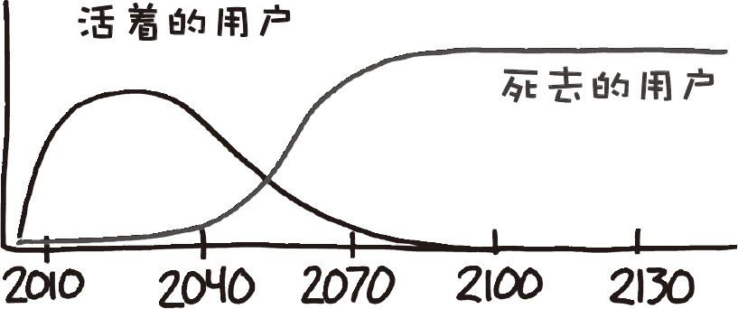
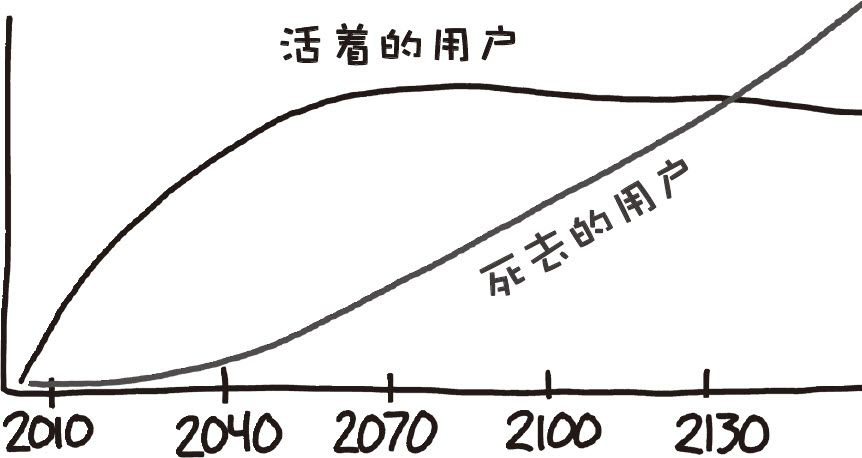
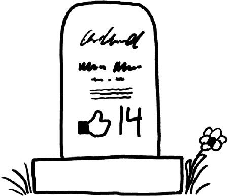

# FACEBOOK之死亡国
###### FACEBOOK OF THE DEAD
### Q．何时（如果真有那么一天的话）Facebook上死人的账户数会超过活人的账户数？

——埃米莉·邓纳姆

***
[^1]  
`“戴上耳机！”“做不到啊，耳朵早掉啦。”`

### A．不是206X年就是213X年。
目前Facebook上死人账户并不多。[^2]这主要是因为Facebook——以及它的用户们——都很年轻。在过去几年中，Facebook用户的平均年龄确实在上涨，但目前玩Facebook的年轻人还是远超老年人。

#### 过去
   
`年老的科利·多克托罗正在cosplay未来的人认为他在过去的穿着。`

根据Facebook的增长速度，以及这些年来注册用户的年龄段演变来看，[^3]这之中大约有1000万到2000万注册用户已经去世了。

目前来看，这些人在年龄段上分布均匀。虽然年轻人的死亡率比六七十岁的老人要低，但由于他们占了Facebook用户中的大部分，因而死去的年轻人的数量还是和死去的老年人的数量差不多。

#### 未来
约有29万Facebook美国用户将（或已经）在2013年死去，而全球在2013年大约要死几百万人。[^4]只需7年，死亡率就会翻倍；再过7年，死亡率还会再翻一番。

即使Facebook明年就关闭注册，每年的死亡数还会持续上升，这个势头将保持好几十年，因为2000年到2020年间读大学的人都开始变老了。

决定死人账号数何时超过活人账户数的关键因素在于，Facebook的新增用户速度——一般是那些年轻人——能否快过老用户死亡的速度。

#### 2100年的Facebook
我们现在要探讨一下Facebook的未来了。

我们没法确切地说Facebook能活多少年，因为我们没有类似的经验。大多数网站都是短时间内大火，然后慢慢地埋没于历史的尘埃之中，因而不妨假定Facebook最后的命运也会是如此。[^5]

按照这个场景，Facebook将在几年后开始失去市场份额，并且永远都不会恢复过来。Facebook的转折点——死人账户数超过活人账户数的那一天——将在2065年前后来临。

 

不过也有可能不是如此，也许它会变得像TCP协议那样，成为其他基础设施的基石，这样用户们可就离不开它了。

如果Facebook能够历经数代人而不倒的话，那么它的转折点将会到22世纪中期才来临。

 

不过这也不太现实，没有什么能够永恒存在，尤其是那些基于计算机技术的东西，急速更迭才是常态。在历史的长河里布满了那些10年前被认为将永远存在的网站和技术的遗骨。

所以Facebook的命运很可能介于这两种情况之间。[^6]我们只有静静等待才能知晓结果。

#### 账户的命运
Facebook有财力能够将所有用户的页面和数据无限期地保存下去。活人用户产生的数据总是比死人用户要多的，[^7]而且也只有那些活人的账户才会被经常访问。即使所有用户中死人（或不活跃）账户占了绝大多数，这也不会对总的数据存储支出产生太大影响。

其实更重要的是我们用户的想法。我们要留着那些页面干啥？除非我们要求Facebook把页面删了，否则他们应该默认会永久备份所有数据。即使Facebook不那么做，也总会有那些数据收集公司这么做。

现在死者的近亲可以将死者的Facebook页面变成一个纪念页。但这其中还涉及许多问题，比如密码、私人信息等，这些问题我们还没有形成社会共识。这些页面还要继续能被访问吗？哪些信息要被隐藏？死者的近亲有权进入邮箱吗？纪念页允许留言吗？如果遇到捣乱的或是恶意破坏该怎么办？其他用户可以与死者的账号互动吗？死者该出现在哪种好友名单上？

这些问题，我们目前正在靠试错法寻找解决方案。死亡一直以来都是一个重大的、艰难的、情绪化的话题，不同的社会有不同的处理方法。

但组成一个人的一生的基本事件是不会变的。我们都要吃饭、学习、长大、恋爱、斗争，最终死去。在不同的地理位置、文化环境以及技术图景中，我们围绕着这些基本活动发展出不同的行为。

正如在我们之前活过的每一个人一样，我们都是在自己的人生运动场上进行着相同的游戏。虽然事情有时总不尽如人意，有时还会碰一鼻子灰，但我们还是不断地在互联网上更新着恋爱、争吵、学习以及长大的社交准则。我们迟早会明白该如何去祭奠。

   
`14个赞`

[^1]:“戴上耳机！”“做不到啊，耳朵早掉啦。”
[^2]:至少在我写这篇文章的时候还是这样的，机器人的血腥革命还没开始呢。
[^3]:你可以用Facebook的create-an-ad工具来数一下不同年龄段的用户数，不过你也得承认Facebook对用户年龄的限制使得一些用户不得不在年龄上撒谎。
[^4]:一些地方我用的是美国地区的数据来代表整体的数据，因为美国地区的数据比较好找，我也不想一个一个去找那些用Facebook国家的具体数字。美国数据并不能很好地代表全世界，但基本道理——人口数量会在继续上涨一段时间后持平，年轻人对Facebook的接纳程度决定了这个网站的成功与否——不管在什么地方大致都是一样的。发展中国家人口增长更快，平均年龄也更低，如果假设那里使用Facebook的人口迅速饱和，这会让一些里程碑式事件提前好几年，不过整体来说，变化并没有你想象中的大。
[^5]:我假定的是Facebook不会删除用户信息，因为即使一些用户不用Facebook了，他们也很少会去删除个人数据。但一旦这一假设不成立，结论就会有很大的变化。
[^6]:也许Facebook用户——很有可能是全人类——的死亡率会在突然之间急速上升，转折点发生在明天也不是没有可能。
[^7]:但愿如此。
