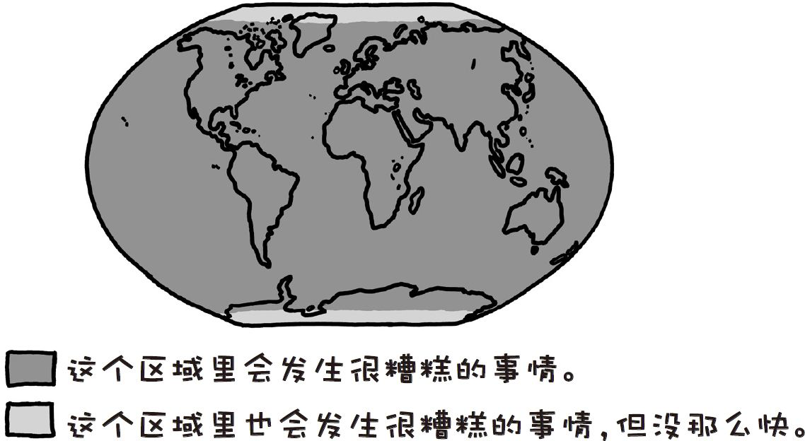
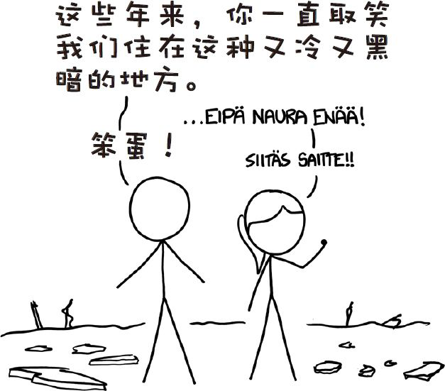
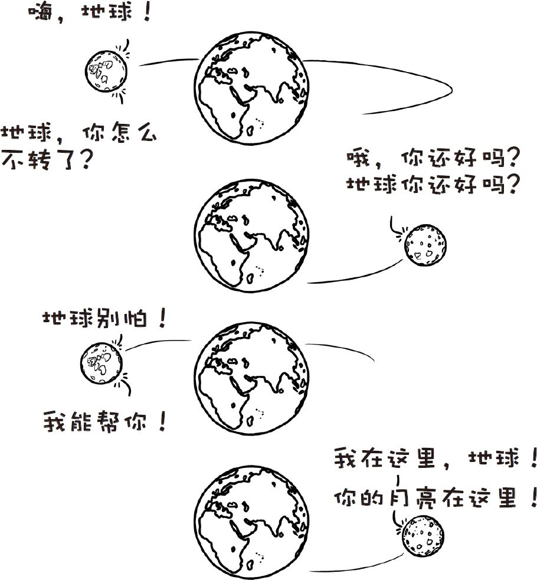
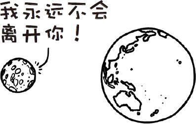

# 全球风暴
###### GLOBAL WINDSTORM
### Q．如果地球和地上所有的东西都在一瞬间停止转动，但大气层还是保持原来的速度，会怎样？

——安德鲁·布朗

***
### A．几乎所有人都会死去。但接下来事情就变得好玩儿了。
在赤道，地球表面相对于地轴的旋转速度约为每秒470米（约每小时1700千米）。如果地球一瞬间停止转动而空气不受影响，那么结果就是突然刮起一阵时速1700千米的大风。  

风速在赤道处最大，但所有居住在南北纬42度线之间的人（约占全球85％人口）都将在一瞬间感受到超音速狂风。  

尽管在地表最猛烈的狂风只能维持几分钟，与地面之间的阻力会使风速慢慢降下来，不过这短短几分钟就足以把几乎所有的人类建筑都摧毁殆尽了。

我家在波士顿，那里的纬度足够高，恰好在超音速狂风区之外，但那里的大风的威力仍将是最强龙卷风威力的2倍。不管是棚屋还是摩天大楼，所有的建筑都会被连根拔起，夷为平地，大楼的碎片会在天空中飞得到处都是。

在极点附近，大风的威力会减弱一些，但没有一个人类城市能够逃离被彻底摧毁的命运，因为它们都离赤道不够远。挪威斯瓦尔巴特群岛上的朗伊尔城是全世界纬度最高的城市，它也会被威力媲美史上最强热带飓风的狂风摧毁。

如果你打算一直等到风暴结束，那么你的最佳去处可能会是芬兰的赫尔辛基。赫尔辛基地处北纬60度左右，虽不足以避免被狂风荡平地面的结局，但赫尔辛基城市下的基岩里有一套复杂的地下通道，以及一个个地下购物中心、曲棍球场和游泳池等设施。

在狂风中没有一幢建筑是安全的，即使是那些足以抵御这种强风的建筑也会面临巨大的麻烦。正如喜剧演员罗恩·怀特说的那样：“不是风在吹，而是风在吹啥。”打个比方吧，你待在一个材料强度足够抵御时速1700千米大风的巨型地堡里。

这很好，你应该会没事儿……前提是你是唯一拥有地堡的人。不幸的是，你周围很可能还有邻居。如果位于你上风处的那个家伙的地堡没你的那么结实，那么你的地堡就将面临时速1700千米的撞击。

人类不会灭绝。[^1]总的来说，待在地面上的人没几个能活下来的，在空中飞舞的碎片会把任何不具备抗核爆能力的物体全部毁掉。然而待在地面之下的大部分人应该都能活得好好的。如果在这一切发生时你待在深深的地下室里（或是在更安全的地铁隧道里），那么你活下来的几率会非常大。

其他地方也会有幸存者。在阿蒙森-斯科特南极科考站的几十位科学家及员工应该不会受到狂风的影响。但对于他们来说，出事儿了的第一个迹象是外部世界一下子变得静默了。

这诡异的宁静可能让他们一时摸不着头脑，但早晚会有人注意到更加奇怪的事情。

#### 空气
随着地表的狂风消失，事情会变得更加奇怪。起初的狂风此时会转化成热浪。一般来说，大风中所携带的动能小到可以忽略不计，但现在我们面对的可不是一般的风。随着之前的狂风突然停止，空气会被加热。

整块大陆上的空气温度会急剧升高，而那些空气最为潮湿的地区将形成全球性的雷暴。

与此同时，横扫海面的大风会搅动表层海水，使之雾化。于是有这么一段时间，海洋将不存在表面一说——无法再区分出哪里是水珠结束的地方，哪里是海面开始的地方。

海水是冰冷的。在薄薄的表层水之下，是温度几乎均匀为4℃的深层水。风暴会将深处冰冷的海水带到表层，由此产生的冰冷的水珠遇上炽热的空气会产生一种前所未见的天气形态——一种夹杂着风、水珠、雾以及温度剧烈变化的混合体。

由于深层的新鲜营养物质随着水流涌到了表层，这种海水的涌升会使表层生物大量繁衍。但与此同时也会导致大量鱼类、蟹类、海龟等生物的死亡，因为深层的海水含氧量太低不足以供它们呼吸。任何需要呼吸空气的生物，比如鲸类和海豚，面对翻涌的海水空气界面都将难以存活。

产生的海浪将会从东到西席卷全球，所有东面迎海的海岸都将直面有史以来最为凶猛的风暴潮。云雾状的海水水珠将会扫荡内陆，让你睁不开眼睛，随后是同样席卷而来的海浪。在一些地方，海浪将冲进数千米深的内陆。

风暴会把巨量尘土和碎屑抛射到大气层中。同时，冰冷的海洋表面将形成一层厚厚的毯状水雾。正常情况下这将导致全球气温急剧下降，事实上也将如此。

至少，在其中一个半球上是这样。

如果地球停止转动，平常的日夜交替将会终止。虽然太阳不会完完全全静止在空中，但以往每天仅有一次的日出日落此时将历时一年。

日夜将各有6个月长，即使是在赤道也是如此。在处于白天的那个半球上，地面将接受阳光不间断的炙烤，而在处于夜里的那个半球，气温会大幅下降。而且在对流的作用下，处于白天的那个半球，被阳光直接照射的地区将会产生巨大的风暴。[^2]

从某种角度来说，此时的地球会与那些潮汐锁定的地外行星类似——这样的行星常见于红矮星宜居带里，但更好的比较对象也许是非常早期的金星。金星由于其特殊的自转速度，每次都会有一个面朝向太阳长达数月之久，像我们现在的地球一样。不过，由于金星表面的稠密大气层环流速度非常快，所以处于白天和黑夜的两个半球之间的温度基本相同。

虽然一天的长度会发生变化，但一个月的长度并不会！因为月亮还是在绕着我们的地球转。不过没了地球的自转给它提供潮汐能，月亮将不会像之前那样慢慢地飘离地球，而是会慢慢地朝地球方向移动。

事实上我们的忠实伙伴月亮会逐渐着手修复安德鲁设想的悲剧情形带来的伤害。目前地球的自转速度比月亮快，潮汐在不断地减慢地球的自转速度，同时将月球慢慢推离地球。[^3]如果地球停止转动了，月亮将不再飘离地球，而且也不再会减慢地球的自转速度。相反，月亮产生的潮汐会逐渐加快地球的自转速度。慢慢地，月亮的引力将会拖动地球……

……然后地球又会再度开始自转。

[^1]:我是指不会马上灭绝。
[^2]:此时由于没有了科里奥利力（来自物体运动所具有的惯性），风暴的旋转方向将
变得无法预测。
[^3]:这一现象成因请参见第26期What If文章“闰秒”。