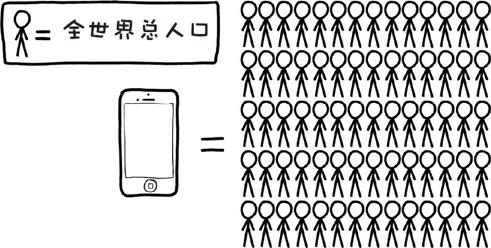
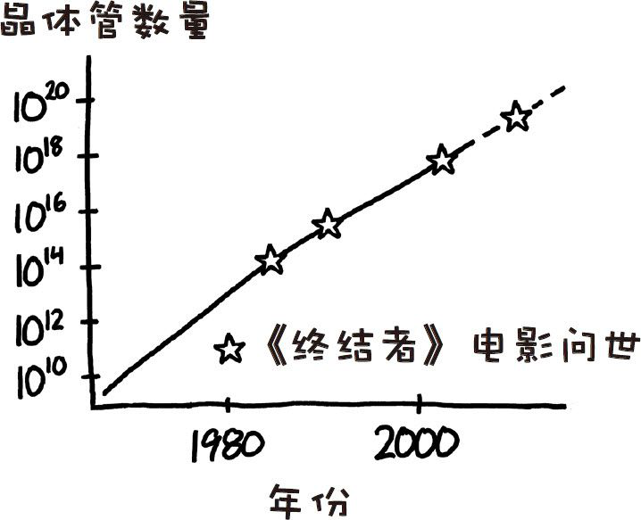

# 人力计算机
###### HUMAN COMPUTER
### Q．如果全世界所有人都停下手头的工作开始做计算，那么一共能有多少计算能力？这些计算能力和现代的计算机或智能手机相比谁更厉害呢？

——马特乌什·诺尔

***
### A．一方面来说，人类和计算机的思考方式完全不同，所以拿它们作比较就类似于比较苹果和橘子。

另一方面，苹果要更好一些。[^1]我们不妨比较人类和计算机做相同任务时究竟谁更快。

要设计出一个任务，使得一个人能比全世界所有计算机都做得快是很容易的，但每过一天难度就会更大一些。比如，人类在看一幅照片场景并猜测之前发生的事情时，目前仍远胜于计算机。

为了测试这个理论，我把这幅图片发给我妈妈，问她认为发生了什么。[^2]她立刻回复说：

> “小孩儿把花瓶打碎了，那只猫正在查看这只花瓶。”

我的母亲很聪明地否定了其他一些可能，包括：
* 猫撞倒了花瓶。
* 猫从花瓶里跳出来扑向孩子。
* 猫追着孩子到处跑，孩子拿着一根绳子试图爬到梳妆台上逃跑。
* 房间里有一只野猫，有个人朝它扔了一个花瓶。
* 猫被制成木乃伊放进了花瓶里，当孩子用具有魔力的绳子碰了一下后猫复活了。
* 固定花瓶的绳子断了，而这只猫正试图把它放回去。
* 花瓶爆炸了，把孩子和猫都吸引了过来。小孩儿戴上了帽子，防止后续爆炸伤到他。
* 孩子和猫跑来跑去想要抓住一条蛇，小孩儿最终抓住了蛇并把它打了个结。

全世界所有的计算机都不能比任何一个家长更快地找出正确的答案，这是因为我们给计算机编程时并没有告诉计算机要怎么解决这种问题，[^3]而我们的大脑则已经接受了上百万年进化的训练，对于猜出周围的人在干什么以及为什么要这么做很是在行。

我们可以选择一个人类具有优势的任务，但这又有什么意义呢？计算机受制于我们的编程能力，因而我们人类有天生的优势。

所以我们还是看看在计算机的地盘上比赛如何吧。

#### 微芯片的复杂度
我们不用弄出一个新任务，只需让人类进行计算机上常用的基准测试就行。这种测试一般包括像浮点数计算、存储和回忆数字、调整字符串以及一些基本的逻辑运算这样的内容。

根据计算机科学家汉斯·莫拉维克的说法，一个人如果用纸笔进行计算机上的芯片基准测试，那么他的速度为每1.5分钟执行一条完整指令。[^4]

这样算来，一部中端手机的处理器的计算能力将是全球人口加起来的运算能力的70倍左右，而一台高性能台式机的芯片则能将这个比值提高到1500。

那么是从什么时候开始，一台普通的台式机的计算能力超过了所有人类的计算能力总和呢？

1994年。

1992年全世界总人口为55亿人，这意味着根据基准测试，人类的总计算能力约为65 MIPS[^5]。

同年英特尔发布了风靡一时的486DX芯片，在默认配置下这块芯片每秒能够处理55～60MIPS。截至1994年，英特尔的新“奔腾”芯片的基准测试成绩达到了每秒70～80MIPS，已经把人类抛在了后头。

你可能会说这种测试对计算机有一些不公平，毕竟现在是一台计算机和所有人类比，那么如果所有计算机和所有人类比会怎么样呢？

这个计算有些困难。我们可以很容易地给各种各样计算机的性能打分，但你如何衡量——比方说——“菲比精灵”玩具中的芯片每秒能够执行多少个指令呢？

世界上绝大多数晶体管都封装在并非专门用于这种测试的芯片里，如果假设所有的人类都经过训练能够进行基准计算的话，那么需要花多少功夫才能修改每一台计算机的芯片以使它们能够进行基准测试呢？

为了避免这种问题，我们可以通过数晶体管的数目来粗略估计全球所有计算设备的总计算能力。结果我发现20世纪80年代的处理器和今天的处理器的晶体管数目与MIPS的比值大致相同——这个比值大约为每秒每条指令需要30个晶体管，数据可能误差一个数量级。

戈登·摩尔（著名的摩尔定律的发现者）发表的一篇论文中给出了自20世纪50年代以来每年生产的晶体管总量。这些数字画成图表之后长这样：

有了这些比值，我们就能把晶体管总数折算成总计算能力。这意味着一台基准测试结果为几万MIPS的现代普通笔记本电脑的计算能力超过1965年全球总人口的计算能力。按照这种算法，计算机的总运算能力超越全人类的总计算能力应该发生在1977年。

#### 神经的复杂度
我想再次重申一下，让人类拿纸笔做CPU基准测试来得出人类的计算能力是一个很愚蠢的方法。从复杂度上来看，我们的大脑比任何一台超级计算机都要复杂，没错吧？

绝大多数时这是没错的。

现在有些项目致力于用超级计算机来完整模拟大脑单独一个突触的功能。[^6]如果我们能看到这些实验动用了多少处理器和时间，我们就能大致猜测出要媲美人类全脑复杂度需要多少个晶体管。

2013年日本“京”超级计算机经过测试得出的结果是，每个人脑相当于1015个晶体管。[^7]这样算来，直到1988年全世界所有的逻辑电路加在一起才能抵得上一个人类大脑的复杂度……而与所有人脑加在一起的复杂度比起来，这些电路的总复杂度根本不值一提。如果摩尔定律预测的趋势持续保持下去的话，根据这些模拟结果，计算机要在2036年才能超过人类。[^8]

#### 为什么这个结论是荒诞的
这两种不同的人脑基准测试得出了两个完全相反的结论。

第一个纸笔基准测试要求人类模拟计算机芯片上执行的单个指令，得出的结果为人脑的得分仅为0.01 MIPS左右。

第二个超级计算机神经元模拟项目让计算机模拟人类大脑中单个突触的行为，得出的结果为人脑得分高达500亿MIPS。

稍微好一些的做法是把两个结果合并在一起，但还是感觉怪怪的。如果我们认为计算机程序模拟人脑和人脑模拟计算机芯片的行为都一样不利索，那么稍微公平一点，人脑基准结果也许是这两个数字的几何平均值。

这样得到的结果是人脑的执行效率约为3万MIPS，差不多和我现在正在打字用的计算机性能是一个水平。这同时也说明全球计算机的总计算能力在2004年就已经超过所有人类的总计算能力了。

#### 蚂蚁
戈登·摩尔在《摩尔定律迈入40周年》一文中提出了一个很有意思的发现。他指出，根据生物学家E．O．威尔逊的说法，全世界有1015～1016只蚂蚁。相比之下，2014年全世界一共有约1020个晶体管，也就是说平摊下来每只蚂蚁能分到几万个晶体管。[^9]

蚂蚁的大脑可能有25万个神经元，每个神经元上又有几千个突触，这意味着全世界所有蚂蚁大脑的总复杂度已经和所有人类大脑的总复杂度相当。

所以我们没必要太在意什么时候计算机会在复杂度上击败我们。毕竟，我们追上了蚂蚁，但蚂蚁一点也没着急嘛。当然了，虽然我们看上去现在主宰了地球，但如果一定要我从灵长类动物、计算机和蚂蚁之中选出一个能在几百万年后依然存在的东西的话，我当然知道该选哪个。

[^1]:除了蛇果，这玩意儿的名字真是坑人。
[^2]:我小时候家里有许多花瓶。
[^3]:到目前为止。
[^4]:这个数字来自汉斯·莫拉维克撰写的《机器人：由机器迈向超越人类心智之路》中的一个列表。
[^5]:MIPS为每秒执行的百万指令数，65MIPS＝6500万条指令/秒。
[^6]:即使是这样也没法完全精确地模拟每一个细节，生物学从来都不是这么简单的。
[^7]:每台“京”超级计算机配备了82944个处理器以及7.5亿个晶体管，连接数量相当于人类大脑的1％，它需要花40分钟才能模拟出人类大脑仅用时一秒的活动。
[^8]:如果你读到这篇文章的时候已经过了2036年，那我在这里给你打一个来自遥远过去的招呼！我希望未来科技会更加进步。对了，你们快找个方法回来接我们啊！
[^9]:TPA：每只蚂蚁能分到的晶体管数目。