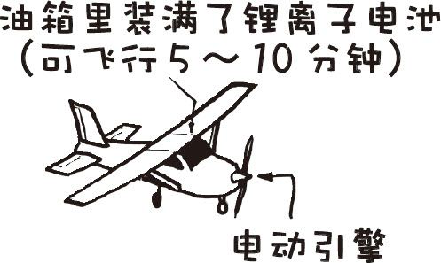
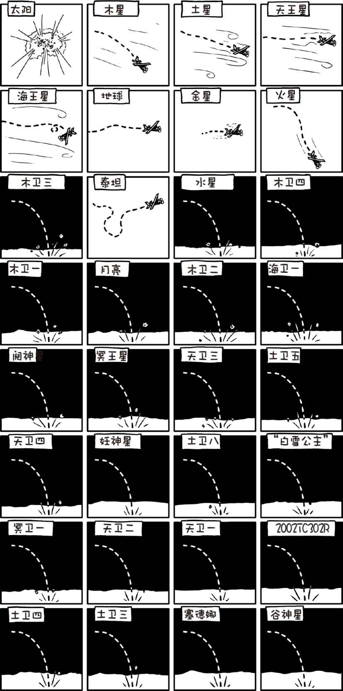
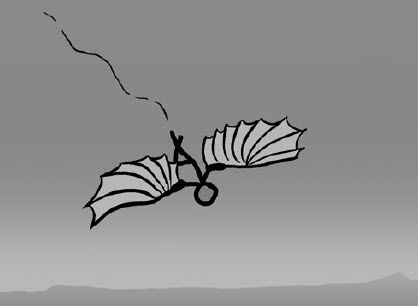

# 星级塞斯纳[^1]
###### INTERPLANETARY CESSNA
### Q．如果你试图在太阳系其他天体上驾驶普通的地球飞机会怎样？

——格伦·基亚基耶里

***
### A．下面先请出我们的飞机：[^2]

这里我们要用电动引擎，因为燃油引擎只能在有绿色植物的星球上使用。在没有植物的星球上，氧气并不会留在大气层中，它会和其他元素结合成二氧化碳和锈迹等东西。植物的存在会把这些氧给拽出来，并重新送回到空气中。引擎需要氧气才能正常工作。[^3]然后是我们的飞行员：

下面这张图则会告诉你当飞机在太阳系最大的32颗星球表面上空释放时会发生什么。

大多数星球上是没有大气的，所以飞机是直挺挺地摔向地面。如果坠落高度是1千米或更低的话，在一些星球上坠落的速度很慢，飞行员可能会活下来——但机载的生命维持系统大概撑不住。

太阳系有9颗星球有足够浓密的大气：地球——显而易见——还有火星、金星、四大气态巨行星、土星的卫星泰坦，还有太阳。现在让我们仔细分析下在这些星球上分别会发生什么。

**太阳**：嗯，跟你想象的差不多。如果飞机释放的距离近到能够感受到太阳大气的话，它会在1秒之内灰飞烟灭。

**火星**：要想知道在火星上驾驶飞机是什么感觉，那么就试试X-Plane火星模拟飞行吧。

X-Plane是世界上最先进的飞行模拟器之一。这款软件由一群热心的航空专业人士和社区志愿者们历时20年编写出来，[^4]能够模拟飞机飞行时流过每一寸机身的气流。这使得它成为一个极为有用的研究工具，因为它能准确模拟出全新设计的飞机以及环境。

如果你对X-Plane的配置文件进行修改，把引力调小一些，把大气调稀薄一些，把星球半径也缩小一些，那么你就可以模拟出在火星上的飞行状态。

X-Plane告诉我们在火星上驾驶飞机可不容易，但也不是不可能。

NASA知道这一点，所以他们考虑用飞机来巡视火星。但问题在于，在如此稀薄的大气环境下要想获得足够的升力，就需要很高的速度。你需要达到近1马赫的速度才能起飞，而一旦你动了起来，巨大的惯性使你难以转弯——如果你尝试转弯，那么飞机会翻滚，同时继续保持原有航向。所以X-Plane的作者把驾驶火星飞机比作驾驶超音速游轮。

我们的塞斯纳172可完不成这种任务。如果它从1千米的高度释放，它将无法积累足够的速度以摆脱俯冲状态，并将以每秒60米（每小时216千米）的速度坠毁在火星表面。不过如果从4～5千米的高度释放，飞机能够达到足够的速度以脱离俯冲而进入滑翔状态——此时空速超过音速的一半。在这种情况下想要活着降落是不可能的。

**金星**：不幸的是，X-Plane无法模拟金星近表面那地狱式的环境。但是简单的物理计算能告诉我们一些东西。结局是这样的：你的飞机能飞得很顺畅，只不过它一直处于着火状态，然后它就飞不动了，再然后它就不是飞机了。

金星上的大气密度是地球上的60多倍，在这种条件下一架塞斯纳足以以人类跑步速度起飞。不幸的是，空气温度足够把铅熔化，飞机上的油漆在几秒内就会熔化，飞机的部件也会迅速失效，再之后在热应力的作用下飞机会解体，然后在空中慢慢飘落。

一个更好的选择是在云层上方飞行。虽然金星的表面糟透了，但是它的上层大气层与地球惊人地相似。在距离地面55千米的地方，一个人戴着氧气面罩，身着密闭防护服就能活下来，气温跟室温差不多，气压也跟地球上的山脉上相近。你需要穿着防护服是因为大气里有硫酸。[^5]

沾上硫酸可一点儿都不好玩，但事实上云层上方的区域对于飞机来说是一个绝佳的环境，只是表面不能有暴露的金属，否则就会被硫酸腐蚀掉。哦对了，我之前忘了说了，你的飞机还必须能够在持续不断的5级飓风中飞行。

金星不是个好地方。

**木星**：我们的塞斯纳没法在木星上飞行，因为那里的重力太强了，维持飞行所需的动力是在地球上的4倍。如果从还说得过去的海平面气压开始，我们将在颠簸的大风中开始绝望地向深处滑翔，速度可达每秒275米（每小时990千米），我们将穿过一层又一层的氨冰和水冰，最后的结局仍将是坠毁。不过木星上没有坠毁表面，因为随着你越飞越深，木星将从气体平滑地变成液体。

**土星**：这里的场景比木星要好一点儿。这里重力弱一些——事实上和地球上差不多——大气层也更浓密一些（但仍然很稀薄），我们可以苟延残喘更长的时间，不过最终还是会要么被严寒干掉，要么被大风干掉，在不断下坠的过程中落得和在木星上一样的下场。

**天王星**：天王星是一个诡异的匀质蓝色星球。这里风速很快，而且冷得刺骨，但在几大气体巨行星中，这里的环境可以说是最好的了，你估计可以飞上那么一会儿。但这里真的是什么都没有，你来这里干嘛？

**海王星**：如果你准备去冰巨行星逛一圈，我建议去海王星[^6]要比去天王星要好。虽然你最后不是被冻死就是在湍流里身体散架，但好歹死前这里还有几片云可以瞻仰一下。

**泰坦**：最好的总要留到最后。就飞行而言，在泰坦上飞行可能要比在地球上还好。这里的大气浓密，重力又小，表面气压只比地球多50％，空气密度是地球的4倍。这里的重力比月球还弱，这意味着在这里很容易飞起来，你甚至可以通过踩脚踏板的方式让塞斯纳飞起来。

说实话，人在泰坦上可以仅靠肌肉的力量就飞起来。一个人穿上滑翔翼就可以舒舒服服地起飞，然后靠超大的游泳用的鳍状靴子到处飞行——你甚至扑腾几下人工翅膀也能飞起来。动力要求也是极低，走路的能量就够。

但弊端（总有一个弊端的啦）在于寒冷的温度。泰坦上的温度只有-201℃，和液氮的温度差不多。从轻型飞机上加热装置的一些参数来看，我估计在泰坦上塞斯纳的驾驶舱温度会以每分钟2℃的速率下降。

飞机上的电池能够用来维持片刻的温暖，但最终飞机还是会因为消耗完热源而坠毁。还记得“惠更斯号”探测器吗？它在下降的过程中电池已经用得差不多了（在下落的过程中拍了许多漂亮的照片），在降落到泰坦表面仅仅26秒之后就屈服于低温的侵袭。不过在降落之后的那么几十秒里它还是成功发回了照片——只来得及发回一张——这是我们所拥有的唯一一张比火星更远的天体表面的照片。
    

如果我们穿上人工翅膀在空中飞行，那我们将是泰坦版本的伊卡洛斯[^7]——我们的翅膀将会结冰、散架，然后带着我们去见上帝。但我从未把伊卡洛斯的故事视为人类局限性的教训——我把它看作是蜡作为黏合剂的局限性的教训。泰坦上的低温只是个工程问题而已，只要经过正确改装，配上正确的热源，一架塞斯纳172就可以在泰坦上飞行——当然我们也行。

[^1]:译注：美国飞行器公司。
[^2]:塞斯纳172天鹰估计是全世界最常见的飞机了。
[^3]:而且我们使用的汽油也来自远古生物。
[^4]:那些人一谈到飞机就喜欢用大写字母。
[^5]:我推销得不太好，是吧？
[^6]:座右铭：“稍微蓝一点儿的那个。”
[^7]:译注：希腊神话中的人物，因飞得太高，双翼上的蜡被日光融化后跌落水中丧生。