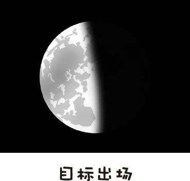
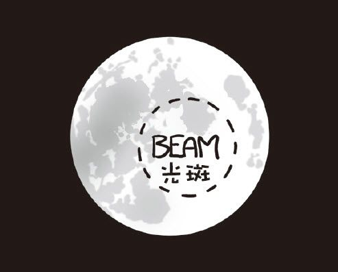
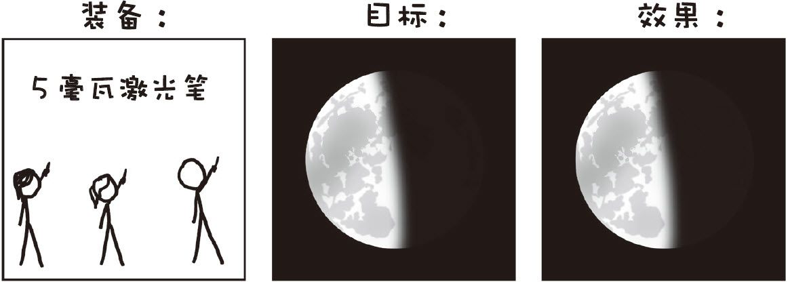
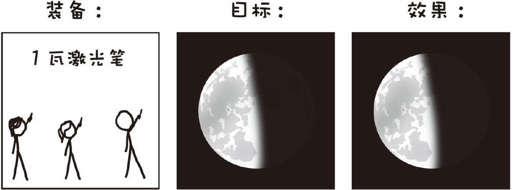
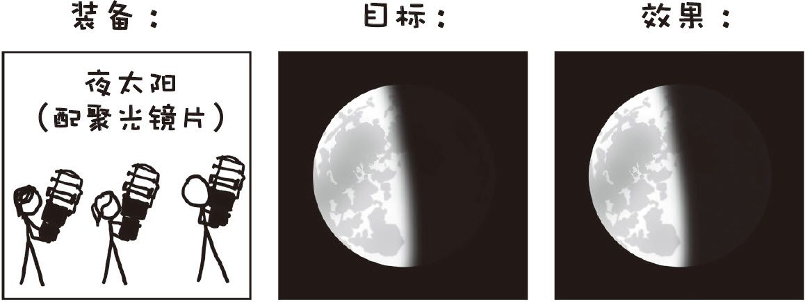
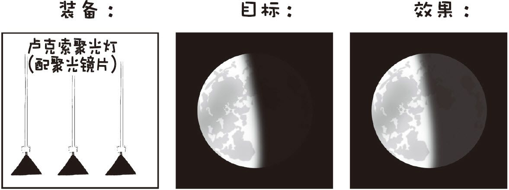
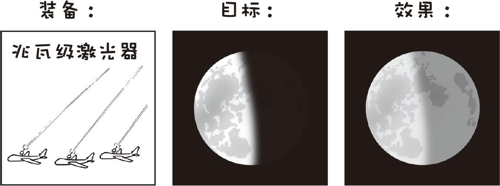
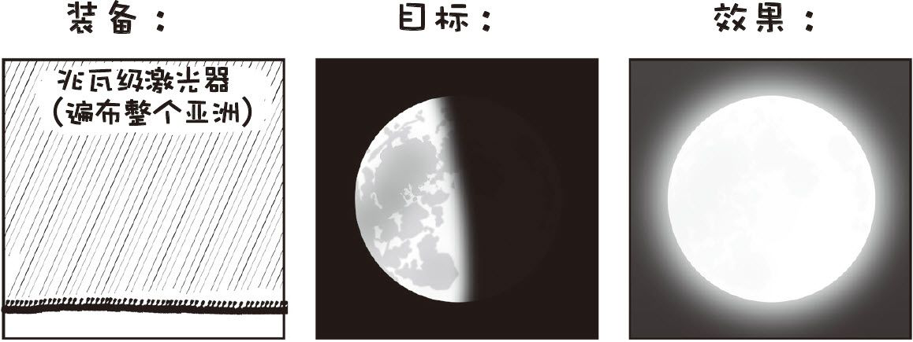
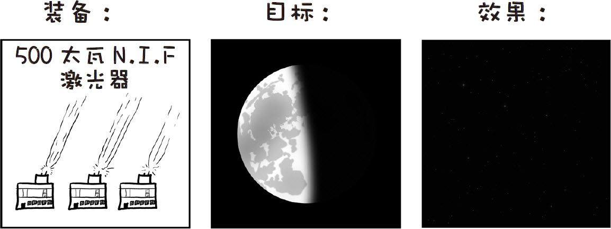

# 激光笔
###### LASER POINTER
### Q．如果地球上所有人都拿着激光笔同时照向月亮，月亮的颜色会发生变化吗？

——彼得·利波维奇

***
### A．不会——如果你用的是一般的激光笔的话。
首先你要考虑这么一个问题，那就是不是所有人都能同时看到月亮。

我们可以让所有人都挤在一个地方，但我们还是先挑一个尽可能多的人口能看到月亮的时刻吧。由于全世界75％的人口都住在0度和东经120度之间，因此不妨把这个时刻定为月亮位于阿拉伯海附近的时候。

下一个问题是要朝新月还是满月照激光笔。新月要暗一些，这样更容易看到激光笔照射的效果。但是新月大多出现在白天，这又抵消了它之前的优势。

所以我们还是选择半月的时候吧，这样我们就可以很容易地比较激光笔照射在亮半边和暗半边的结果。

红色激光笔标准功率约为5毫瓦，好点儿的激光笔射出的足够平行的光柱能够照到月亮上，虽然此时形成的光斑仍然会散开成很大一块区域，面积接近月球截面的大半。在光线飞往月球的途中，大气层会略微扭曲一下，还会吸收掉一部分，但绝大多数光还是能够顺利抵达月球。

不妨假设所有人的瞄准精度都足够照到月球，但也没法更精确了，所有的光束均匀分布于月球表面。

格林威治时间午夜过后半个小时，所有人都按下了开关。

效果是这样的：

不给力啊！

这个结果不足为奇。太阳辐射到月球上的能量是每平方米1000多瓦。月球的截面积约为1013平方米，也就是说月球接收到的太阳辐射总功率为1016瓦，平均到每个人头上就是2兆瓦，完爆我们手中的5毫瓦激光笔。诚然每个人的激光笔的功效都有所不同，但这对整体结果几乎没有任何影响。

1瓦的激光笔非常危险。它不仅足以让你失明，还能烧伤你的皮肤，或者把东西点燃。很明显，在美国普通消费者买这玩意儿应该是非法的。

开玩笑啦！你花上300美元就能买到一支，只要在网上搜索“1瓦手持激光”就能找到。

所以假设我们花了2万亿给每个人都买了一支1瓦的激光笔。（供总统候选人备忘：这个政策肯定能赢得我这一票。）现在这种激光笔不仅功率更大，而且绿色的光柱会更接近可视光谱的中端，人眼对绿色更加敏感，因而会感觉看上去亮了一些。

换了新装备之后效果如下：

还是不给力啊！

我们用的所有激光笔加起来只能产生5弧分宽、150流明照度（比绝大多数手电筒都亮）的光柱。这个光柱能让月球的可视表面增加约0.5流明的照度，但太阳光线照射到月球上能够产生13万流明的照度。（就算我们所有人都照射同一个点，也只能让月球10％的可视面积的照度提升大约6流明。）

相比之下，满月时的月光照到地球上照度约为1流明，这意味着不仅从地球往月球看这束光不够亮，甚至你站在月球上往地球看，看到的光柱还没有照在地球上的月光亮。

随着锂电池技术和LED照明技术在过去10年间的大幅进步，高亮度手电筒开始大量出现。但很明显手电筒还是不给力，所以我们直接略过手电筒，给每个人发一台“夜太阳”。

你可能从没听说过这个名字，但在电影里你应该看到过它。它就是装在警车上或海岸警卫队直升机上的搜索大灯。它的照度可达5万流明，能让一块区域看上去就像在白天一样。

这种光一般发散角度有好几度，所以我们需要用一些聚光镜片来把光束发散程度限制在0.5度以内，这样才能照到月球上。

可能看不大出来，但我们其实是有进步了！这股光束将产生20流明的照度，是月球暗的那一半的亮度的2倍！不过，效果还是不明显，而且亮的那一半显然没受什么影响。

这次让我们把夜太阳换成IMAX电影的投影机阵列，它由2台水冷的3万瓦大灯组成，总输出可超过一百万流明。

还是几乎看不出区别。

拉斯维加斯的卢克索酒店顶部装有全世界最强力的聚光灯。假设每个人手中都拿着一台，然后再用一个透镜阵列把所有的光束都聚焦到月球上。

这次效果明显多了，目标达成！干得漂亮！

好吧……

美国国防部研发了一种兆瓦级的激光器，用来拦截并摧毁尚在中段飞行的来袭导弹。

波音YAL-1激光器是一个装在波音747上兆瓦级别的氧碘化学激光器。它发出的是近红外激光，因而无法直接用肉眼看到，但我们不妨假设我们造了一台同等能量的可见光激光器。

终于能和阳光媲美了！
但我们也在消耗5拍瓦[^1]的功率，相当于全世界平均用电量的2倍。

好吧，我们这次在整个亚洲以每平方米1台兆瓦级激光器的密度放置所有的激光器，光给这50万亿台激光器提供能量就能在大约2分钟内耗尽地球上所有原油储备。但在这2分钟时间内，月球看上去是这个样子的：

整个月球将会和正午的太阳一样亮，2分钟后，月球的风化层会被加热到炽热的状态。

好吧，我们又朝疯狂更进一步了。

世界上最强大的激光是美国国家点火装置（一处核聚变研究实验室）中的约束激光束。它能产生功率高达500太瓦[^2]的远紫外线激光。不过它的点火时间只持续几纳秒，因而它所释放出来的总能量约合四分之一杯汽油。

假设我们找到了一个办法能够让它持续不断地输出能量，然后人手发一套，把它们都对准月球。不幸的是，激光发出的能量首先会把地球大气层变成等离子体，瞬时引燃整个地球，杀光全人类。

但我们不妨假设通过某种方法，激光穿过了大气层而不受影响。可是在这种情况下，地球还是会烧起来。从月球反射回来的光会比正午的太阳亮4000倍。此时的月光能在不到一年的时间里烧开整个地球上的海水。

但先不去管地球，月球会发生什么？

激光本身造成的辐射压力足以让月球产生一千万分之一倍重力加速度。这个加速度在短期可能没什么明显影响，但经年累月它会慢慢把月球推离地球轨道……

……如果辐射压力是唯一的力的话。

4千万焦耳的能量就能气化1千克的石头。假设月球岩石的平均密度约为每立方米3千克，那么激光发射出的能量将会以每秒4米的速度气化月球的基岩。

但真实情况下月球的基岩不会气化得那么快，这其中有个很重要的原因。当一块石头被气化后，它并没有凭空消失。月球的表层会变成等离子体，而这层等离子体将把剩余的表面和激光束隔离开来。

我们射出的激光束会往等离子体中输入越来越多的能量，等离子体也会变得越来越热。其中的粒子会相互弹来弹去，轰击月球表面，最终以惊人的速度射向太空。

这股喷射出来的物质实际上相当于把整个月球表面变成了一具火箭发动机，还是非常高效的那种。像这样轰击材料表面的方法叫作激光烧蚀，而我们发现它是一种很有前途的航空推进技术。

月球质量巨大，但慢慢地岩石产生的等离子体将会不可避免地将它推离地球。（产生的喷射流也会荡平地球朝向月球的那一面，并摧毁所有激光器。但我们现在不妨假装这些激光器刀枪不入。）这些等离子体也会把月球表面一层层撕扯开来，但这一过程过于复杂，难以模拟。

但我们不妨瞎猜一回，令等离子体中的粒子以平均每秒500千米的速度射向太空。这样不出几个月，月球就会被推到激光的有效射程之外。月球的大部分质量得以保留，但会逃离地球的引力场，进入一个环绕太阳的不对称轨道。

严格说来，按照国际天文学联盟定义，月球不会变成一颗新的行星。由于它的新轨道与地球轨道有交叉，它会被归类为像冥王星那样的矮行星。与地球轨道的交错使得月球的新轨道产生不可预测的摄动[^3]，它最终的命运不是一头撞入太阳之中，就是被弹射到太阳系之外，或者轰然撞上太阳系中的某颗行星——很有可能就是地球。我想我们都会赞同，这种情况下我们真的是自作自受。

这回够给力了吧。

[^1]:译注：1拍瓦=1015瓦
[^2]:译注：1太瓦=1012瓦
[^3]:译注：一个天体绕另一个天体转动时，因受到其他因素的影响，偏离原来的轨道的现象。