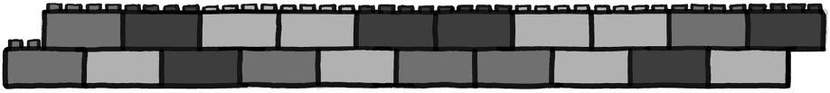
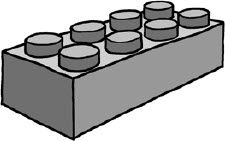
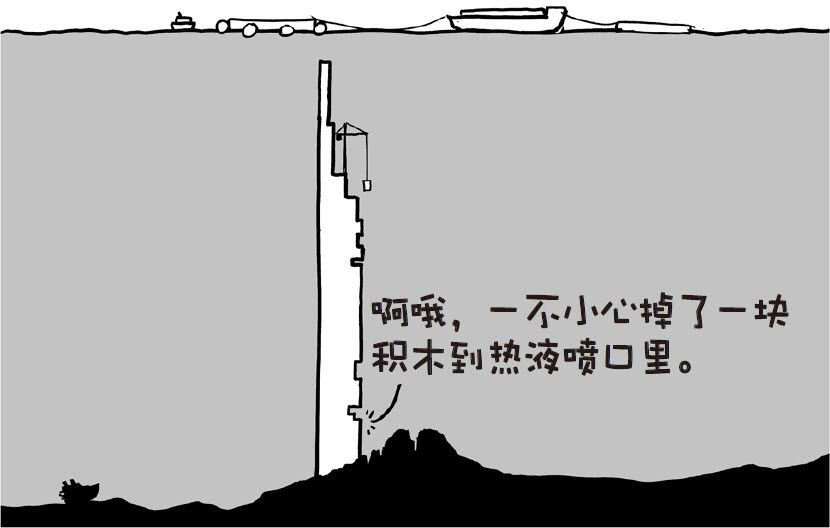
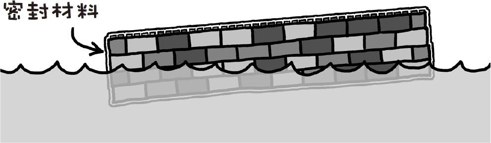
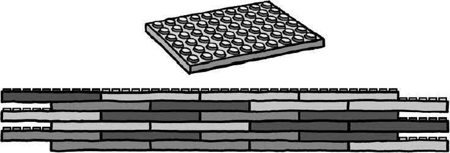
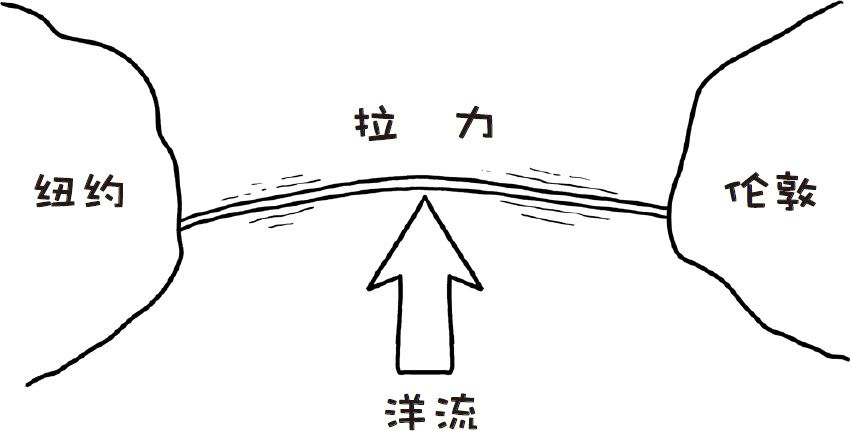
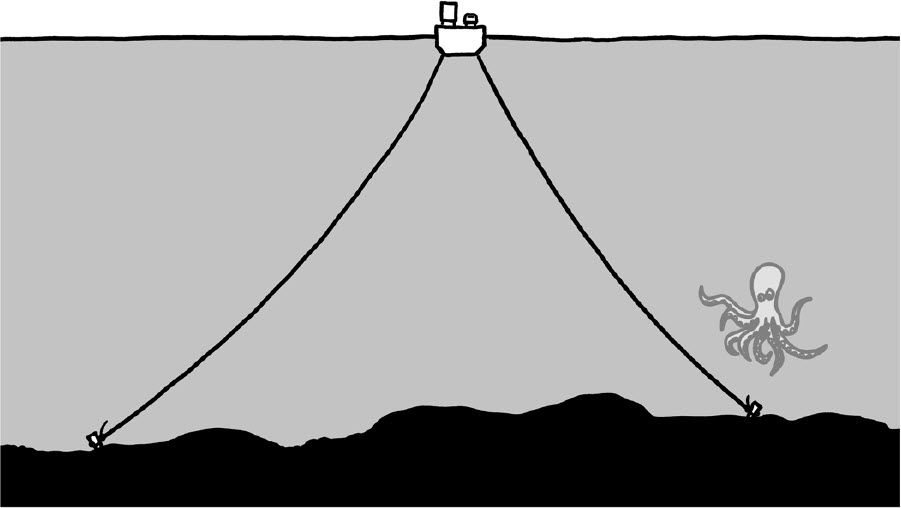
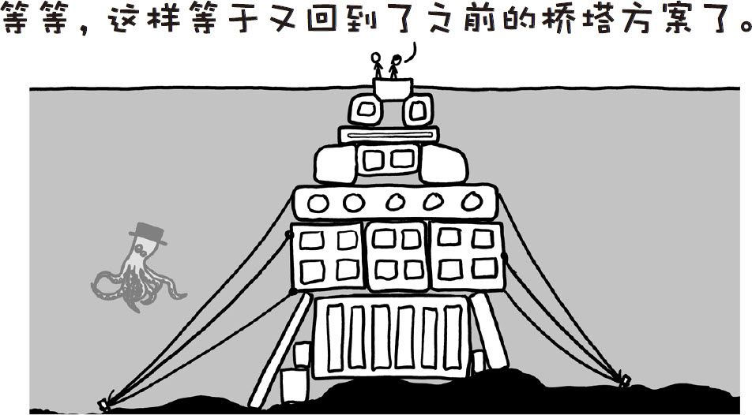
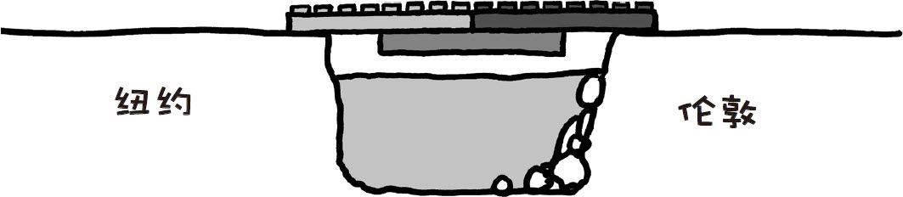

# 乐高大桥
###### LEGO BRIDGE
### Q．要想用乐高积木搭一座连接纽约和伦敦的大桥需要多少积木？已经生产出来的乐高积木数量够建造这么一座大桥吗？

——杰瑞·彼得森

***
### A．野心先不要这么大。
#### 连接两座城市
全世界当然有足够连接纽约和伦敦的Lego[^1]积木。如果用LEGO[^2]“单体”来作为衡量标准的话，纽约和伦敦相距7亿块单体。这意味着如果你像这样搭积木……

……则会需要3.5亿块积木。不过造出来的桥连自身的完整性都不能保证，而且任何比LEGO®[^3]小人大的东西都放不上去。但这是一个很不错的开头。

全世界已经生产出来的Lego[^4]积木超过4000亿块，但其中又有多少是可以拿来建造这座乐高大桥的砖块，又有多少是丢失在地毯当中的乐高小人护目镜呢？

假设我们用的是最普通的2×4 LeGo[^5]积木。

丹·博格是一位Lego[^6]套装档案保管员，同时也是Peeron.com乐高数据网站的运营专员，用他整理出来的数据我粗略估计了一下：每50～100块乐高积木中就有一块2×4的长方形积木。这意味着全世界一共有50亿～100亿块2×4乐高积木，这些积木足够建造我们那个一块积木宽的乐高大桥了。

#### 承载汽车
当然了，如果我们想让正常的汽车能够开上乐高大桥，那么大桥需要变得更宽一些。

我们可能还想让乐高大桥浮起来。大西洋很深，所以我们希望尽可能别建造一个5千米高的乐高桥塔。

一块块拼起来的乐高积木并不具有防水性[^7]，而且制作乐高积木的塑料密度大于水。这个问题很好解决：我们在外表面涂一层密封材料，这样整个积木块的密度就比水小了。

每排开1立方米的水，我们的乐高大桥能够浮起400千克的物体。一辆普通的私家车质量接近2000千克，所以每开上去一辆车，乐高大桥的体积就至少要增加10立方米。

如果我们造出1米厚5米宽的大桥，它自身浮在水面上应该没什么问题——虽然突出海平面只有一点点距离——汽车开在上面也会很稳当。

Legos[^8]积木强度非常高。根据英国广播公司（BBC）的研究结果，如果你把2×2的乐高积木一块一块往上叠，需要叠25万块积木才能让最下面那块积木崩溃。[^9]

这种想法遇到的第一个问题是世界上没有足够的乐高积木来建造出这种样式的乐高大桥。第二个问题和海洋有关。

#### 极大的力
北大西洋风暴频发，也许我们的乐高大桥能够避开墨西哥湾流中快速移动的那部分，但它仍然会受到强风和大浪的冲击。

我们的大桥能造得多结实？

好在有南昆士兰大学的研究人员特里斯坦·洛斯塔奇，我们能够获取某些种类乐高连接件的抗拉强度。和英国广播公司得出的结果相似，他们得出的结论也是乐高积木非常结实。

最佳的设计是把又长又薄的盘片互相重叠放在一起：

这样的设计结构强度非常高——抗拉强度和混凝土有得一比——但还是远远不够用。大风、海浪和洋流会把大桥的中部往一个方向推，在桥身中产生出极大的拉力。

解决这个问题的传统方法是把桥身锚定在地面上，这样桥体就不会往一个方向漂出太远的距离。如果我们还允许用绳索来建造乐高大桥，[^10]]我们就可以用绳索把巨大的桥身锚定在海床上。[^11]

但问题还没解决呢。一座5米宽的桥或许可以在平静的小池塘里浮起一辆汽车，但我们的乐高大桥需要在大风大浪的情况下仍然保持位于大浪上方。开阔海面上普通的浪高可达数米，因而我们需要让桥面浮在离水面至少4米的地方。

我们可以通过增加气囊和空心腔体来增加整体的浮力，但这样一来我们需要加宽桥面，否则它就会翻转倾覆。这意味着我们需要动用更多的锚，锚上还要绑上浮筒以防止沉下去。增加的浮筒会增大阻力，会在绳索中产生更大的应力，把整个桥体往下拉，这样一来我们又需要更多的浮筒……

#### 海床
如果我们打算把大桥建造在海床上，那么会面临许多问题。在巨大的压强下，气囊完全无法张开，因而整个结构必须要承载自身的重量。要解决洋流冲击带来的问题，我们需要把桥造得更宽。于是最后我们相当于造了一条铺道出来。

这样的一个副作用是北大西洋洋流将会被阻断，气候科学家表示由此引起的后果“很有可能是很糟糕的”。[^12]

此外，我们的大桥还会穿过大西洋中脊上方。大西洋海床正在从中间的一条裂缝向两边延伸，速度大约是每112天移动1块乐高积木的距离。因而我们需要在桥身上设置伸缩缝，或者频繁地去大洋中间添加几块积木。

#### 造价
乐高积木由ABS塑料制成，在写这篇文章时这种材料的成本约为每千克1美元。即使我们使用最简单的设计方案，就是那个用几千米长的铁索的那个方案，[^13]也要花费至少5万亿美元。

考虑一下：伦敦整个地产市场的价值也就2.1万亿美元，跨大西洋海运的价格约为每吨30美元。

这意味着把大桥的总造价里拿出一部分就够买下伦敦所有的地产，并且还剩下足够多的钱把这些地产一块一块全部海运到纽约。然后我们可以在纽约港一座新的小岛上再把这些房子一块一块地原样拼回去，之后再在两个“城市”间用一个简单无比的乐高大桥连接起来。

`剩下的钱没准还够买一个很赞的乐高千年隼号战舰套装。`

[^1]:管乐高积木的狂热爱好者会指出商标应该写作“LEGO”。
[^2]:实乐高集团官方要求写成“LEGO®”。
[^3]:过作者就没有法律义务把商标符号也写上去。维基百科样式指南授意写成“Lego”。
[^4]:基百科上的写法也是争议重重。人们激烈讨论了好几页，其中还包括了许多没有法律依据的违法警告。人们还就是否要用斜体而争论不休。
[^5]:吧，没人会这么写。
[^6]:样还行。
[^7]:用：我曾经用乐高积木搭了一艘船，我把它放在水里，然后它就沉了。:(
[^8]:觉得我要因此收到许多愤怒的投诉邮件了。
[^9]:许那天没什么好新闻。
[^10]:还有密封材料。
[^11]:如果我们只能用乐高组件的话，可以用那些包括小尼龙绳的套装。
[^12]:他们会继续问道：“等等，你刚说你打算造什么来着？”以及“你是怎么进来的？”
[^13]:我最喜欢的《老友记》剧集。
