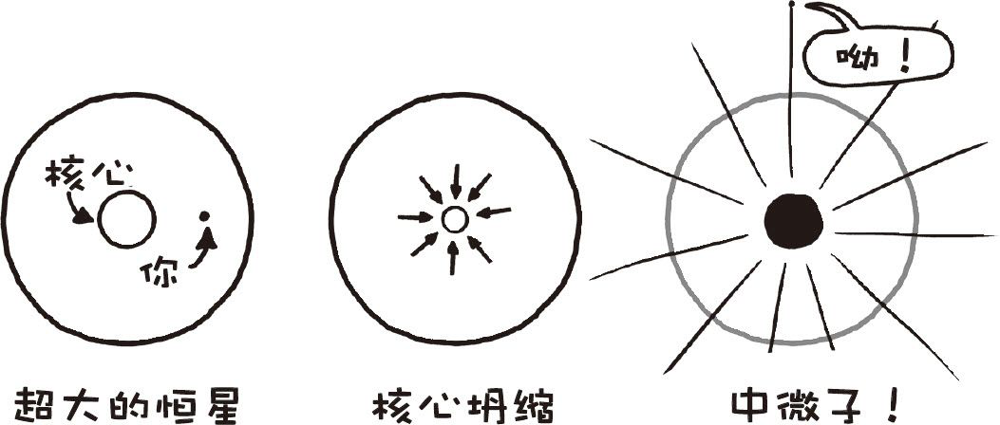
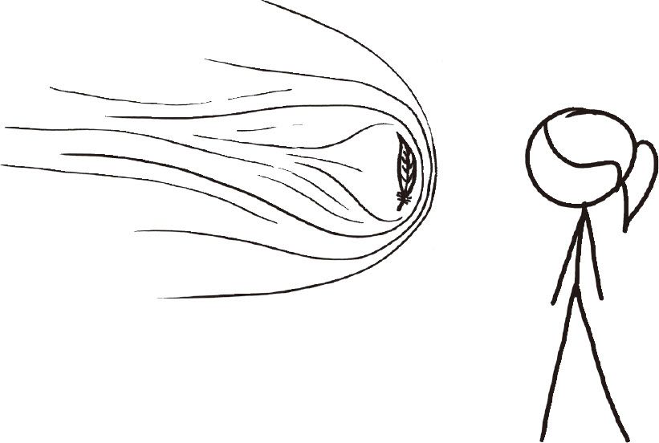

# 致命中微子
###### LETHAL NEUTRINOS
### Q．一个人要离超新星多近才能受到致命剂量的中微子辐射？

——唐纳德·斯佩克特博士

***
### A．“致命剂量的中微子辐射”这一说法很奇怪，我脑子转了好几圈才反应过来。
如果你不是物理专业人士，你可能不觉得有什么奇怪，所以我要给你科普一下为什么这个说法让人很摸不着头脑：

中微子就像幽灵一般，它几乎不与任何物质发生反应。看看你的手——每秒钟有约1万亿个来自太阳的中微子穿过你的手掌。

`好了，别一直看着你的手了。`

那么你为什么没有感受到汹涌的中微子洪流呢？这是因为，这些中微子几乎不与常见物质发生作用。平均来说，在这股中微子洪流中，每几年才会有1个中微子直直“撞上”你身体中的某个原子。[^1]

实际上，在中微子面前地球也几乎是透明的，来自太阳的几乎所有中微子都能丝毫不受影响地穿过地球。为了探测到中微子，科学家们建造了装有数百吨物质的大箱子，希望能记录到哪怕是一个来自太阳的中微子与这些物质发生碰撞的记录。

所以说，如果一个粒子加速器（会产生中微子）想给世界其他地方的探测器发送中微子的话，它只需要直直地瞄准探测器就行了，即使探测器在地球的另一端也无所谓！

这就是为什么“致命剂量的中微子辐射”听起来很怪异——它把风马牛不相及的数量级混在了一起。这就像说“用羽毛把你打倒在地”或者“装满了蚂蚁的体育馆”一样，[^2]如果你有数学背景，这有点类似于看到ln(x)e这样的表达式——我不是说它字面上没有意义，只是你很难想象哪里会真的出现这种情况。[^3]

同样，你甚至都难以制造出足够多的中微子让它们中哪怕只有一个和物质发生反应，要想象在什么样的场景下会有足以对你造成伤害的中微子就更难了。

但超新星能够提供这样的场景。[^4]问我这个问题的霍巴特和威廉姆史密斯学院的物理学家斯佩克特博士告诉我，他推测和超新星相关的数字时的经验法则是：不管你认为超新星有多大，它们其实比你以为的更大。

让我给大家直观地比较一下。按照你的视网膜所接收到的能量来算，以下两者哪个更亮：

在一个日地距离以外观看一颗超新星，还是在你眼珠前爆炸的氢弹？

`求你快点引爆这个炸弹吧，它太重了。`

运用那位物理学家的经验法则可知，超新星更亮一些。其实它们差了……整整9个数量级。

这也正是这个问题的优雅之处所在：超新星巨大到难以想象，而中微子又飘渺到难以想象。在哪个距离上这两个难以想象的事情会相互抵消，并对人体产生影响？

辐射专家安德鲁·卡拉姆的一篇论文给出了答案。这篇论文指出，在某些超新星核心坍缩成中子星的过程中会放出多达1057个中微子。（每个发生坍缩的质子都会放出一个中微子。）

卡拉姆计算出在1秒差距[^5]距离上的中微子辐射剂量约为0.5纳西弗，也就是吃一根香蕉所受辐射的1/500。[^6]

致命剂量的辐射量约为4西弗。利用平方反比律，我们可以计算出辐射剂量：

2.3个天文单位比太阳和火星之间的距离要远那么一点。

发生核心坍缩的超新星此前都是巨大的恒星，因此如果你在那个距离观看超新星，那么你将位于恒星的外层内部。

`GRB#0103898是观测到的最为剧烈的超新星——尤其是对就飘在它旁边的人来说`

中微子辐射伤害的计算进一步加深了你对超新星究竟有多大的理解。如果你在一个天文单位外观察超新星——并且通过某种手段你没有烧起来，也没有气化，或是变成某种奇异等离子体——那么单单是汹涌而来的幽灵般的中微子就足够置你于死地。

如果速度够快的话，一根羽毛也绝对能把你撞倒。

[^1]:如果你是个孩子的话频率可能更低一些，因为你身体里的原子也少嘛。从统计学角度来看，中微子第一次撞击到我身体里的某个原子应该是在我10岁左右的时候。
[^2]:只占全世界蚂蚁的1％还不到。
[^3]:如果你想为难刚学微积分的学生的话，问他们ln(x)e的导数是什么。看上去应该是1或者其他什么简单的表达式，但其实不是。
[^4]:拼成supernovas还说得过去，拼成supernovii就算了吧。
[^5]:约3.262光年，或者说比地球到半人马座α的距离略短一些。
[^6]:辐射计量表：    
