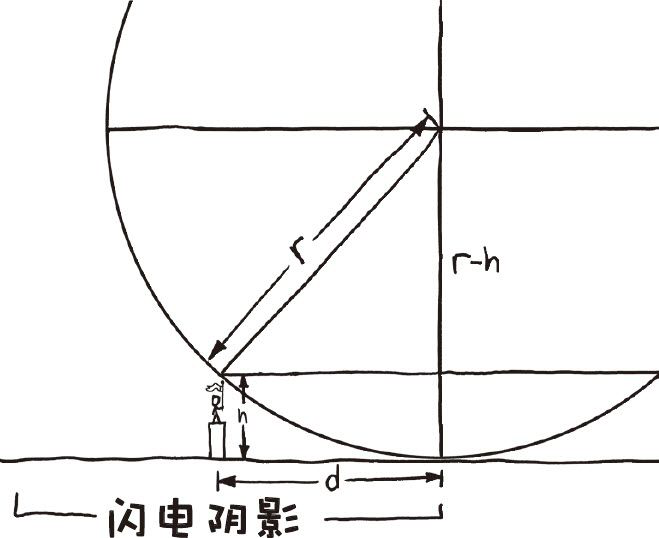
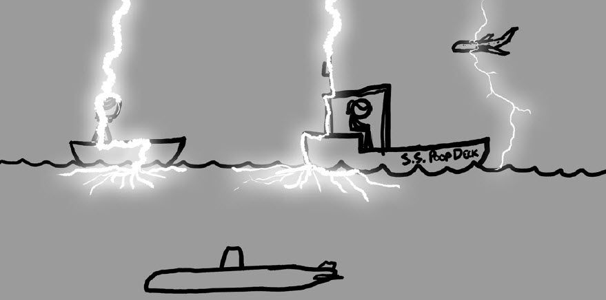
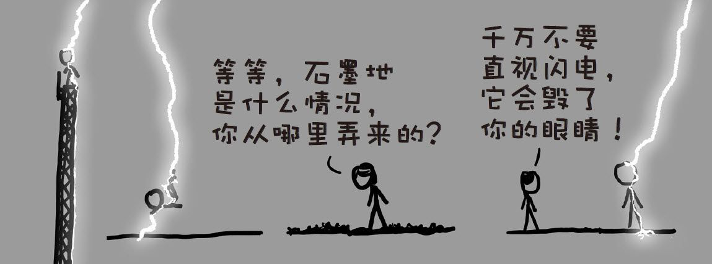
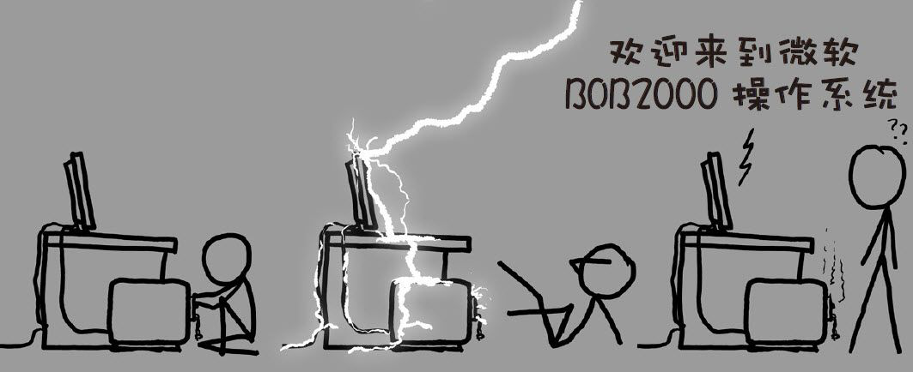

# 闪电
###### Lighting
***
在开始之前，我想强调一下：**我不是闪电安全方面的专家。**

我只是网络上一个画漫画的漫画家，我喜欢看到东西着火或者爆炸，所以这意味着我并没有把你的利益放在心上。在闪电安全方面的权威是在美国国家气象局工作的人们。[^1]

好了，牢记这一点后，我们回到正题上来。

要回答下面的问题，我们首先需要弄清楚闪电的传播路径。这里我教大家一个估测的小窍门：假想一个半径60米的大球[^2]在地表滚动，途中球碰到的地方就是闪电可能击中的地方。在这篇文章中，我将回答许多个关于闪电的不同问题。

人们总说闪电会击中附近最高的东西。这种极其含糊的说法简直就是个招人质疑的活靶子，“附近”是多远？我说，好像不是所有的闪电都会击中珠穆朗玛峰吧。但闪电会击中人群中长得最高的人吗？我所知道的最高的人应该是瑞恩·诺斯[^3]了。那出于安全考虑，我是不是只要站在他旁边就不会被闪电击中了呢？如果是其他原因呢？也许我应该回答问题，而不是提出问题。

那么闪电是如何选择目标的呢？

闪电最先会形成一个叉状电荷，又被称为先导。先导会从云端伸出向下延伸，以每秒几十到几百千米的速度向地面传播，在几十毫秒的时间内穿过几千米长的空气到达地面。

先导中的电流相对较小，大约在200安培这个数量级，这点电流也足够电死你了，但与之后发生的相比就有点相形见绌了。一旦先导接触到地面，云层和地面之间就会发生剧烈的电荷中和过程，放电电流将会超过2万安培。在这个过程中你就会看到一道亮眼的闪光，接着先导会以光速的几分之一速度原路返回，在不到1毫秒的时间内就能回到云端。[^4]

我们看到的闪电“击中”地面的地方，就是之前先导最先接触到地面的地方。先导在空气中呈跳跃状向下传播，它最终会向着（通常是）地面上的正电荷前进。不过，它在决定下一步跳向哪里时只能“感知”尖端附近几十米范围之内的电荷。如果在这个范围内地面上连着什么东西，那么闪电就会跳到这个东西上，否则就会半随机地挑选一个方向，然后重复这一过程。

为了找出闪电会击中哪里，你在地面上滚动着这个假想的半径60米的球。[^5]这个大球会爬到树上或建筑上面而不会穿过它们（也不会把它们卷进去）。与大球表面接触的地方——树顶、栅栏以及正在打高尔夫的人——都是潜在的被雷击的目标。

这样你就可以计算一个在平面上高度为h的物体的闪电“阴影”。

$$
阴影半径 = \sqrt{-h(h-2r)}
$$

在这个阴影里，先导更倾向于击中这个高高的物体，而不是它周围的地面。

然而位于这个阴影中并不意味着你就安全了——事实常常相反。当电流流到那个高高的物体上之后，它会接着四散流到地面上。如果你碰到了附近的地面，电流就有可能从你的身体中流过。2012年在美国因雷击致死的28人中，有13个人是站在树下面或附近。

有了这些基本知识，在接下来的几个问题中，我们来看看在给定情况下闪电的可能路径。

---
### Q．在电闪雷鸣的时候待在泳池里到底有多危险？

### A．相当危险。水是可以导电的。
但最大的问题不在于此——最大的问题在于如果你正在游泳，那么你的头会露在一大块平整表面的外面。即使闪电击中的是你周围的水，那也是非常危险的。2万安培的电流会向四周扩散——绝大部分沿着水面——但你在不同距离下各会受到多大程度的电击是很难计算的。

我估计至少在几十米的范围内你会处于极度危险之中，在淡水中这个距离会更大，因为电流更喜欢从你电阻小的身体中流过。

如果你在洗澡或站在瀑布底下的时候被闪电击中呢？

水雾并不会威胁到你，它们只不过是空气中一堆分离的水滴。真正对你产生威胁的是你脚底下的浴缸，以及和水管接触的那摊水。

---
### Q．如果我在船上或飞机上被雷击了会怎么样？在潜艇上呢？

### A．没有船舱的船安全性和平坦的高尔夫球场差不多。
配备封闭船舱和闪电保护系统的船只和汽车差不多安全，潜艇的安全性和水下的保险箱差不多。（不要把水下的保险箱和潜艇里的保险箱搞混了：潜艇里的保险箱可比水下的保险箱保险多了。）[^6]

---
### Q．如果你在广播信号塔上更换灯泡时被雷击了会怎么样？如果你在做后空翻的时候被击中了呢？或者站在一片石墨地上呢？又或者抬头盯着闪电看呢？

### A．

---
### Q．闪电击中飞行途中的子弹会发生什么？

### A．子弹不会影响闪电经过的路径。
你必须精确地把握好时机，这样才能让子弹在闪电回击的那一刻恰好位于闪电路径之中。

闪电路径的核心部分直径大约为几厘米，而AK-47步枪使用的子弹长度约为26毫米，每毫秒能够前进约700毫米。

子弹的铅质核心外面包了一层铜质外壳。铜是电的优良导体，2万安培电流中的大部分都将轻易地流过子弹走捷径。

令人惊讶的是，闪电并不会对子弹造成什么伤害。如果子弹静止不动，那么通过的电流将会很快加热并熔化子弹上的金属材料。但由于子弹的飞行速度太快，它在离开闪电通道的时候自身仅被加热了几摄氏度，子弹会几乎不受任何影响地继续飞向目标。闪电周围的磁场和流过子弹的电流会产生一些有意思的电磁力，但所有我检验过的电磁力中没有一个会显著影响最后的结果。

---
### Q．如果你在雷暴天刷BIOS的时候被雷击了会怎么样？

### A．

[^1]:[http://www.lightningsafety.noaa.gov/](http://www.lightningsafety.noaa.gov/)
[^2]:或者滚一个真的球……
[^3]:古生物学家估计他直立时肩膀处有将近5米高。
[^4]:虽然这个过程又被称为回击，但电荷是向下流动的，然而放电看上去是向上传播的。这有点像当交通信号灯从红灯变为绿灯时，前面的汽车开始移动，然后才是后面的汽车，看上去汽车运动是向后传播的。
[^5]:出于安全原因，不要用真的球。
[^6]:译者注：submarine既有潜艇之意又有水下之意，safe既有安全之意又有保险箱之意。