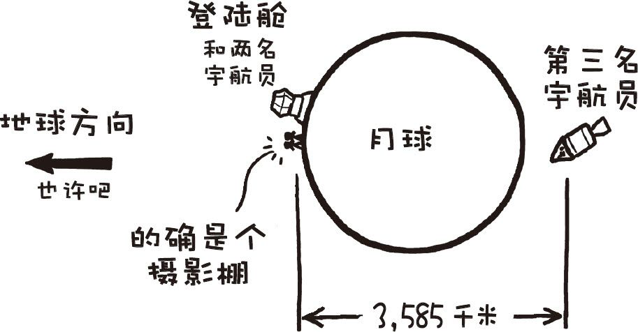
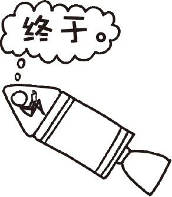

# 最孤独的人
###### LONELIEST HUMAN
### Q．在这个世界上离其他活人最远的人是谁？他们孤独吗？

——布赖恩·J．麦卡特

***
### A．这问题很难给出确定的答案！
最有可能的人是阿波罗登月计划中曾待在位于月球轨道上的指令舱里的6位宇航员了，他们分别是：迈克尔·科林斯、迪克·戈登、斯图尔特·罗萨、阿尔弗莱德·沃尔登、肯·马丁利和罗纳德·埃万斯。

在每次任务中都会有一位宇航员留在指令舱中，与此同时另两位宇航员会踏上月球表面。当指令舱位于轨道的最高点时，登陆月球的宇航员离留守指令舱的宇航员约有3585千米。

换个角度看，这也是其余的地球人和这些宇航员相距最远的时候。

也许你以为这些宇航员获此殊荣是板上钉钉的事了，但别这么急着下结论，还有一些人可能离这一殊荣也不远！

#### 波利尼西亚人
从一个永久居住地往外数3585千米[^1]而碰不到一个活人几乎是不可能的。但第一个跨过太平洋的波利尼西亚人却很有潜力，不过这需要一个孤独的水手比他的队友快出一大截。这种情况是有可能的——也许某个人意外地被风暴卷入大海并远离伙伴——但我们恐怕永远也无法确定。

自从太平洋成了人类殖民地的一部分后，便很难在地球表面找到在3585千米内看不见活人的地方了。现在南极洲都有驻留的研究人员，就更别想找到这种地方了。

#### 南极探险者
在南极探险时代中，有一些人曾经离那些宇航员所获得殊荣非常之近，其中之一没准是纪录的真正保持者。有一个离纪录很近的人叫罗伯特·斯科特。

罗伯特·福尔肯·斯科特是个英国探险家，但他的生命最终以悲剧结尾。1911年，斯科特带领的团队到达南极点，却发现挪威探险家罗尔德·阿蒙森早在几个月前就已抢先到达。失望的斯科特和他的同伴开始往回走，但在穿越罗斯冰架时他们最后都遇难了。

最后遇难的那位探险队成员在很短的一段时间里，应该可以说是世界上最孤单的人之一了。[^2]但不管他是谁，在他周围3585千米范围内仍然找得到活人，包括其他南极探险者的前哨站以及在新西兰雷奇欧拉（斯图尔特岛）上的毛利人。

除此之外，还有其他一些人可以角逐这一称号。一位法国水手皮埃尔·弗朗索瓦·普莱斯声称他曾被流放到南印度洋上的阿姆斯特丹岛。如果确实如此的话，他很接近于宇航员们保持的纪录，但他还是离毛里求斯、澳大利亚西南部以及马达加斯加沿岸不够远。

也许我们将永远无法准确地知道谁是最孤独的人。也许是某个因船只沉没而漂泊在南半球大洋上的18世纪的水手。但在有力的历史证据出现之前，我还是觉得那6位执行阿波罗任务的宇航员才该获得这一称号。

于是我们继续看布赖恩的后半个问题：他们孤独吗？

#### 孤独
返回地球后，阿波罗11号指令长迈克尔·科林斯表示，他一点儿都不觉得孤独。他在描述这一经历的书《带着希望的火种：一位宇航员的旅程》中写道：

>我丝毫不觉得孤独或者被遗弃。相反，我觉得自己是月球表面上发生的一切的一部分……但我并不是说我没有一种孤寂感，这种感觉确实存在，尤其是当我转到月球的背面，和地球通信的无线电信号突然中断的时候。我现在是一个人，真的是一个人，与任何已知的生命形式隔绝。如果数一下的话，在月球的另一边有地球上的30亿人和两位登月的宇航员，而在这边只有我，加上天知道什么东西。

阿波罗15号指令长阿尔弗莱德·戈登甚至还十分享受这个过程：

>一个人是一回事儿，孤独是另一回事儿，二者全然不同。我现在是一个人，但我不觉得孤独。我曾经是一名空军飞行员，后来是一名试飞员——这期间大多数时间我都在战斗机里度过——所以我很适应这种环境。我完全享受它，我不用和戴夫和吉姆通话……在月球的背面，我甚至都不用和休斯敦联系，这真的是这次旅途中最棒的一部分。

内向的人都明白：史上最孤独的人类非常乐于享受这几分钟的安宁与寂静。

[^1]:由于地球表面有弧度，因而你需要相隔超过3619千米的地表距离才行。
[^2]:那时候阿蒙森的团队都已经离开南极大陆了。
