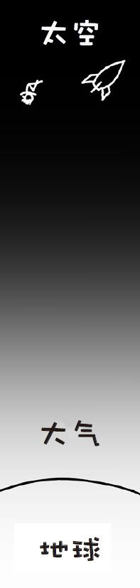
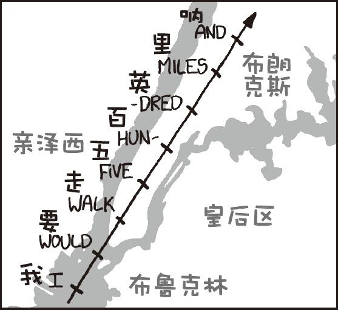
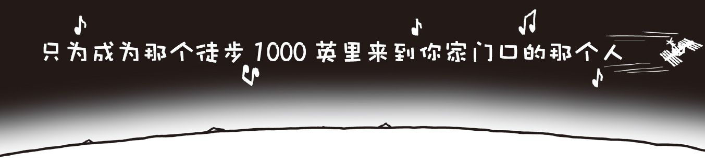

# 轨道速度
###### ORBITAL SPEED
### Q．在宇宙飞船返回再入大气层时，如果用一个像“好奇号”降落火星表面时所用的“天空起重机”，把飞船的速度降到每小时只有几千米，那是不是就可以不用热防护罩了？

——布赖恩

***
### Q．有没有一种办法可以让飞船在冲入大气层的时候避免压缩大气，这样就不再需要昂贵而又脆弱的外部热防护罩了？

——克里斯托弗·马洛

***
### Q．可不可以把一个小火箭（载有货物）提升到一个很高的地方，然后在那里只需要很小的火箭就能达到逃逸速度？

——肯尼·范德梅勒

***
### A．这三个问题问的东西本质上是一样的，而且我在其他几篇文章中也讲到过，不过现在我把它们特别拿出来讲一下：
进入地球轨道之所以困难并不是因为太空太高。

进入轨道很困难是因为你必须达到足够快的速度。

太空并不是像这样：

`未按真实比例绘制`

太空其实是这样的：

`你知道的，按真实比例绘制。`

太空大约距离我们有100千米远。它确实很遥远——至少我不想爬100千米高的梯子——但它又没有想象中的远。如果你在萨克拉门托、西雅图、堪培拉、加尔各答、海得拉巴、金边、开罗、北京、日本中部、斯里兰卡中部或者波特兰，那么你离大海的距离比你离太空的距离还要远。

进入太空[^1]很简单。虽然你确实没法开车进入太空，但这并不是一个大问题。仅靠一个电话线杆大小的探空火箭就能把一个人送入太空。要知道美国的X-15飞机就是因为飞得非常快，然后机头往上一拉进入太空的[^2]'[^3]。

`你这是来也匆匆，去也匆匆。`

进入太空容易，要留在太空中就没那么简单了。

近地轨道处的地球引力几乎和在地面上一样强。即使是空间站也没能逃离地球引力的魔爪，它受到的引力大小约是在地面上的90％。

要想不从太空掉回来，你必须要绕地球飞得足够快。

要想保持在绕地轨道的高度你需要达到每秒8千米[^4]的速度。火箭的能量只有很少一部分用来将负载带到大气层外，大部分的能量都被用于加速到轨道上侧着走的速度。

于是我们就看到了入轨的重点：达到轨道速度要比进入轨道高度花费多得多的燃料。要想把一艘飞船加速到每秒8千米需要许许多多的助推器。达到轨道速度已经很难了，还要携带足够的燃料把速度再降下来根本就是不切实际的。[^5]

如此惊人的燃料需求也是为什么飞船在再入大气层时都用热防护罩而不是反推火箭来减速——一头栽入大气层是最可行的减速方式。（至于布赖恩问的那个问题，“好奇号”也是这么减速的，它携带的反推火箭只是在接近地面时才启动，之前已经通过火星大气制动降低了一大部分的速度了。）

#### 那么，每秒8千米有多快呢？
我觉得人们之所以会有开头的那些迷惑，是因为在太空中的航天员看起来移动得并不快，他们看起来就像在慢慢飘过一颗蓝色星球。

但每秒8千米的速度是非常非常非常快的。如果你在日落时仰望天空，有时候你会看到国际空间站从你眼前飞过……然后过了90分钟，它又出现了。[^6]也就是说国际空间站在这90分钟时间里绕地球飞行了整整一圈。

如果你想和国际空间站比飞行速度的话，假设你在足球场的一端射出一颗来复枪子弹[^7]，当国际空间站跑到足球场的另一端时，子弹才刚飞了不到10米。[^8]

想象一下你以每秒8千米的速度在地球表面竞走会是什么样子。

为了让你有更直观的感受，我们不妨以歌曲的节拍来记录时间。[^9]假设你在开始时播放了1998年普罗克莱门兄弟演唱的I'm GonnaBe（500 Miles）（我要走五百英里），这首歌每分钟大约有131.9拍，所以歌曲每播放一个节拍，你就能走上2英里多。

当你唱完歌词的第一行时，你就已经从布朗克斯（纽约最北端）走到了自由女神像那儿了。

相当于你每秒能跑15个地铁站。

当你唱完第二行（16拍）时，你就能够跨越英吉利海峡了。

而这里有一个很神奇的巧合。歌曲一共有3分30秒长，而国际空间站的速度是每秒7.66千米。

这意味着如果国际空间站上的一位宇航员在听这首歌，那么在整首歌唱到最后一行时……

……他刚好跨越了约1000英里的距离。

[^1]:这里是指国际空间站或者航天飞机所在的近地轨道。
[^2]:X-15曾两次飞到太空，皆由约瑟夫·沃尔克驾驶。
[^3]:记得是往上拉机头，而不是往下，否则你就要悲剧了。
[^4]:如果是在近地轨道较高处的话这个数字会小一些。
[^5]:指数式增长是火箭科学中的核心问题：速度每秒提升1千米，就需要自身质量×1.4千克的燃料。进入轨道要加速到每秒8千米，这需要1.48≈15倍自身重量的燃料。用火箭减速也会面临相同的问题，速度每减少每秒1千米，就需要1.4倍自身质量的燃料。如果想要减速到零，并轻柔地再入大气层，那么还需要额外的15倍自身质量的燃料。
[^6]:网上有许多软件可以帮你找到国际空间站和其他一些卫星的位置。
[^7]:足球或橄榄球都行。
[^8]:这么玩在澳大利亚是被允许的。
[^9]:心肺复苏也会用歌曲的节拍计算时间，使用的歌曲是Stayin' Alive（活下去）。
