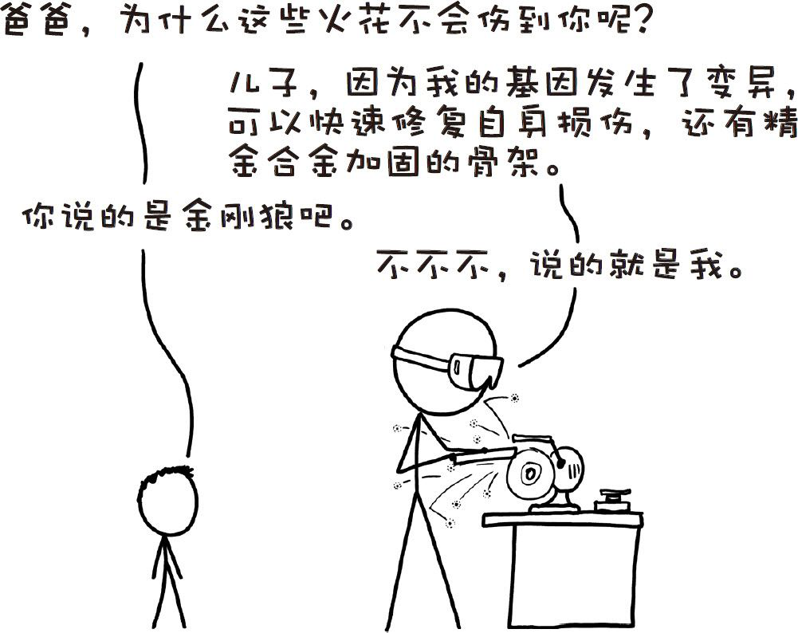
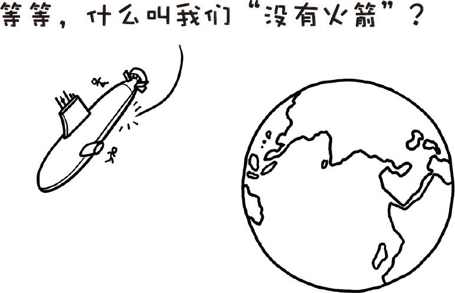
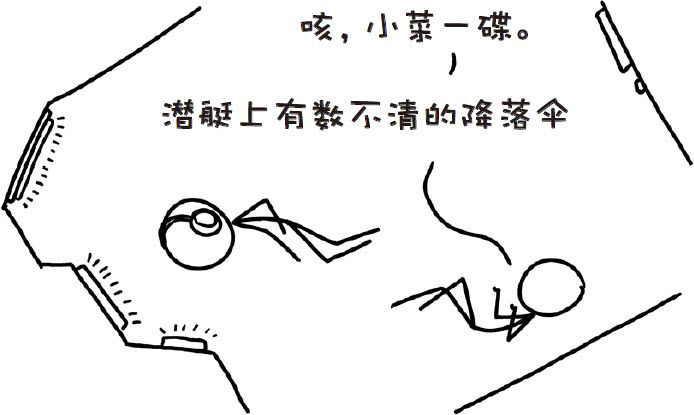

# 太空潜水艇
###### ORBITAL SUBMARINE
### Q．核潜艇在近地轨道太空中能坚持多久？

——贾森·拉思伯里

***
### A．潜艇本身不会有什么问题，但里面的艇员可就有麻烦了。
潜艇不会在太空中爆炸。潜艇的外壳强度足以承受50～80倍大气压的外部水压，所以承受内部的一个大气压对它来说根本不是问题。

潜艇的整个艇体应该是气密的。虽然水密并不意味着它能防止气体泄漏，但潜艇能在50个大气压下保证不漏水这一事实，应该能够说明至少空气不会泄漏得太快。潜艇上或许会有一些专门设计用来释放空气的单向阀门，但总体来说潜艇应该算是密封的。

艇员面对的问题显而易见：空气。

核潜艇使用电力从海水中提取氧气。但在太空中没有水，因而也没法用来产生更多的空气。潜艇上备有一些应急的氧气储备，可以供艇员用上几天，但最终他们还是会面临氧气用尽的困境。

他们可以使用反应堆来保持温暖，不过他们需要小心掌握好尺度，因为海洋比太空更“冷”一些。

严格来说，这句话是不对的，所有人都知道太空非常寒冷。太空飞船在太空中过热的原因在于太空的热传导性能不如海水，所以热量在太空飞船中聚积的速度比在海里的更快。

但如果你在咬文嚼字上更进一步，这句话也是正确的。海洋确实要比太空更冷。

星际空间非常寒冷，但在太阳（或地球）附近其实是非常热的！

之所以太空看起来没有那么热，是因为“温度”的定义在太空中有点不那么适用。太空很冷，是因为它太空了。

温度描述的是一堆粒子的平均动能的大小。在太空中，一个个分子都有着很高的分子平均动能，只是它们数量太少影响不到你。

在我还小的时候，我家地下室里有一个机械小作坊。我记得我曾经看着我爸使用一台金属研磨机，每当金属接触砂轮时都会有四散飞溅的火花，许多火花飞到了他的手上或衣服上。我当时不能理解为什么我爸不会受伤，因为那毕竟都是几千摄氏度的火花。

后来我才知道火花不会伤人的原因是它太小了，它所携带的那一丁点儿的热量会被人体吸收，只影响到极小一部分皮肤。

太空中那些“热”分子就像我爸作坊里的火花，它们可能很热也可能很冷，但它们的体形过于微小，就算碰到了也不会对你产生多大影响。[^1]相反，潜艇里是变热还是变冷则取决于产生多少热量，以及你能多快地把这些热量排出去。

现在你的周围没有一个温暖的环境能把热量辐射回来，因此你通过辐射流失的热量会比在正常情况下快许多。不过没有了周围的空气从你体表带走热量，你因对流而流失的热量也同时减少了。[^2]对于大多数载人飞船来说，后者更值得关注。他们要面临的最大问题不是保持温暖，而是保持凉爽。

在水温为4℃的海洋中，核潜艇显然有能力在舱内维持一个可供生存的温度。不过要想在太空中维持这个温度，处于地球的阴影中时，潜艇流失热量的功率约为6兆瓦，而艇员们散发热量的功率只有20千瓦，就算加上太阳直射时的几百千瓦日暖[^3]也不够，所以他们必须打开反应堆来供暖。[^4]

为了脱离地球轨道，潜艇需要把速度降到足够低的程度，这样才能重返大气层。但没有火箭，它无法完成。

好吧，严格地来说，潜艇上是有火箭的。

不幸的是，潜艇上的“火箭”的朝向不对，没法把潜艇推离轨道。火箭靠自身携带的燃料推进，意味着发射火箭的后坐力极小。当枪射出子弹时，枪其实在把子弹向前推。但如果是火箭的话，你只是启动了火箭，然后它就自己飞走了。发射艇载导弹并不能向前推动潜艇。

但如果你不发射的话却可以。

如果把现代核潜艇中搭载的弹道导弹从发射管中取出来，调个头再塞回发射管中并点火，那么每枚导弹都能使潜艇的速度提升改变约每秒4米。

典型的脱离轨道机动需要使速度降至大约每秒100米，这意味着“俄亥俄级”核潜艇上搭载的24枚“三叉戟”导弹就足够使自己脱离地球轨道了。

脱离轨道后，由于潜艇并不配备散热用的隔热瓦，在超音速下也不具有空气动力稳定性，因而它将不可避免地开始翻转并在空中解体。

如果你能挤进一个正确的缝隙中，并且把自己绑在加速度座椅上，那么你有很小很小很小的几率能够撑过剧烈的减速阶段。之后你需要在潜艇撞击到地面之前带上一个降落伞跳出残骸。

如果你真的打算这么做（我并不推荐），有一个绝对重要的事情你需要牢记在心：

记得解除导弹上的引爆装置。

[^1]:这也是为什么即使火柴和火炬的火焰温度差不多，在电影中你只会看到那些大块头们用手一捏就能灭了火柴，但绝不会看到他们对火炬做同样的事情。
[^2]:通过热传导流失的热量也变少了。
[^3]:apricity，这是我最喜欢的一个英文单词，它的意思是冬日里的阳光。
[^4]:当他们朝太阳方向运行时，潜艇的表面会升温，但整体热量流失的速度仍然大于热量获取的速度。