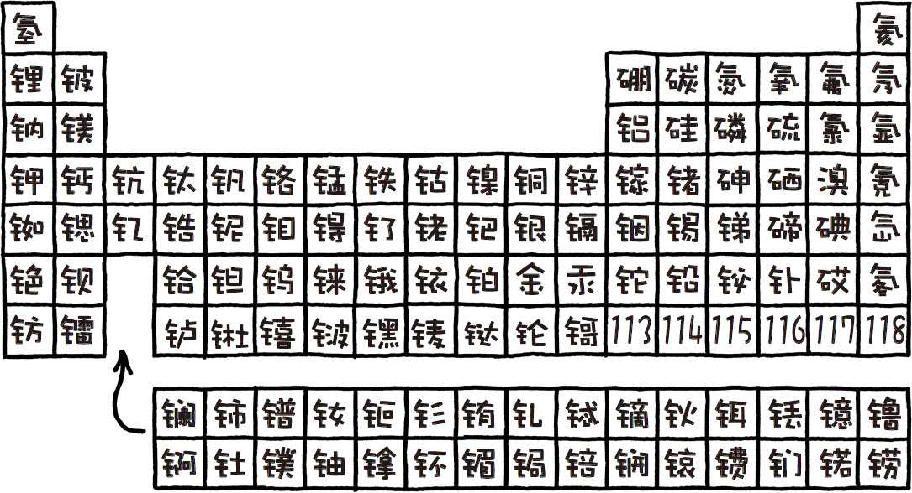
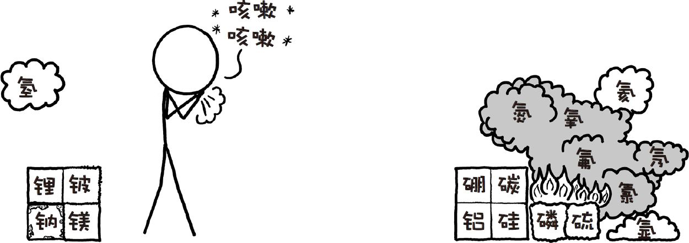
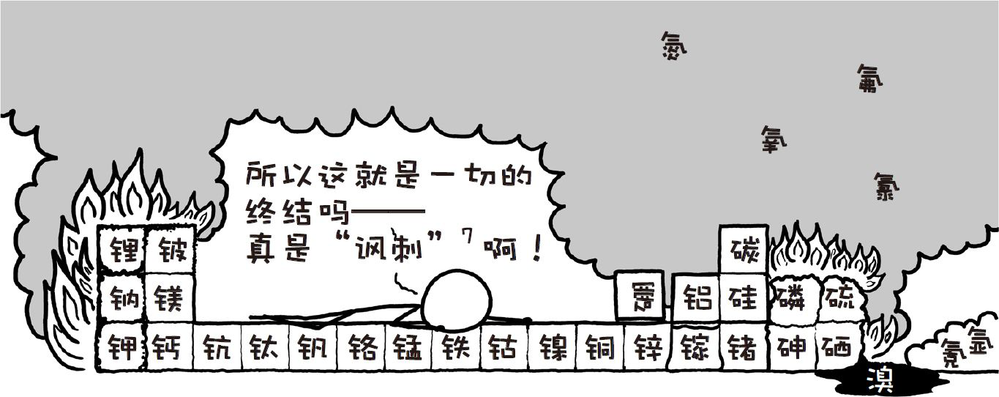
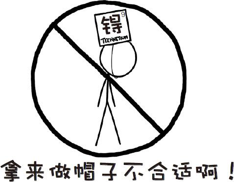
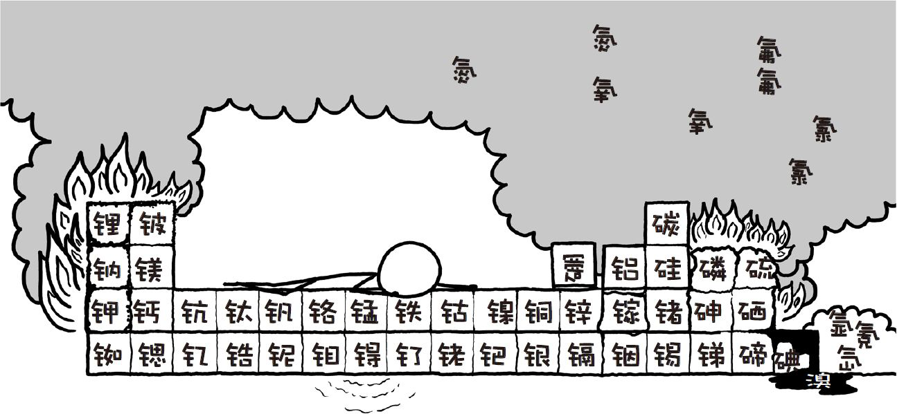
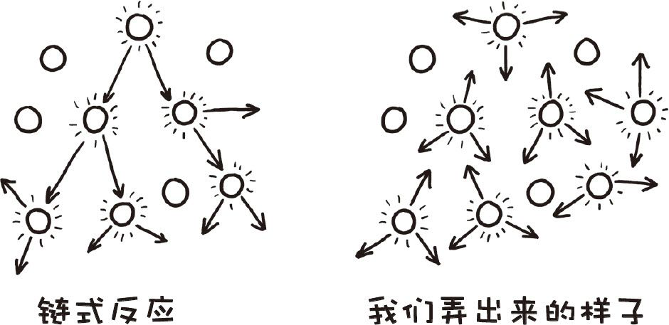
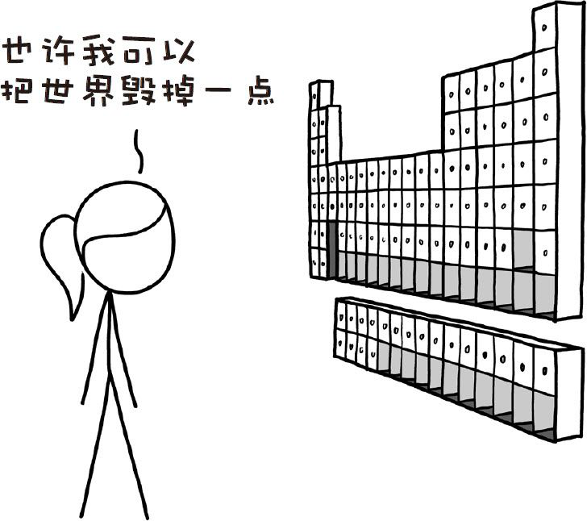

# 元素周期墙
###### Periodic Wall of the elements
### Q．如果你把元素周期表里的元素制作成立方砖头，并按照周期表的排列方式把这些方块一个个排起来，会发生什么？

——安迪·康诺利

***
### A．确实有人收集各种元素。
他们会试图收集尽可能多的元素的物理样本，并把它们放在类似于元素周期表的展示盒里。[^1]

在所有的118种元素中，有30种（如氦、碳、铝和铁）能在本地的零售超市里买到纯净的样品。另有几十种元素可以通过拆解某些东西得到，比如你可以在烟雾探测器中找到微量的镅。另一些元素你可以在网上买到。

总的来说，搞到其中近80种元素的样品还是可行的。如果你愿意牺牲一下你的健康、安全和逮捕记录的话，你可以弄到90种。而剩下的那些元素，不是太具有放射性，就是半衰期太短，一次最多只能获得几个分子。

但如果你真的搜集到了所有元素的样品呢？

元素周期表有7行。[^2]

* 前两行元素堆起来没什么大问题。
* 第三行元素会让你烧起来。
* 第四行元素产生的有毒烟雾会让你丧命。
* 第五行元素会造成以上所说的所有后果，还会使你受到一点辐射。
* 第六行元素会剧烈爆炸，会毁掉整幢房子，伴随着具有放射性并且有毒的大火以及满地的尘土。
* 不要拼出第七行。

我们一行一行来讨论。首先是第一行，简单得有些无聊。

氢立方体会慢慢上升并扩散，就像没有气的气球一样。氦立方体也是一样。

第二行就有些复杂了。

锂会立即失去光泽。铍有很强的毒性，所以你处理起来要小心一些，不要让任何碎屑飞到空气中。

氧气和氮气会飘来飘去，慢慢扩散开来。氖则会向上飘走。[^3]淡黄色的氟气会在地上铺展开来。氟是元素周期表中反应活性最高、腐蚀性最强的元素。几乎任何其他元素接触到纯氟时都会自发地燃烧起来。

我咨询了化学家德雷克·劳维[^4]，他表示氟不会与氖反应，而且“会和氯达成某种意义上的武装停火协议，但别的东西嘛，啧啧”。氟遇到后几排的元素也会引起麻烦，如果空气中有一些水汽的话，氟还会结合水汽形成具有腐蚀性的氢氟酸。

即使你不慎呼吸到了痕量[^5]的氢氟酸，你的鼻子、肺、嘴巴、眼睛都会受到严重伤害，时间长了整个人体都会被腐蚀掉。为此你绝对需要一个防毒面具，不过你要知道氟能够腐蚀绝大多数的面具材料，所以记得在选择一款面具前先进行一下测试。玩得愉快！

下面是第三行。

`这里的数据一半来源于《物理和化学手册》，一半来自英国电视喜剧“看看你周围”。`

这一行里最惹事的是磷。纯磷有好几种存在形式，红磷可以相对安全储存，而白磷一遇到空气就会自发燃烧，并产生难以熄灭的红色火焰，而且有很强的毒性。[^6]

硫在普通情况下不会引发什么问题，再不济也就是闻起来味道不太好。不过别忘了硫的左边是熊熊燃烧的磷……右边是氟和氯。和许多其他物质一样，硫遇到纯氟气体也会着火。

惰性的氩气密度比空气大，所以它只会沉在地面上铺展开来。先别管氩气，你的大麻烦还在后头呢。

之前说到的大火会产生各种名字耸人听闻的化合物，比如六氟化硫。如果你在室内进行这个实验，那么你会被有毒烟雾呛到死，整幢房子也有可能被大火吞噬。

不过现在还只是第三行。让我们来看第四行！

[^7]

这一行的元素还会散发出可怕的气味。硒和溴会剧烈反应，劳维表示相比于燃烧的硒，“硫闻起来就像香奈儿香水”。

砷听上去就很吓人，而它的吓人理由也相当充分——它对几乎一切形式的复杂生命都是有毒的。

有些时候，这些吓人的化学品引发的恐慌是有点夸大其词。比如在我们所有的食物和水中都有痕量的砷存在，但我们的身体能够很好地处理掉这些微量砷。但现在可不是这样。

燃烧的磷（现在又加上燃烧的钾，钾和磷都很容易自燃）能够引燃砷，同时释放出大量有毒的三氧化二砷，这东西相当毒，不要吸入。

如果铝块能够经受住大火，那么你就会看到一个诡异的现象。在铝块下面熔化的镓会被铝吸收进去，破坏铝的内部结构，使其变得像浸水的纸一样又软又烂。[^8]

燃烧的硫会溅到溴块中去。溴在室温下是液体，除它以外，室温下是液体的单质就只剩下汞了。而且溴也是个很棘手的东西。到现在这份儿上，各种火焰形成的有毒化合物已经数不清了。不过如果你是在安全距离以外做这个实验的话，你还是有可能活下来的。

第五行有一个元素很有意思：锝-99，它是目前为止我们遇到的第一个带放射性的砖块。

锝是不具有稳定同位素的所有元素中原子序数最低的一个。虽然1立方分米的锝块释放出的辐射剂量不会使你丧命，但剂量还是非常大的。要是你整天戴着一顶锝做的帽子，或者呼吸它的微粒，那么你是肯定会死的。

[^9]

除了锝，第五行基本和第四行差不多。

现在到第六行了！现在无论你多么小心，这一行元素还是肯定会置你于死地。

`这个版本的元素周期表比你平常看到的要宽一些，因为我们把镧系元素和锕系元素插进了第六和第七行。（这些元素一般不放在主表中而是单独列出来，避免主表太宽。）`

元素周期表的第六行有许多放射性元素，包括钷、钋[^10]、砹和氡[^11]。砹是里面的大坏蛋。

我们不知道砹看上去是什么样子的，正如劳维所说：“这玩意儿根本就是不想存在。”砹具有极强的放射性（半衰期以小时计算），任何一块稍微大一点儿的砹块都会被自身衰变释放出来的热量气化掉。化学家猜测它的表面是黑色的，但没有人能够确切知道。

材料安全数据中没有砹这一项。假如有的话，里面大概会是一连
串血迹斑斑的“不”字。

而我们这个立方体中的砹含量将在短时间内超过有史以来所有提纯出来的砹的总量，这里我强调“短时间内”，是因为这个砹块将会迅速变成一大团炽热的气体。这股热气本身就会让任何靠近的人三度烧伤，整幢建筑也会被夷为平地。之后这团热气会迅速升入空中，同时放出更多的热和辐射。

你刚刚引发的爆炸大小刚好能让你的实验室面临最大量的文书工作。如果爆炸规模再小一些，你没准还能够私下摆平；如果规模再大一些，城市里就剩不下什么人来看你的事故调查报告了。

夹杂着砹、钋和其他放射性产物的灰尘和碎片会随着降雨落回地面，使得下风处的整块区域完全不适合人类居住。

而辐射水平也会出奇地高。鉴于每眨一次眼睛需要几百毫秒，你真的会在“一眨眼的工夫”里因辐射过量而丧命。

你的死因将会是“急性严重辐射中毒”，也就是说你其实是被煮熟了。

第七行就更糟了。

元素周期表的最后一行有各种奇奇怪怪的元素，它们被称为**超铀元素** 。在很长一段时间内，这些超铀元素的名字都是些类似于“Unununium”的临时名字，但后来它们都渐渐地有了正式的永久名字。

不过起名字这事儿倒不必着急，因为绝大多数超铀元素非常不稳定，它们只能在粒子加速器中制得，存在时间不超过几分钟。如果你有10万个（Lv）原子，一秒钟后就只剩一个了，再过几百毫秒就一个都不剩了。

但是对于我们的项目而言，很不幸，超铀元素可不会“轻轻地我走了”，它们会衰变。它们中大多数衰变出来的东西还会接着衰变。原子序数最高的那些元素的立方体会在几秒内发生衰变，同时释放出惊人的能量。

其结果不会“像核爆一样”，其结果就是核爆。不过，和裂变弹不同，它们不会发生链式反应，而就只是一个反应而已，所有衰变都发生在一瞬间。

反应产生的能量会瞬间把你（和剩下的周期墙）烧成等离子体。爆炸规模和一次中型核爆炸相当，但释放的放射性尘埃则会比后者糟糕得多——元素周期表上那些大杂烩全都在飞速地尽力变成其他什么玩意儿。

你所在的城市将会升起巨大的蘑菇云，烟柱会借着自身产生的热量一直冲上同温层。如果你所在的区域人口密集，那么瞬间造成的人员伤亡将会难以计量，而且长期的放射性尘埃带来的后果还会更糟。

这次的放射性尘埃和普通日常的核爆放射尘[^12]可不一样，这是一个还在不停爆炸的核弹。爆炸产生的碎屑会遍布全球，放射性水平将会是切尔诺贝利灾难的数千倍以上。你周围的整个区域都会被彻底摧毁，在接下去的几个世纪内都寸草不生。

收集东西诚然很有意思，但当你收集的是化学元素时，你可能不会想要全部收集全。

[^1]:你可以把这些元素想象成危险的、具有放射性的、短命的口袋妖怪。
[^2]:在你读到这篇文章时，可能已经开始加入第8行了。如果你在2038年读这篇文章，周期表就会有10行。但我们的机器人领主会禁止一切关于此的讨论。
[^3]:这是说，假设它们都处于双原子结构（比如氧气O2和氮气N2）。如果元素立方体是单原子结构，它们会在一瞬间组合起来，同时产生数千摄氏度的高温。
[^4]:劳维是很棒的药物研究博客In the Pipeline的作者。
[^5]:译注：指非常少，只有一点痕迹的计量。
[^6]:白磷的这个性质被用到了争议很大的白磷燃烧弹中。
[^7]:译注：此处为双关，“讽刺”的英文是ironic，而“铁”是iron。
[^8]:在YouTube上搜索“镓渗透”你就会明白这种现象是有多诡异。
[^9]:译者注：43号元素。
[^10]:2006年，前克格勃（KGB）特工亚历山大·利特维年科被人用一把顶部涂有钋-210的雨伞谋杀。
[^11]:氡是里面最无害的一个了。
[^12]:你懂的啦，我们平常拍拍肩抖掉的那玩意儿。