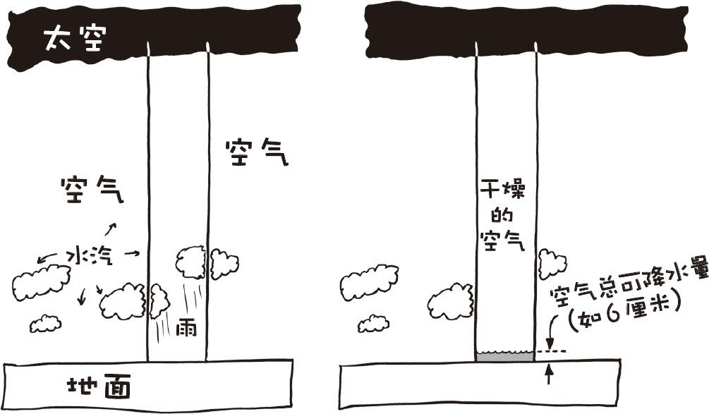
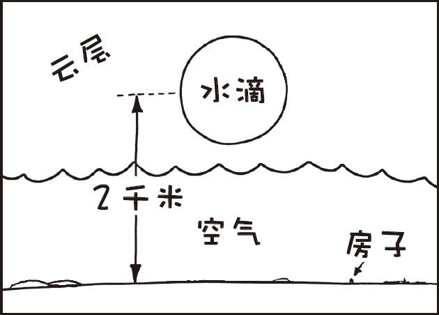
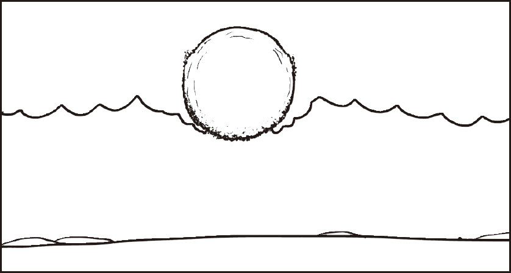
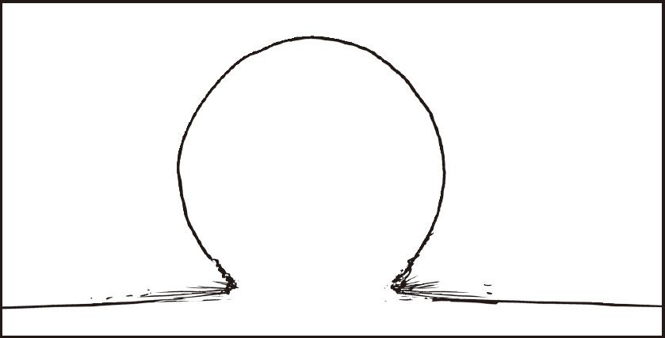

# 雨滴
###### RAINDROP
### Q．如果一场暴雨中所有的水分都汇聚成一颗巨大的水珠并从天上掉下来会发生什么？

——迈克尔·麦克尼尔

***
### A．堪萨斯的某个盛夏，空气燥热而潮湿。
门廊里两位老人坐在摇椅里。

在西南边的天际，一股不祥的云涌现出来，并在逐渐接近的过程中形成云柱，顶部向外扩散形成铁毡样形状。

老人们听到了微风吹过风铃时发出的丁零声。天色渐渐暗了下来。

#### 湿气
空气中携带着水分。如果你从地面开始向上竖起一道墙直至大气层顶端，使包围在其中的空气柱降温，其中所含的水分就会凝结成雨。如果你在底部收集这些雨水，就会发现雨水的深度在零到几十厘米之间。这个深度就是我们所说的空气的总可降水量（TPW）。

通常来说，总可降水量为1～2厘米。

卫星会测量地球上每一点的水蒸气含量，并得到一些非常漂亮的地图。

不妨假设一个暴雨云团长宽各100千米，具有较高的总可降水量——6厘米。这意味着整个云团中含水：

`100千米×100千米×6厘米＝0.6立方千米`

这些水的质量有6亿吨（恰好差不多是人类的总重量）。一般情况下，其中一部分水会分散地落下来形成雨，降水量最多也是6厘米。

而在这个云团中，所有的水都凝结成了一大滴水，一个直径超过1千米的水球。假设这个水球离地若干千米，绝大多数雨都在这里冷凝形成。

然后巨大的水滴开始下落。

在最初的五六秒内看不出任何异常，之后云层的底部开始慢慢向下隆起，在某一瞬间看上去有点像正在形成的漏斗云。然后隆起部分越来越宽，10秒后，水滴的底部开始露出云层。

现在水滴的下落速度已经达到了每秒90米。呼啸而过的大风将表层水吹成水雾。随着越来越多的空气被强行挤入水滴内部，水滴的下沿开始变成泡沫状。如果水滴继续以这个速度下落足够长的时间，这些力会渐渐把整个水滴分解成雨滴。

但在那发生之前，在水滴形成后约20秒，水滴的下沿接触到了地面。现在水滴的下落速度超过每秒200米。在接触点的正下方，空气无法及时排开，被压缩的空气迅速产生大量热量，假如有时间的话，下面的草丛是会着火的。

好消息是，这些热量只持续了几毫秒的时间，随后它就被大量冰冷的水淹没了。坏消息是，急速而来的冰冷水滴速度超过音速的一半。

如果之前你一直漂在整个水滴的正中央，你直到此时此刻才会发现一些异样。水滴的中央非常暗，如果你有足够的时间（和肺活量）游上几百米来到水滴边缘，你会看到黯淡的光线。

随着水滴离地面越来越近，不断增加的空气阻力会产生越来越大的压强，你的耳朵会感到胀痛。几秒后，当水滴接触到地面时，你就会因挤压而死——冲击波会在瞬间产生超过马里亚纳海沟底部的压强。

整个水滴一头撞上地面，不过地面上的基岩是不可撼动的。由此产生的压力将水推向四侧，产生一股超音速全向射流，[^1]摧毁一切沿途的物体。

水墙向外延伸出数千米，拔起树木，推倒房屋，翻起土层。在一刹那之间，房子、门廊和那两位老人就被水给淹没。方圆几千米范围内的所有东西都被彻底摧毁，只留下残留在基岩上的一摊泥浆。水花继续一路向外扩散，将方圆20～30千米内的建筑悉数冲毁。在这个距离下，有山脉和山脊的庇护的地区得以幸存下来，洪水开始流入山谷和水道。

更远的地区基本不会受到这场暴雨的影响，不过在水滴撞击地面几个小时后，几百千米以外的下游地区将会经受突如其来的洪水袭击。

这场无法解释的天灾通过新闻迅速传遍了世界，整个世界为之震惊又困惑，全世界范围内每一朵云的产生都会引发巨大的恐慌。雨成了全世界人们最恐惧的东西，但一转眼几年过去了，灾难并没有再来。

气象学家历时数年希望还原当年发生的水滴灾难，却得不出任何解释。最终，他们放弃了尝试，这个无法得到解释的天气现象被称为“回响贝斯[^2]暴雨”（dubstep storm）——用一位研究者的话来说——“可真是一大‘低’啊。”

[^1]:大概是我见过的最酷炫的连续3个单词。
[^2]:译注：回响贝斯是一种电子乐风格，其中通常有很厚重的低音声线。
