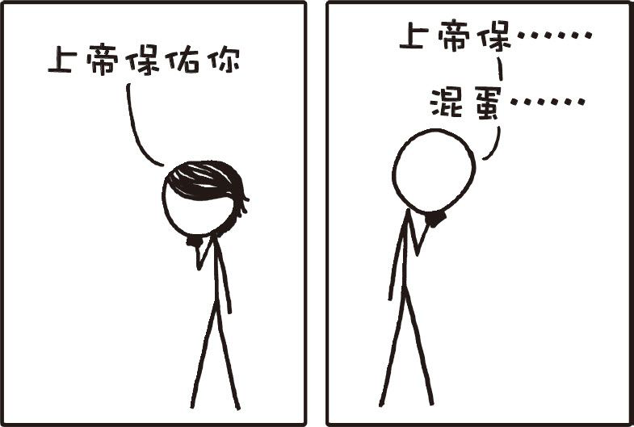

# 随机祝福电话
###### RANDOM SNEEZE CALL
### Q．如果你随机拨打一个电话号码，然后说“上帝保佑你”。那么有多大几率接电话的那人刚打过喷嚏？

——米米

***
### A．这个几率有点难算，不过大致是四万分之一这么个几率。

在你拿起电话前首先要记住，有十亿分之一的几率你要打给的那人刚杀了一个人。[^1]所以在你送出祝福的时候最好小心一点。

不过很显然打喷嚏的几率要比谋杀高出许多，[^2]所以接电话的那人刚打过喷嚏还是很有可能的。至于想用这个方法抓住杀人犯……你还是回去洗洗睡吧。

`友情提示：当有人打喷嚏时我就会这么说`

和谋杀率相比，没有多少学术研究会关注打喷嚏率这玩意儿。而被引用次数最多的人均打喷嚏频率来自于一名受ABC广播公司采访的医生，他觉得平均每人每年会打200次喷嚏。

在为数不多的几个学术数据来源中，有一个研究诱使受试者产生过敏反应，然后监测他们打喷嚏的情况。为了估计平均打喷嚏的频率，我们不妨直接忽略这个研究打算采集的所有真实医疗数据，转而关注实验中的对照组。对照组里的受试者完全不接触过敏原，他们只是在一个房间里共计做了176个20分钟的实验流程。[^3]

对照组中的受试者在这58小时左右的时间里一共打了4次喷嚏[^4]，假设他们只在醒着的时候才会打喷嚏，那么相当于每人每年会打约400个喷嚏。

在谷歌学术搜索的帮助下，我们找到了5980篇2012年发表的提到“打喷嚏”的论文。假设这其中有一半的论文是在美国发表，并且平均一篇论文有4位作者，那么你有一千万分之一的几率打给了一个正好在当天发表了一篇关于打喷嚏的论文的作者。

而另一方面来看，每年美国都会有60个左右的倒霉蛋被闪电劈死。这意味着你有十万万亿分之一的几率打给一个30秒前刚被闪电劈死的倒霉蛋。

最后，我们不妨假设在这篇文章发布的当天，有5位读者决定实践一下。如果他们24小时没日没夜地不停打电话，那么有三万分之一的几率他们打给的那人正在通话中——因为那人也在给别人打相同的祝福电话。

而有十万万亿分之一的几率在同一时刻这两个无聊鬼正好互相打给对方。

此时此刻，老天爷看不下去了，于是一道闪电把他们都劈死了。

[^1]:基于美国平均十万分之四的谋杀率计算，这个比例在发达国家中算是高的了。
[^2]:引用：你还活着。
[^3]:这个长度相当于Hey Jude重复播放490遍。
[^4]:在整个58小时的试验期间，4个喷嚏是最有意思的实验数据。我宁愿听490遍Hey Jude也不想做这个实验。
