# 15级地震
###### RICHTER 15
### Q．如果美国纽约城受到一场里氏15级的地震袭击会发生什么？里氏20级，25级呢？

——亚历克·法里德

***
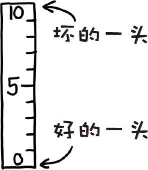

### A．里氏震级在学术上现在已经被“矩震级”[^1]所取代，
它们都是用
来衡量地震释放出的能量的多少。里氏震级没有上限，不过由于我们
平时了解到的地震都在3～9级之间，因而许多人都认为最高就是10
级，最低是1级。

事实上10级并不是上限，但实际情况下10级很有可能是最高的震
级了。一场里氏9级的地震已经显著改变地球的自转了，本世纪内两场
里氏9级以上的地震都使得一天的长度发生了很小的一些变化。

一场里氏15级的地震释放出来的能量有将近1032焦耳能量，约相
当于地球的引力结合能。换言之，死星在奥德兰星球上引起了一场里
氏15级的地震[^2]。

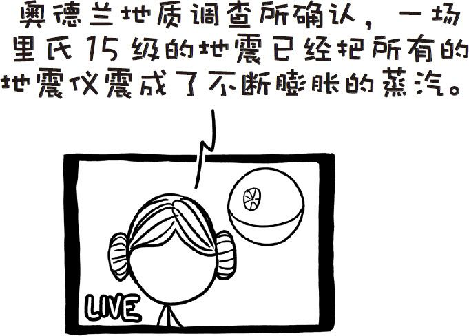

理论上来讲，地球上可能发生威力更大的地震，但这也只是意味
着膨胀的碎片云的温度更高一些而已。

太阳的引力结合能比地球更高，可能会发生里氏20级的阳震（虽
然这可能会引发毁灭性的新星爆发）。已知宇宙范围内威力最大的震
动发生在一颗质量极大的中子星上，震级就约为20级。释放出的能量
相当于你在地球那么大的体积内堆满氢弹，然后在一瞬间引爆。

我们已经花了很长时间讨论庞大而剧烈的东西，如果我们走另一
个极端呢？有没有震级为0级的地震？

有！事实上震级还可以一路往下走变成负数，让我们来看看低震
级“地震”来袭时会对你家产生什么影响吧。

#### 0级地震
达拉斯牛仔橄榄球队全体队员全速撞上你家邻居的车库墙上。

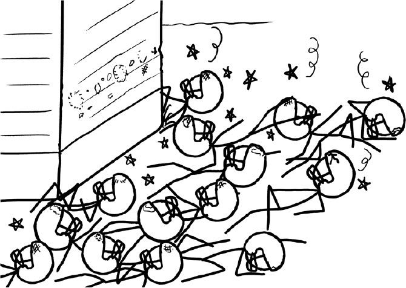

#### -1级地震
一名橄榄球运动员撞上你家院子里的一棵树。

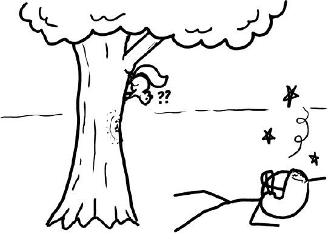

#### -2级地震
一只猫从梳妆台上摔下来。

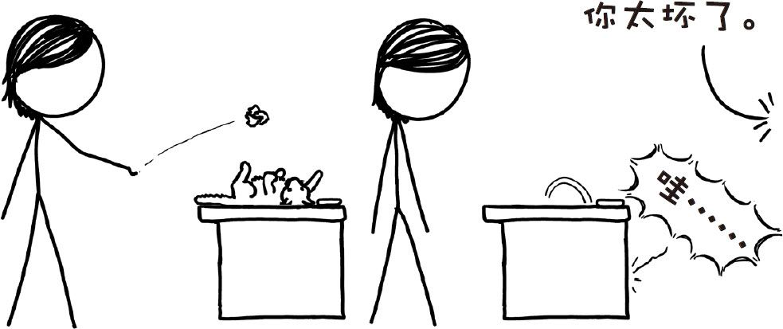

#### -3级地震
一只猫把你的手机从床头柜上推下去了。

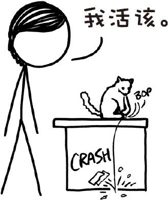

#### -4级地震
一分钱硬币从一只狗身上掉下来。

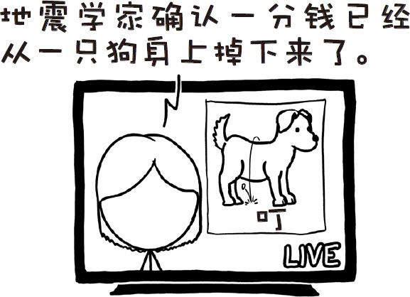

#### -5级地震
在IBM的M型键盘上按下一个键。

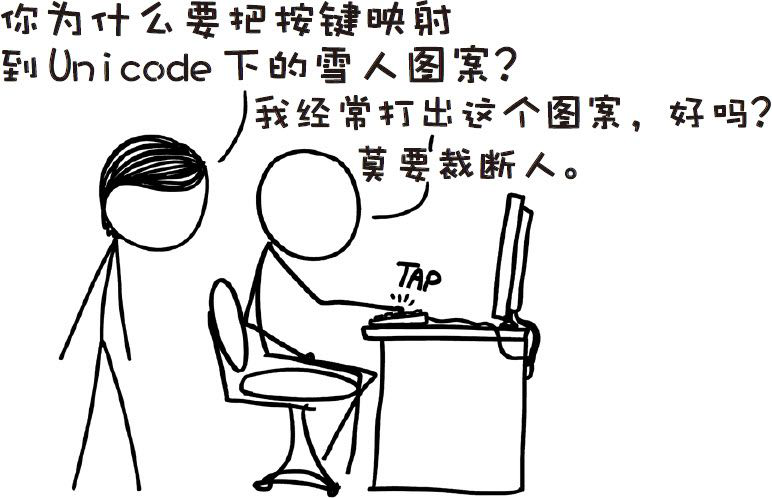

#### -6级地震
在轻型键盘上按下一个键。

#### -7级地震
一片羽毛落到地上。

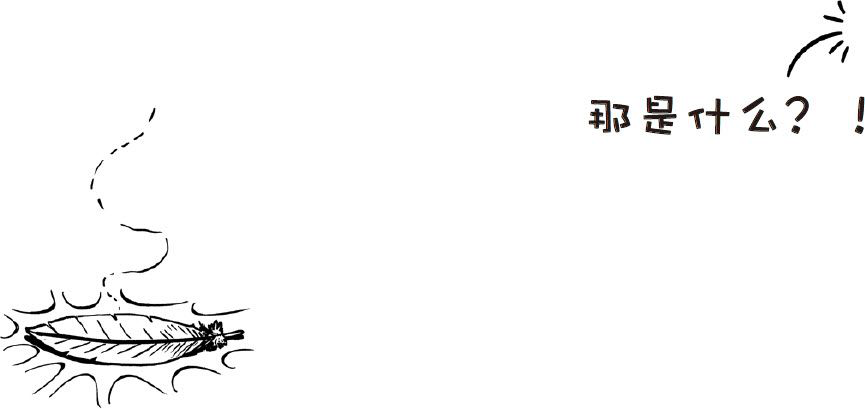

#### -8级地震
一粒细砂落到沙漏底部的沙堆上。

……让我们直接跳到

#### -15级地震
空气中飘动的一粒尘埃落到桌上。

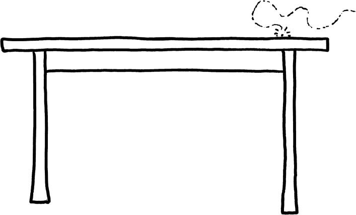

有时换种思路，不去破坏任何东西的感觉真好。

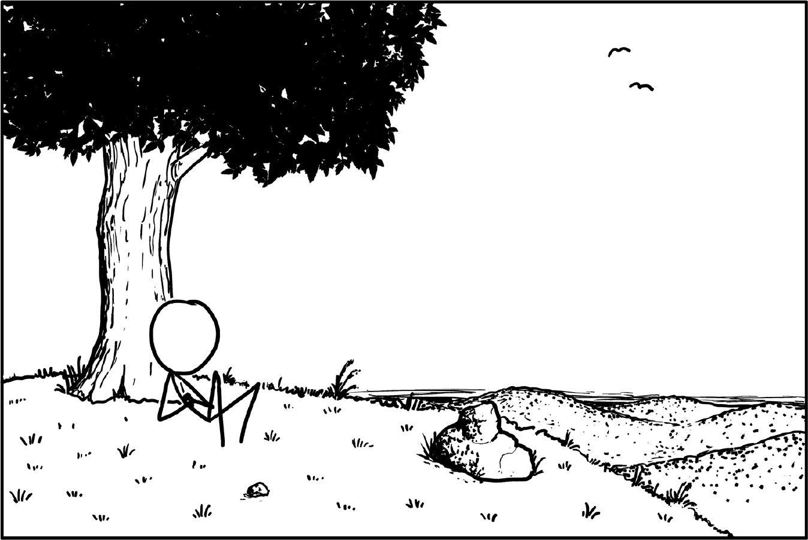

[^1]:同样的，藤田级数也已经被改良藤田级数所取代。有时人们废弃一种单位只是因为它用起来太糟糕，比如千磅力（kips）每秒千立方英尺（kcfs），以及兰氏度（表示比绝对零度高多少华氏度）。（我曾经不得不读用这些单位写成的技术论文）在其他一些时候，你会意识到科学家们只是想要纠正人们的想法。
[^2]:译注：《星球大战》中的星球。
