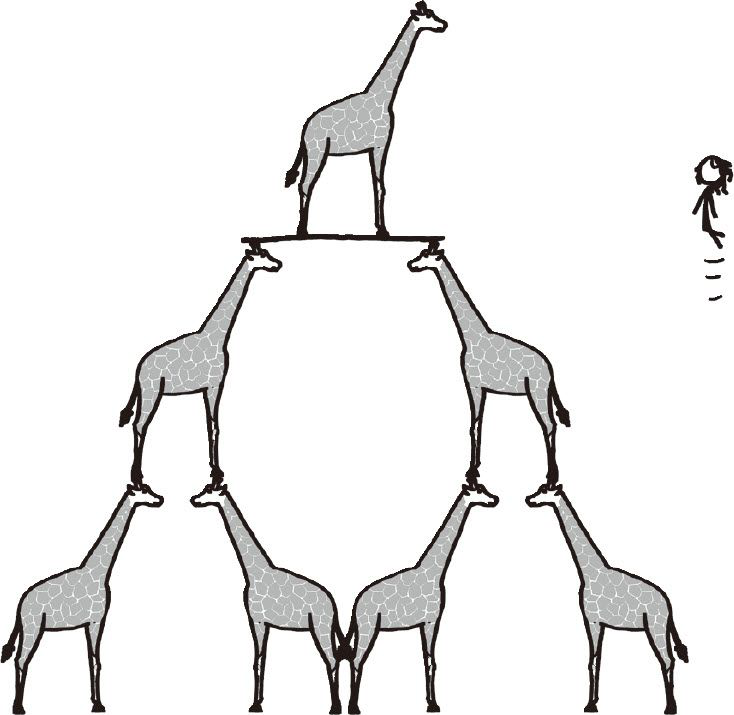

# 匀速上升
###### RISING STEADILY
### Q．如果你突然开始以每秒1英尺（约30厘米）的速度上升，你会怎么死？你会先被冻死还是因窒息而死？还是有其他死法？

——丽贝卡·B

***
### A．你带大衣了吗？
每秒1英尺这个速度并不快——一部普通电梯的速度都比它快。你要花上5～7秒才能让别人伸手够不着，这取决于你的朋友们有多高。

30秒后，你的高度是30英尺（9米）。如果你把书翻到第172页，你会发现这也是你的朋友能扔给你三明治或水瓶或其他什么东西的最后机会了。[^1]

一两分钟后，你已经高于树梢了。你感觉和地上差不多，都很舒服。如果当天有风，那么树梢上方更稳定的风很可能会让你感觉有些冷。[^2]

10分钟后，你会超过大多数摩天大楼的高度。25分钟后，你已经比帝国大厦的尖塔还高了。

这里的空气要比在地面的稀薄3％左右。幸运的是，你的身体整天都在应付这样的气压变化。你的耳朵可能会有点痛，但除此之外你不太会意识到其他东西。

气压会随着高度而大幅变化。不管你信不信，当你站在地面上时，1米之内的气压都能差出到可测量的程度。如果你的手机内置气压计——许多智能手机应该都内置了——你可以下载一个应用来测一下你脚附近的气压比头附近高多少。

每秒1英尺差不多就是每小时1千米，所以1个小时后，你差不多就是离地1千米了。此时此刻，你开始感觉有些冷了。如果你穿着一件外衣那还好，但你会感觉到风在变大。

2个小时后，你已经达到了约2千米的高度，温度也降到了冰点以下。风速很有可能在继续增加，如果你有一部分皮肤暴露在外，那么你就要开始担心冻疮了。

从此时起，气压将会降到比客机机舱还低的程度[^3]，这时很多低压后果会变得严重起来。但如果你没有一件保暖的衣服，低温才是最大的问题。

在接下来的2个小时内，空气温度也跌到0℃以下[^4]'[^5]。现在即使你没有窒息而死，那么用不了多久你就会被冻死。不过要等到什么时候呢？

在冻死这个话题上最有发言权的应该要数——毫不意外——加拿大人了。论及人类在寒冷空气中的存活情况，最广泛使用的模型正是由加拿大国防与民用环境医学研究所的彼得·蒂克西斯和约翰·弗里姆提出的。

根据他们的模型，你的死因很大程度上取决于你穿的衣服。如果你赤身裸体，你会在第5个小时前后因低温症而殒命，而此时你身体里的氧气还没用尽呢。[^6]如果你被温暖的衣服裹得严严实实，你会有一些冻疮，但应该还活得下去……

……直到你来到死亡区。

在8000米以上——地球上只有少数几座山有这么高——空气中的氧气含量不足以支持人类生存。在这个区域附近你会感受到许多不同的症状，其中可能包括迷糊、眩晕、迟钝、视力障碍和恶心。

当你向死亡区继续靠近时，你血液中的氧气含量开始大幅跳水。

血管本应将低氧气含量的血样带回肺中，然后补充新鲜氧气。但在死亡区，空气中的氧含量太少，以至于你血管中仅有的氧气会往外跑而不是吸收氧气。

后果就是你会迅速丧失意识，然后死亡就会到来。这大概发生在第7个小时前后，你很难撑到第8个小时。

  
`他生前和死后没什么区别，都在以每秒1英尺的速度上升。`

200万年后，你那冰冻的尸体还在以每秒1英尺的速度运动，它将会穿过日球层顶（heliopause）进入星际空间。

发现冥王星的天文学家克莱德·汤博于1997年去世。他的一部分骨灰由“新地平线”号宇宙飞船搭载，飞船在飞越冥王星后将继续向太阳系外进发。

的确，你那每秒1英尺的旅程又冷，又不舒服，死得也很快。但当太阳在40亿年后变成红巨星并将地球吞噬时，你和克莱德将会成为唯一逃出去的人类。

所以，你死而无憾了。

[^1]:虽然这些东西还是没法让你活下来，不过……
[^2]:这篇文章中假设的是“典型”的大气层温度分布，当然，具体情况差异会很大。
[^3]:根据我手机中气压计的数据，客机机舱一般加压到70％～80％的大气压。
[^4]:摄氏度和华氏度都行。
[^5]:当然不能用开尔文。
[^6]:我想知道这个结果是怎么通过实验做出来的……