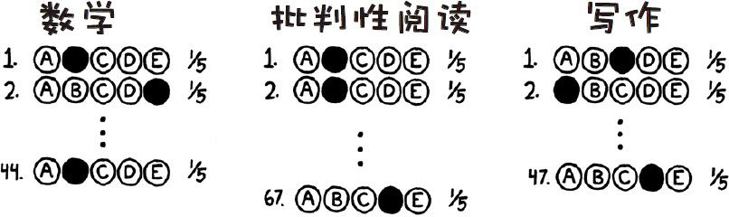
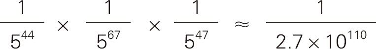
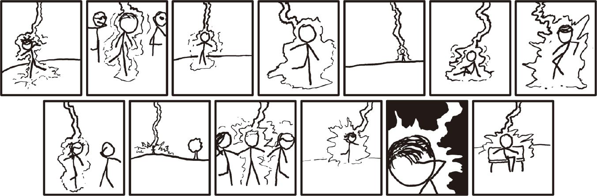

# 考试靠猜
###### SAT GUESSING
### Q．如果每个参加美国高考（SAT）的学生都在选择题部分乱猜一气会怎么样？有多少人会获得满分？

——罗布·鲍尔德

***
### A．没人。
SAT考试是给美国高中学生参加的标准化测试，在一些情况下，乱猜一个答案是一个不错的选择。但如果你所有题目都乱猜呢？

SAT考试并非全部都是选择题，为了把问题简单化，我们假定只在选择题部分乱猜答案，并假设所有人在写作题目和填空部分都拿了满分。

在2014年的SAT考试中，数学部分有44道选择题，批判性阅读部分有67道，新式[^1]的写作部分有47道。每道选择题有5个选项，因而乱猜一个答案有20％的几率能够猜对。

所有158道选择题都猜对的几率为：

如果全部400万17岁的孩子都去参加SAT考试瞎猜答案，那么几乎可以肯定的是，在三个部分中的任何一个部分都不会有满分出现。

有多肯定？假设他们每天用计算机参加100万次考试，并且持续50亿年——直到太阳膨胀成一颗红巨星，将地球烧成渣——在这么多次考试中，仅仅数学部分得到满分的几率只有万分之一。

这几率有多小？每年有大约500名美国人被闪电击中（平均每年有45人死于雷击，被雷击的死亡率约为9％～10％）。这意味着指定某一年任选一个美国人，他被闪电击中的几率是七十万分之一。[^2]

这意味着如果想通过乱猜获得SAT考试满分，这个几率比所有健在的前总统加上《萤火虫》[^3]的全部主演们都在同一天被闪电击中的几率还小。

致今年参加SAT考试的各位，祝你们好运啦——虽然光靠运气是没用的。

[^1]:很久以前我考过SAT考试，行了吧？
[^2]:参见xkcd“条件风险”一章。[http://xkcd.com/795/](./imgs/conditional_risk.png)
[^3]:2002年美国科幻电视剧。
