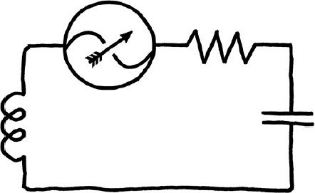
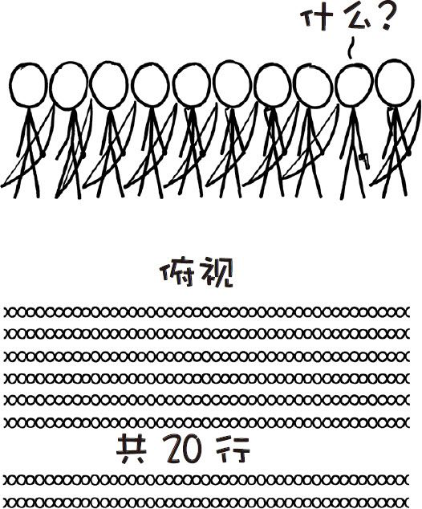

# 斯巴达勇士
###### SPARTA
### Q．在电影《斯巴达300勇士》中，斯巴达勇士朝天空中射箭，看上去阳光都被箭给挡住了。那么在现实生活中这种场景是否可能出现？如果可能的话需要用到多少支箭？

——安娜·纽厄尔

***
### A．要做到这种效果相当困难。
#### 方法一
长弓射手每分钟能够射出8～10支箭。用物理术语来说，一位长弓手就是一个频率为150毫赫兹的发箭机。

每支箭在空中停留的时间只有几秒。如果在战场上平均每支箭滞空时间为3秒的话，那么在任意时刻，仅有一半射手的箭在空中。

每支箭都能挡住约40平方厘米的阳光。由于一位射手只有一半的时间箭是在半空中，因而平均每支箭能挡住20平方厘米的阳光。

如果射手们站成方阵形状，每一行两人间距半米，两行之间相距1.5米，并且一个射击阵列有20行（宽30米），那么平均每1米的宽度……

……能有18支箭在空中。

从有效射程以外看18支箭只会挡住约0.1％的阳光。同志还需努
力！

#### 方法二
我们可以让射手们站得更靠近一些。如果他们站得和夜店狂舞区那里一样近，[^1]每平方英尺的人数就可以翻两番。当然，站这么近射起箭来肯定不舒服，但我确定射手们一定会想出解决方法来的。

我们可以将射击阵列的宽度增加到60米，这样每米就有130名射手了。

他们能射多快？

在2001年电影《指环王：魔戒远征队》加长版中出现了一个场景，其中一队兽人[^2]朝莱戈拉斯猛攻，而莱戈拉斯连续不断地迅速拔箭射击，在兽人冲到他面前之前就一箭一个射倒了这些兽人。

扮演莱戈拉斯的演员奥兰多·布鲁姆在现实生活中没法以这么快的速度射箭，其实在拍摄时他只是假装在拉弓射击，并没有搭上箭，观众们看到的箭其实是后期通过特效加上去的。既然在观众看来，莱戈拉斯的飞快速度还没有到物理上不可能的程度，因此我们就以它为限来进行计算。

假设我们能训练出许多像莱戈拉斯那样能在8秒内射出7支箭的射手。

在这种情况下，我们的射击方阵平均每秒能够射出不可思议的339支箭，但即使这样也只能挡住约1.56％的阳光。

#### 方法三
我们还是完全放弃手动射箭，转而给这些射手每人都配备一把加特林射箭器。如果他们每分钟能射出70支箭，这样每100平方米的战场就能射出截面积110平方米的箭阵。真是完美！

但这里有个问题。虽然所有的箭加在一起截面积有100平方米，但其中有些箭是互相重叠的。

计算一大堆互相重叠的箭覆盖的地面面积百分比的公式为：

总截面积110平方米的箭只能覆盖三分之二的战场。由于我们的眼睛是以对数形式衡量光的亮度，因而把阳光亮度减弱到三分之一在肉眼看来只是有一点点暗淡，完全达不到“完全遮蔽”的效果。

如果我们把已经不切实际的射箭速度进一步提高，最终还是可以达到完全遮蔽的效果。如果加特林射箭器每秒能够射出300支箭，那么它就能阻断战场上空99％的阳光。

但其实还有更简单的办法。

#### 方法四
之前我们进行的计算隐含了一个条件，那就是太阳在我们的正上方。在电影中当然是这样，不过也许那句著名的夸口说的是凌晨进攻的计划。

如果太阳刚从东边的地平线上升起，而射手们向北射箭的话，阳光必须要穿过整个“箭云”才能抵达地面，这样的遮蔽效果会是之前的几千倍。

当然了，要是这样射箭的话，就别指望它们落在敌军附近了。可是问题里说的是射出的箭挡住了太阳，他们并没有说要不要击中任何人。

而且谁知道呢，也许面对合适的敌人，只需要挡住阳光就足够了。

[^1]:经验法则：每平方米站1个人算稀疏人群，而每平方米站4个人就跟在夜店狂舞区一样拥挤了。
[^2]:严格来说他们并不是典型的半兽人，而是强兽人。强兽人的准确起源和特性有些难以捉摸。托尔金曾表示他们是人和半兽人杂交而成，但在发布于《失去的传说》上的更早的草稿中，托尔金表示强兽人生于“地球泥沼和地下热量之中”。导演彼得·杰克逊在翻拍时机智地选择了后者作为呈现在银幕上的内容。
