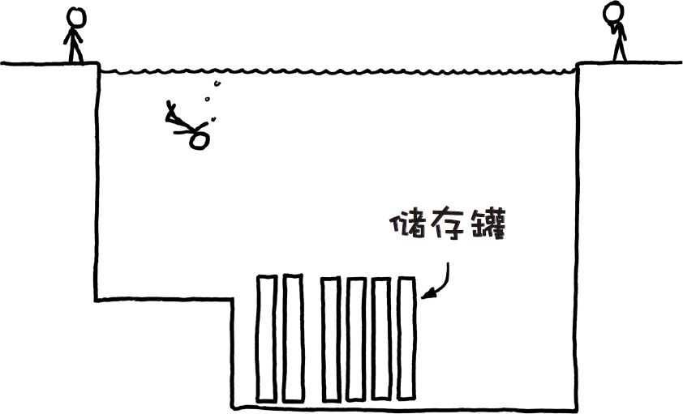
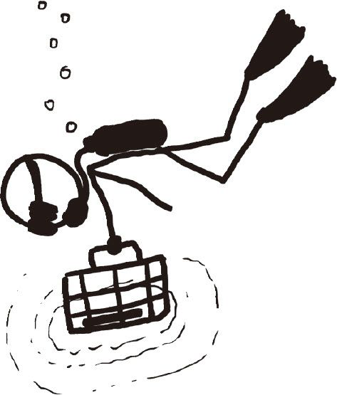

# 乏燃料游泳池
###### SPENT FUEL POOL
### Q．如果我在一个普通的乏燃料（用过的核燃料）水池里游泳会怎么样？我是不是要潜到水底才会受到致命剂量的辐射？我在表面能安全地待多久？

——乔纳森·巴斯蒂安·菲利亚特罗

***
### A．假设你的游泳技术还算不错的话，那么你差不多可以通过不停踩水在水中活上10～40小时，之后你就会因为体力不支而昏迷并溺水。
对于底下没有核燃料的水池来说也是这样……

核反应堆产生的乏燃料具有高度放射性。水在屏蔽辐射和散热方面性能都不错，因而乏燃料会被存放在水池底部，直到其中的放射性物质活跃程度降到一定水平后才会被转移到干桶中。对于这些干桶该储存在哪里，我们目前还没有达成共识，但总有一天，我们会找到合适的地方的。

下面是一个普通的乏燃料储存池的样子：

辐射产生的热量不是大问题，虽然理论上来说，乏燃料池中的水温可以达到50℃，但在现实情况下，水温一般会介于25～35℃——这比大多数泳池的水温要高，但比浴缸里的热水温度要低。

辐射水平最高的燃料棒，应该是最近才从核反应堆里移除出来的那些。对于乏燃料里释放出来的辐射而言，每7厘米深的水就能让剂量减半。根据安大略电力公司的报告中给出的辐射水平，如果把刚取出来的燃料棒放在燃料池中，那么危险区域如下：

当你潜到水底，用手肘碰一下刚拿出来的燃料罐，然后立即游回水面，所受到的辐射就极有可能让你丧命。

但若是停留在最外面的那块区域，那么你想待多久就可以待多久——燃料棒核心所释放出来的辐射[^1]剂量，比你在街上四处走动时受到的背景辐射1剂量还少。实际上，只要你待在水下，那么绝大多数普通背景辐射是不会影响到你的。你在乏燃料池里踩水受到的辐射剂量没准儿比你走在大街上时受到的剂量还要少。

  
`记住，我只是个漫画家。如果你打算遵循我关于核废料安全问题的建议，那么之后无论发生什么都是你自作自受。`

以上讨论完全建立在没有出任何差错的情况下，如果乏燃料棒的外壳发生了腐蚀，那么水中就可能会有些裂变产物。这些物质能够很好地清洁水质，你在里面游泳也不会受到伤害，但它的辐射剂量已经到了让你不能把这里的水当瓶装水卖出去的程度。[^2]

我们知道在乏燃料池里游泳一般来说是安全的，因为会有潜水员定期进行保养。

但是，这些潜水员也必须小心。

2010年8月31日，一位潜水员正维护瑞士莱布施塔特核电站的乏燃料池。突然他发现在池子底部有一段管子，不知道是什么东西，于是他通过无线电询问主管该怎么办。主管让他把管子放到他的工具篮里，他也这么做了。由于水池中气泡的声音太大，他没有听到辐射警报器的响声。

当工具篮被提出水面后，屋子里顿时警铃大作。工具篮被扔回水中，潜水员也马上离开了水池。他身上的辐射计量器显示他受到的全身辐射剂量比正常水平高，而他右手上的剂量更是极高。

原来这根管子是反应堆核心中辐射监测器上的一根保护管，长时间的中子流使得它具有高度放射性。在2006年一个舱室关闭时它意外地脱落了下来，然后就沉到了燃料池底部一个不起眼的小角落，之后的4年里也一直没有被发现。

要是这名潜水员把那根管子放到工具腰带或者背包里等靠近身体的地方的话，管子上的辐射物质足以使他丧命。正如前面所说的，水救了他一命，只有他的手——手比身体其他娇嫩的内脏器官更能承受辐射——受到了大剂量的辐射。

所以说，只要你按规矩在乏燃料池里游泳，你应该不会遇到问题，除非你潜到水底或捡了个奇怪的东西上来。

为了确证，我联系了一位在研究用核电站工作的朋友，问他如果你试图在他们被辐射污染的池子里游泳会发生什么。

“在我们这里？”他想了一会儿之后说道，“你会死得很快，甚至在你碰到水之前，警卫就一枪把你打死了。”

[^1]:译注：背景辐射是环境中普遍持续存在的电离辐射，通常来自人类活动排放和自然界的释放。
[^2]:这很糟糕——它来当“能量饮料”可是太合适了。
