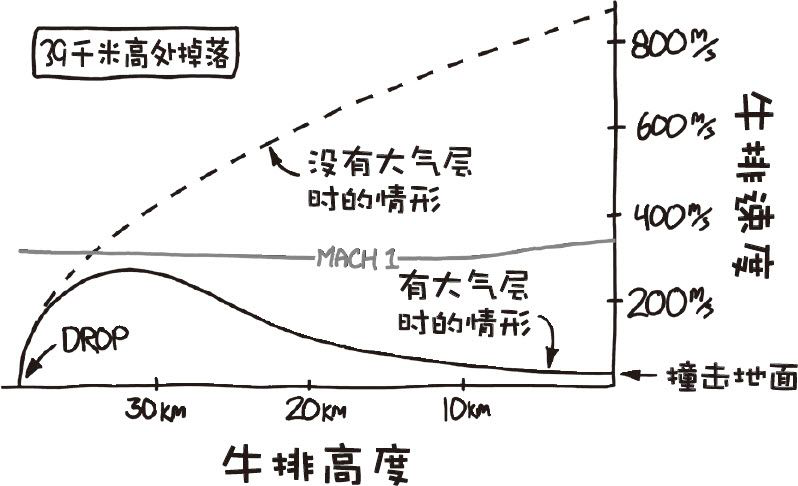
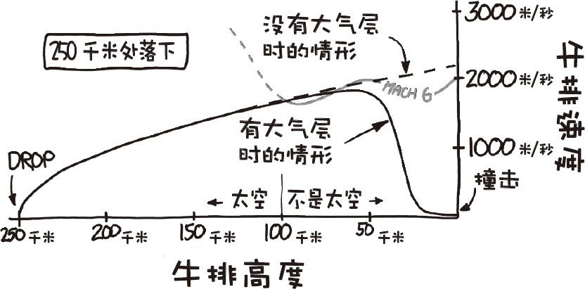

# 牛排坠落
###### STEAK DROP
### Q．从多高处掉下来的牛排才能在掉到地上时正好烤熟？

——亚历克斯·莱希

***
### A．但愿你喜欢匹兹堡生牛排，捡起来之后别忘了解冻哦。
从太空中掉回来的物体会变得非常烫手。当它们进入大气层时，位于前方的空气来不及跑开，因而会在物体前方被不断压缩，同时温度也会逐渐升高。一个简单的经验法则是，当速度高于2马赫时，压缩生热的效应会逐渐开始明显起来。（这也是为什么协和式飞机在机翼前端有防热材料）

当跳伞运动员菲利克斯·鲍姆加特纳从39千米的高空跳下后，他在离地30千米的地方突破了音速。这个速度足以使空气温度升高几摄氏度，但考虑到那个位置的空气实在是太过寒冷，因而这几摄氏度的差异可以忽略不计。（在他刚跳下的那段时间里，空气的温度为零下40度。这个温度很神奇，因为零下40℃和零下40℉都是同一温度。）

据我所知，这个牛排问题最初起源于4chan[^1]上的一个长帖，但这个帖子的内容很快就演变成了长篇大论的蹩脚物理以及攻击同性恋的混杂体，最终也没有得出一个明确的结论。

为了得到更准确的答案，我决定进行一系列数值计算，模拟牛排从不同高度掉下来的结果。

一块8盎司（约250g）的牛排大小形状和一个冰球差不多，所以我用《冰球物理学》（这本书的作者阿兰·阿什用一些实验室设备亲自测量了各种数据）第74页上的阻力系数来近似牛排的阻力系数。虽然牛排和冰球还是有区别的，但更加精确的阻力系数对最终结果没有太大的影响。

由于回答这些问题经常需要牵涉到分析极端物理条件下的非常规物体，因而相关的资料只能在美国军方在冷战期间的研究中找到。（很明显，美国政府会往任何与武器哪怕只有一点儿联系的东西里投入大把的金钱。）为了了解空气会如何加热牛排，我阅读了研究弹道导弹再入大气层时鼻锥被加热的论文，其中最有用的两篇文章是《战术导弹整流罩气动加热的预测》和《再入大气层载具历史温度的计算》。

最后我还需要找出热量在牛排中的传导速度。我一开始查阅的是在工业食物生产中模拟不同种类肉的热传递的论文。后来我才意识到，要知道不同温度和时间搭配下，牛排会被加热到哪种程度的最简单的方法是：去找一本烹饪书来看。

在《极客厨房》这本很棒的书中，作者杰夫·波特很好地介绍了肉类烹制的科学道理，并解释了不同温度范围下热量对牛排的影响及其原因。库克的《做好菜的科学》一书也很有帮助。

把上面所有信息综合到一起，我发现牛排会迅速加速坠落直到到达30～50千米的高度，在这个高度，空气足够稠密到能让牛排开始减速下坠。

随着空气密度越来越大，牛排下落的速度也会逐渐下降。不管牛排在下落到大气层下部时速度有多快，它最终都将减速到终端速度。无论一开始起落点多高，牛排从25千米的高度坠落至地面总是需要6～7分钟时间。

在这段距离中，空气温度大部分时间都低于冰点，这意味着牛排会在温度低于0℃、风力媲美飓风的狂风中待上6～7分钟。就算在下落过程中牛排已经熟了，掉到地面后你还是需要解冻才能食用。

当牛排最终掉落到地面时，它的速度将会是约每秒30米的终端速度。如果想要对此有一个直观的认识，想象一下一块牛排被棒球大联盟的投手砸在地上的样子。就算牛排只有一部分被冻住了，这样也很容易被摔碎。不过如果牛排最后掉到了水里、泥里或者树叶堆里，那应该没事儿。[^2]

从39千米高度掉下来的牛排应该不会像菲利克斯那样突破音障，它甚至不会被显著加热。这也说得通，毕竟在落地时菲利克斯的保护服也没被烤焦嘛。

即使突破音障，牛排应该也不会支离破碎。因为除了菲利克斯，许多曾在超音速状态下弹射的飞行员都活了下来，并讲述了他们自己的故事。

要想突破音障，你需要让牛排从50千米的高度落下来，但这仍然不足以把它烤熟。

我们需要到更高的高度。

如果从70千米高度落下，牛排的速度会快到把空气加热到177℃左右。不过这股纤弱稀薄的高温空气只会持续不到1分钟，任何具有基本厨房经验的人都会告诉你把牛排放到350°F的烤箱里烤60秒并不能把它烤熟。

从100千米——太空边缘的正式定义——高度落下来并不会有太大区别。牛排超过2马赫速度的时间会有1分半钟，牛排的外表面很有可能会烧焦，但热量很快就会被冰冷的平流层狂风消散掉，因而内部并不会被烤熟。

在超音速和高超音速条件下，牛排周围会形成激波，而激波会把牛排和越来越快的狂风隔离开来。激波前沿的准确性质，以及由此产生的对牛排的机械应力，取决于这块8盎司的生牛排如何在高超音速狂风中翻滚。我尝试着去找这方面的文献，但没有找到任何与此有关的研究。

在我进行模拟的过程中，我假设在低速下某些类型的涡流脱落会使牛排翻来覆去，而在高超音速下，牛排则会被挤压成半稳定态的椭球状。但这也只是我的大胆猜想，如果有人真的在高超音速风洞中放入了一块牛排以取得更准确的数据，请一定把视频发给我。

如果你从250千米的高度释放牛排，牛排能达到的温度就更高了。250千米的高度已经在低地球轨道的范围里了，不过由于牛排是从静止开始下落，因而速度比不上那些脱离轨道再进入大气层的物体。

在这种情况下，牛排的最高速度能够达到6马赫，这时牛排的外表面可能焦得恰到好处。但很不幸，内部仍然是生的，除非牛排在高超音速下猛地颠簸了一下炸成了碎片。

如果从更高的地方落下，热量就会变得相当可观。牛排前方的激波将会达到数千度（反正不管用摄氏度还是华氏度都有几千度），这时牛排的表层会被彻底烤成焦炭。

把肉扔到火里的一个正常后果就是变成焦炭。但高超音速的焦肉面临一个问题：被烧成焦炭的肉并没有多少结构强度，因而会被狂风吹走，使得更深一层的肉被烧焦。（如果热量足够高，牛排的表面会在被剥离的瞬间被烤熟，这个速度区域在弹道导弹论文中被称为“剥蚀区”。）

即使在这么高的高度下，牛排所受的高温时间仍然不足以把整块肉从里到外都烤熟。[^3]我们可以尝试更高的高度和更快的速度，我们甚至可以通过从轨道以一定角度扔下去以增加暴露在高温下的时间。

但当温度高到一定程度，或者烧蚀的时间长到一定程度后，整块牛排就会慢慢解体，因为牛排的外层不断地被烧焦并被狂风剥离。如果大部分牛排能够坚持到最后落到地上，内部仍将会是生的。这也是为什么我们要在匹兹堡上空扔牛排。

有这么一个流传的故事，说的是匹兹堡的钢铁工人喜欢把牛排摔到刚出炉还在炽热发光的金属表面，把牛排的外层烤熟，但内部仍然保持生的状态。这大概就是“匹兹堡生牛排”的来历。

所以从一个亚轨道火箭上把牛排扔下来，并派出一支回收小队把它找回来，擦干净，再加热一下，去掉烧焦的部分，然后就可以开吃啦。

要小心沙门氏菌，以及《天外来菌》[^4]哦。

[^1]:译注：全球性综合类网络论坛，用户可以匿名发布评论和照片。
[^2]:我是说，看着没事儿，吃了不一定没事儿。
[^3]:我知道你们一些人在想什么，答案是不行——它在范艾伦辐射带里待的时间不够长，不足以通过辐射来消毒。
[^4]:迈克尔·克莱顿的畅销小说，曾多次被改编为电影、电视剧。