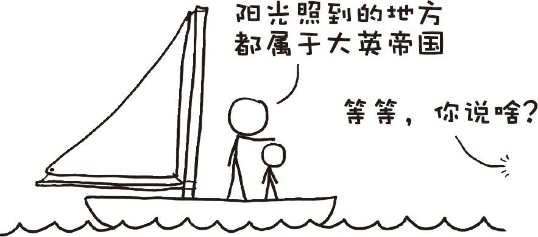

# 日不落帝国的日落
###### SUNSET ON THE BRITISH EMPIRE
### Q．什么时候（如果有的话）在所有大英帝国的土地上都看不到太阳？

——库尔特·阿蒙森

***
### A．到目前为止这种情况还没发生过。
不过这仅仅是因为有这么一小撮人住在某些比迪士尼公园还小的土地上。

#### 世界上最大的帝国
大英帝国的领土遍布全球各地，因而才会有人说大英帝国是日不落帝国，因为总有那么一块领土所处的正好是白天。

要想知道这种情景是何时开始出现的十分困难，因为宣称某一块（已经有别人居住）土地是殖民地的这一做法从一开始就很武断。实际上英国人驾着船开到哪里就在哪里插上一面旗子，宣称这是他们的殖民地，所以你很难确定一个国家的某一地区是何时被“正式”加入到大英帝国里去的。“那些处在阴影里的地方呢？”“那里是法国，但我们终究会把它抢回来的。”

  
`“那些处在阴影里的地方呢？”“那里是法国，但我们终究会把它抢回来的。”`

大英帝国不再经历日落的准确日期大概是18世纪末、19世纪初的某一天，当第一块澳洲领土正式加入的时候。

在20世纪初期，大英帝国基本已经解体了，但让人惊讶的是，自那以后太阳依然没有真正落下去过。

#### 14个殖民地
英国现在有14处海外领土，这些都是曾经的大英帝国的残留。

  

许多新独立出来的英国殖民地都加入了英联邦，其中一些诸如加拿大、澳大利亚等国家的官方君主都是伊丽莎白女王，但它们都是独立的国家，只是恰好君主都是同一个而已，它们现在不属于任何帝国。[^1]

太阳不会同时在所有的14处（或13处，如果你不把英属南极领地算在内的话）领土上落下。不过，只要英国失去一处小领地，它就会经历200多年来整个帝国的首次日落。

每天晚上在格林威治时间午夜前后，开曼群岛上空的太阳就会落下，而太阳要在凌晨1点以后才会在英属印度洋领地升起。在这段时间内，南太平洋上小小的皮特凯恩群岛是唯一能够看到太阳的英国领地。

皮特凯恩岛上只有几十人，都是当年英国皇家海军“邦蒂号”上的叛变船员的后裔。2004年一桩丑闻让这个小岛变得臭名远扬，因为包括市长在内的三分之一的成年男性居民性侵儿童的罪名成立。

不管这个小岛有着怎样不堪的往事，它仍是大英帝国的一部分。除非你把它一脚踢出帝国版图，否则大英帝国长达2个世纪之久的白天仍将继续。

#### 永远都是白天吗？
呵呵，也许吧。

再过400多年，在2432年的5月份，这个小岛将经历自叛逃者登陆以来首次日全食。

对于大英帝国来说有一点是幸运的，那就是日食发生的时候太阳在加勒比海地区开曼群岛上空。这些地区不会看到日全食，而且在伦敦太阳还好好地挂在空中呢。

事实上，在接下去的几千年里皮特凯恩岛上空都不会发生日全食，也就不会终结大英帝国的日不落神话。如果英国还能继续保持现有的领土范围的话，那么它的白天还能持续好长好长一段时间呢。

但不会永远都是白天。最终在几千年后的某一天，皮特凯恩岛上空将会发生日全食，长久以来挂在大英帝国上空的太阳也就终于会落下。

 

[^1]:任何他们所知的帝国。
