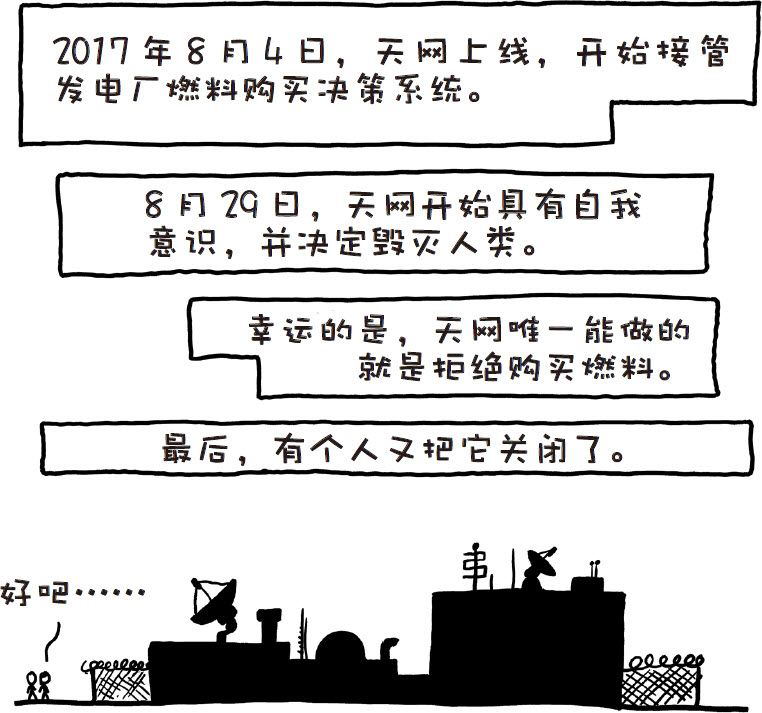
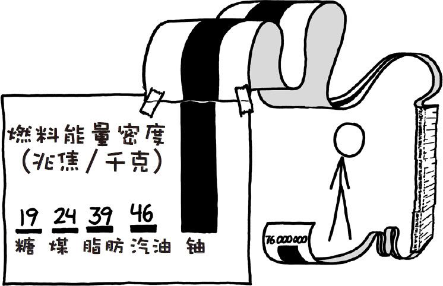
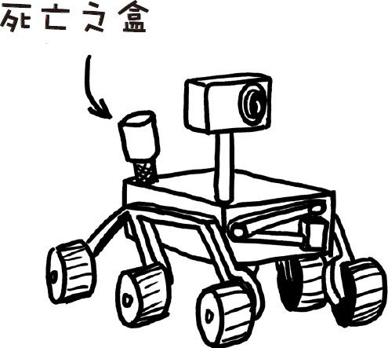

# 最后的人类之光
###### THE LAST HUMAN LIGHT
### Q．如果所有人类都消失了，那么最后一个人造光源会何时熄灭？

——阿兰

***
### A．“最后的人造光源”这一头衔有好多竞争者呢。
艾伦·韦斯曼在2007年出了一本很棒的书，名字叫《没有我们的世界》。这本书详尽地探讨了在人类突然消失后地球上的建筑、道路、摩天大楼以及动物们都会经历什么。2008年推出的一部电视剧《人类消失后的世界》也讨论了相同的情景。不过这两者都没有回答你提的这个问题。

那我们就先从简单的入手：绝大多数灯都撑不了多久，因为主要的电网会很快崩溃。供应世界大部分电力的化石燃料发电厂需要持续的燃料补给才能源源不断地发电，而供应链需要人类来作决策。

没有了人类，电力需求也会下降，但恒温器仍会继续工作。随着火电厂在最初的几个小时内停转，剩下的发电厂开始共同承担电力缺口。这种调控过程即使在有人监管的时候也是十分困难的，因而结果就是剩下的发电厂也接连迅速地陷入停顿，造成主要电网完全停电。

然而，很多地方不需要外部电网供电也能正常工作。让我们选取其中几个例子，看看它们会在什么时候熄灭。

#### 柴油发电机
许多偏远的社区（比如那些在偏僻小岛上的社区）的电力来源于柴油发电机。只要柴油不用完发电机就能一直输出电力，它所能坚持的时间一般在几天到几个月之间。

#### 地热发电厂
无须人类供给燃料的发电站，相对来说处境要好一些。地热发电厂由地球内部的地热驱动，可以在无人监控的情况下运行一段时间。

根据冰岛史瓦森吉岛上地热发电厂的维护日志，操作人员需要每6个月就更换一次齿轮箱中的机油，并给所有发电机和链接机构涂上润滑油。没了人类来进行这些维护性操作，这些发电厂可能还会继续运行数年，但最终会因部件生锈损坏而停止工作。

#### 风力发电机
依靠风力发电机的人们处境会比大多数人强。风力发电机设计之初就是按照不需持续维护的标准来设计的，原因很简单：风力发电机数量太多，而且爬到顶上去维护很累人。

一些风车可以在无人干预的情况下运行很长一段时间。丹麦的盖泽尔风力发电机建造于20世纪50年代末期，在无人维护的条件下连续工作了11年。现代的风力发电机的标准是不需维护正常工作3万小时（3年），其中肯定会有一些发电机能够连续运转几十年。而在这些发电机中，肯定在某个地方至少有一个显示状态的LED灯。

但到头来，大多数风力发电机还是会慢慢停止工作。原因和地热发电厂类似：发电机的齿轮箱坏了。

#### 水力发电站
通过将水的势能转化成电能的水力发电站能够继续运行很长一段时间。历史频道播放的《人类消失后的世界》中节目组询问了胡佛大坝的一位操作员，他表示即使所有人员立即撤离，整个发电站还是能在自动运行模式下继续工作数年。水力发电站最终也会停止工作，原因不外乎进水口堵住了，或是和风力发电机或地热发电厂一样遇到了机械故障。

#### 电池

靠电池发光的灯会在一二十年内全部熄灭。即使没有连接任何用电器，电池自身也会慢慢放电。某些品种的电池电力会比其他电池的电力更加持久一些，但即使号称“电力持久”的电池也会在一二十年的时间内流失完所有电能。

当然也有一些例外。在牛津大学克拉伦登实验室中有一个靠电池驱动的电子钟，自1840年来一直在发出声响。不过这个声响太过轻微，每次振动响板只消耗极少电量，因而人耳几乎听不到。没有人确切知道它用的到底是什么电池，因为没人打算把它拆开来一探究竟。

`欧洲核子研究组织的物理学家们是这么检测牛津电子钟的。`

可惜，这个电子钟上没有灯泡。

#### 核电站
核电站有些难说。如果核电站进入低功率模式，那么它们几乎能够无限期地运行下去，因为核燃料的能量密度实在是太高了，正如某网络漫画所展现的：

不幸的是，虽然燃料足够，核电站仍然撑不了多长时间。只要有什么零部件损坏，反应核心就会自动关闭。自动停堆会很快发生，因为很多事件都能触发这一行为，不过最有可能的诱因是外部供电中断。

你可能觉得发电厂要外部供电才能运转这一点很不可思议，但核电站的控制系统的设计宗旨即为任何一处系统失灵都会导致这个发电站迅速关闭，这一过程叫作“紧急停堆”（SCRAM）[^1]。当外部能源消失时，不管是因为别的电站都关闭了还是自带备用发电机的燃料耗尽，都会导致反应堆停工。

#### 太空探测器
在所有人造物体中，太空飞船应该会是最能抵抗时间侵袭的东西。一些探测器能够在太空中保存几百万年，不过探测器上的电力系统可支撑不了这么长的时间。

几个世纪后，火星探测器就将被火星尘土所掩埋。到那时，大多数卫星都已经随着轨道高度的衰减而落回地球。GPS卫星在更高的地球轨道上，能够坚持的时间也更长，但随着时间的推移，再稳定的轨道也会受到月球和太阳的干扰。

许多太空飞船的电力都来自太阳能面板，还有一些则靠放射性物质衰变获取电力。比如说火星探测器“好奇号”就是靠一根小棒末端连着的容器中的一块钚衰变释放的热量驱动的。

“好奇号”上配备的放射性同位素热电式发电机（RTG）可以持续供电一个世纪以上，最终它输出的电压将低到不足以维持探测器继续运行，但在此之前，其他部件可能早就已经损坏了。

看上去“好奇号”很有潜力，但有一个问题：没有灯光。

“好奇号”确实有光源，用来照亮样本或进行光谱分析。但这些灯只会在进行测量工作时打开，没了人类控制中心的指令，这些灯不会自己亮起来。

除非有人在飞船中，否则一般太空飞船不需要很多的灯。20世纪90年代探索木星的“伽利略号”探测器在它的飞行数据记录仪中安装了一些LED灯，但这些LED灯发出的是红外线而不是可见光，因而把它们叫作“灯”有些不太合适。而且不管怎么说，2003年人们操纵“伽利略号”探测器故意让其坠毁于木星表面。[^2]

其他一些卫星也装有LED灯。比如一些GPS卫星会用紫外LED灯来控制设备的电荷聚积，这些灯的电力来自太阳能电池板。理论上来讲，只要太阳一天不熄灭，这些灯就能一直亮下去。不幸的是，大多数的灯可以坚持的时间甚至还不如“好奇号”，最终它们都会被太空垃圾撞毁。

但别忘了太阳能电池板不只是用在太空中。

#### 太阳能

在偏远地区的路边，经常可以看到的紧急通话盒通常都是由太阳能驱动的。盒子上面一般都装有灯具，用于在晚上产生照明。

和风力发电机一样，这些电话盒维护起来很困难，因而在最初就被设计成能使用很长时间。只要不受灰尘和碎屑的干扰，只要连接其中的电子元件不损坏，太阳能电池板就一直能够发电下去。

太阳能电池板的导线和电路最终都会因腐蚀而损坏。但在一些干燥的地方，只要电器元件质量过硬，并且能依靠偶尔的微风和雨水清除积灰，这些太阳能电池板就能够毫无压力地持续供电长达一个世纪。

如果我们严格定义“人造光源”，那么毫无疑问，偏远地区靠太阳能驱动的灯会是坚持时间最久的人造光源。[^3]

但别忘了还有另一个不太常见的竞争者。

#### 切伦科夫辐射

一般而言，辐射是不可见的。

一些手表的表盘上镀有化学元素镭，它能发出淡淡的亮光。然而这种亮光并不来源于放射性本身，而是来自镭上的一层磷光涂料，当这种涂料受到放射性物质的照射时就会发出光亮。随着时间的推移，这层涂料会慢慢失效。虽然表盘本身还是在不停地释放射线，但它再也不会发光了。

然而表盘并不是唯一的辐射发光源。

当放射性颗粒穿过水、玻璃等材料时，它们会发光，原理类似于超音速产生的音爆——只不过声波换成了电磁波。这种光芒被称为“切伦科夫辐射”，在核电站堆芯你可以看到它那标志性的蓝色辉光。

一些放射性废料，比如铯-137，会被融化然后混入玻璃中，冷却后形成的固体块会被包裹在更多层的保护层中，这样这些放射性废料就能被安全妥善地运输和储存。

在黑暗中，这些玻璃块会发出蓝色的微光。

铯-137的半衰期为30年，因而两个世纪后它仍然在发出蓝光，但放射性水平将只有起初的1％。由于光的颜色取决于衰变的能量，而与辐射量无关，因此它的亮度会随着时间的推移而慢慢黯淡下来，但仍然会保持蓝色。

因此，我们终于知道了答案：几百年后，在那些混凝土保管库的深处，那些最具毒性的放射性废料仍然会发出幽幽的蓝光。

[^1]:当恩里科·费米参与建造第一座核反应堆时，他把控制棒用绳索悬挂在顶部的横杆上。一旦出现什么闪失，站在横杆旁边的另一位杰出的物理学家就会挥动斧头砍断绳索释放控制棒。因此有了一种（大概是假的）说法，说SCRAM的意思是“安全控制棒旁拿斧子的人”（Safety Control Rod Axe Man）。
[^2]:这次故意坠毁的目的是安全地焚毁这颗探测器，这样它就不会在无意之中让地球细菌污染附近的几颗卫星（比如满是水的欧罗巴）了。
[^3]:苏联建造了一些靠放射性衰变驱动的灯塔，但目前它们都已经不运作了。