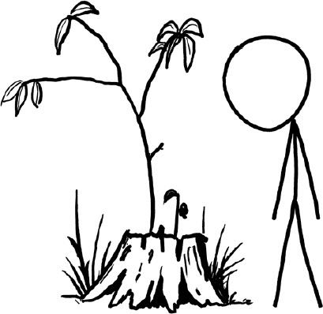
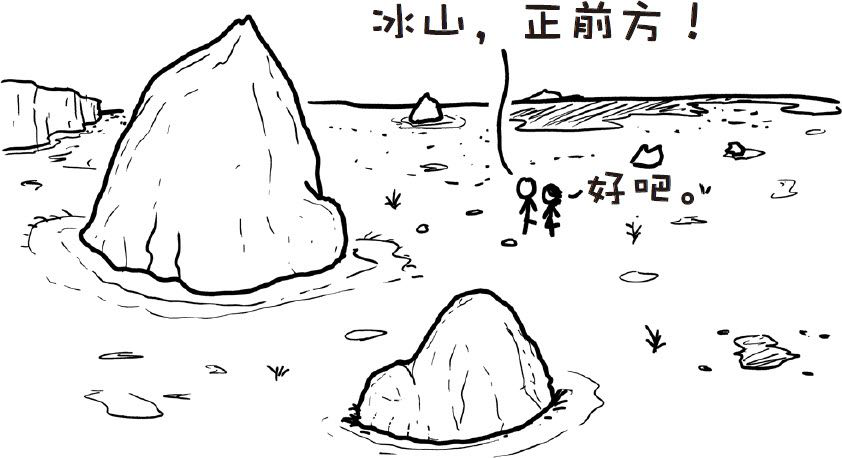
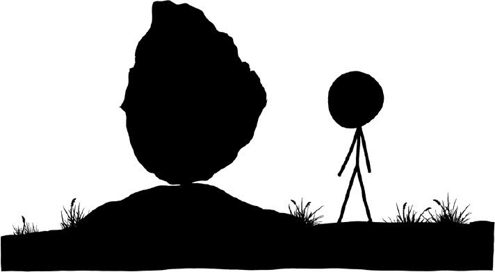
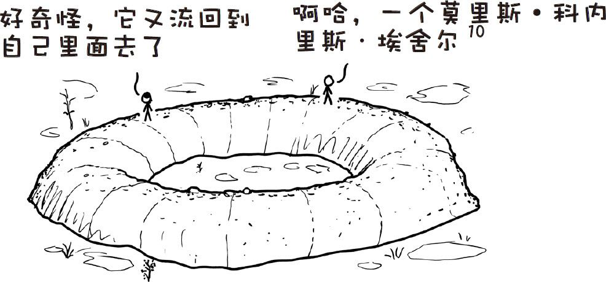
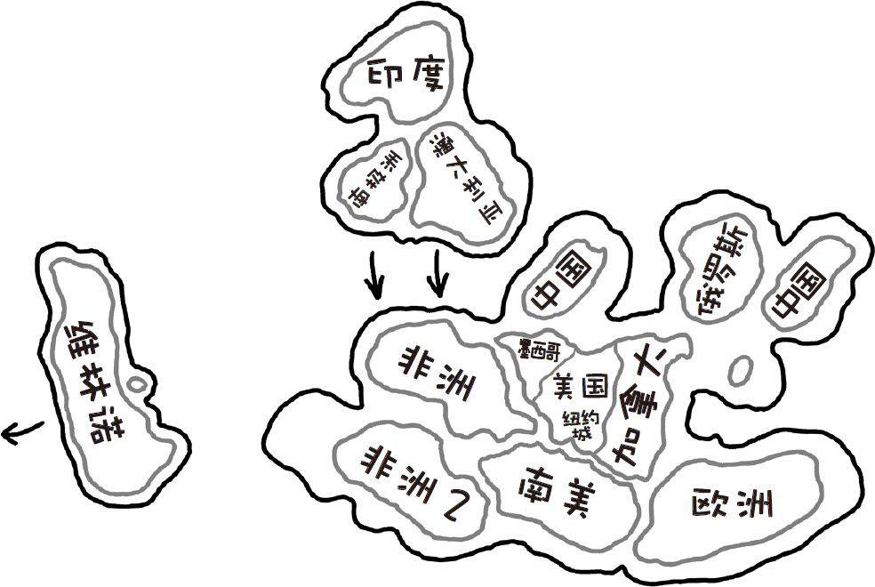
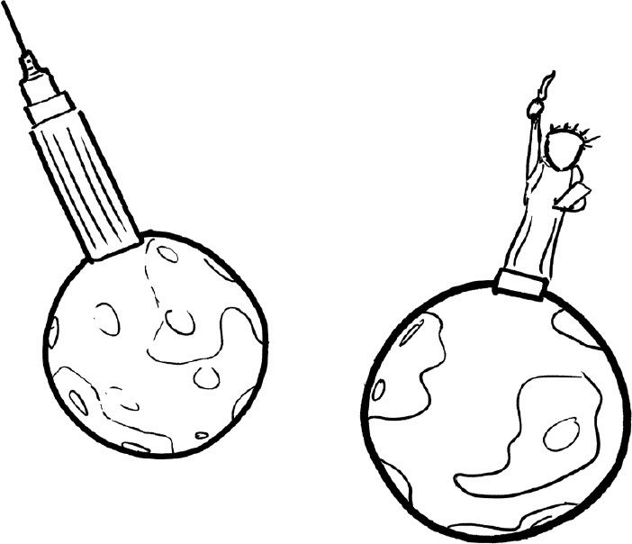

# 纽约式时间机器
###### NEW YORK-STYLE TIME MACHINE
### Q．我总认为当你回到过去时，你会到达和穿越前同一位置的地方，至少在电影《回到未来》中是这样的。如果真是如此，那么站在纽约的时代广场向前穿越1千年会怎样？1万年呢？10万年呢？100万年呢？10亿年呢？如果是向未来穿越100万年呢？

——马克·德特兰

***
### A．让我们一起来看看。  
#### 1千年前
在过去3千年间，曼哈顿地区就一直有人居住。最早来此定居的人大约是在9千年前。

欧洲人于17世纪来到这里，那时居住在此的还是勒纳佩人。[^1]勒纳佩人是一个由众多部落组成的松散联盟，住在如今的康涅狄格、纽约、新泽西以及特拉华地区。

1千年前，这个地区很有可能还居住着一群相似的部落联合体，但是此时距离欧洲人初次抵达还有500年。他们和17世纪勒纳佩人的距离，就像勒纳佩人和现代人的距离一样远。

要想知道1千年前连城市都没有的时代广场看上去是什么样，我们就要借助一个伟大的项目：威利极亚（Welikia）[^2]。它是由一个更小的项目——曼纳哈塔（Mannahatta）发展而来的。威利极亚计划已经绘制出了欧洲人第一次到达纽约城时那里的详细生态地貌图。

在welikia.org上，我们可以看到互动式的地图，一窥纽约以前的美景。1609年，曼哈顿岛还是由起伏的山脉、沼泽、林地、湖泊和河流形成的地景的一部分。

1千年前的时代广场的样子应该和威利极亚中描述的差不多。表面上看，可能会觉得它有点像如今生长在美国东北部的那些古老森林，但两者还是有一些显著差异。

1千年前的时代广场有更多大型动物。如今在美国东北地区零碎分布的小片古老森林里，已经几乎见不到大型食肉动物了。那里还有一些熊、少量的狼和郊狼，几乎没有山狮。（不过鹿群的数量暴增，部分原因是大型食肉动物都消失了。）

1千年前的纽约森林本应满是栗树。20世纪初期的枯萎病发生之前，北美东部的硬木林曾有四分之一是栗树，但现在活下来的只有树桩了。

现在在新英格兰的森林，你还能看到那些树桩。它们会间歇性地生出新芽来，但不久就会因枯萎病而死去。用不了多久，最后的栗树树桩也会死去。

在森林中狼很常见，随着你往内陆行进还会越来越多。你可能还会在内陆地区的森林里遇上山狮[^3]'[^4]'[^5]'[^6]'[^7]和旅鸽。[^8]但有一种生物你不会看到：蚯蚓。当欧洲殖民者第一次来到新英格兰地区时，那里还没有蚯蚓。要想知道其中的原因，我们将视线移到更早的时期。

#### 1万年前
一万年前的地球刚从冰河期里走出来。

此前覆盖新英格兰的大冰盖刚刚消退。2.2万年前，冰盖的南端在斯塔顿岛附近，但在1.8万年前，冰盖向北退到了杨克斯以北。[^9]到了1万年前，大部分冰盖已经后退到如今的加拿大边境以北了。

冰盖的消退抹去了基岩以上的所有东西。在之后的1万年里，生命开始渐渐转移回来。一些物种向北移动的速度比其他物种快，当欧洲人到达新英格兰时，蚯蚓还没回到那里呢。

随着冰盖的消退，一部分大冰块从整体上脱落下来，就这样遗留在地面上。

当这些冰块融化后，产生的水填满了地面上的低洼处，形成了所谓的锅穴湖。位于昆士兰的斯普林菲尔德大道北部尽头处的奥克兰湖就是一个锅穴湖。撤退的冰盖还会留下形成期间夹杂的卵石，这些石头被称为冰川漂砾，如今在中央公园还能看到。

在冰川下，融水形成的河流在高压下流动，在所经之处堆积起大量沙石。这些沉积物形成了所谓的“冰河沙堆”（eskers）的脊，在现今我位于波士顿的家旁边的树林处纵横交错。很多奇奇怪怪的地形都是由这种现象造成的，包括世界上仅存的垂直U形谷河床。

[^10]

#### 10万年前
10万年前的世界看起来可能和现在的世界更加相像。[^11]我们生活的时代里充满了快速交替的冰期，但在过去的1万年里，我们的气候一直保持稳定[^12]和温暖。

10万年前，地球正处在一个相似的气候稳定期末端，这个时期被称为桑加蒙间冰期。那时可能也有一个像我们现在这样高度发达的生态系统。

不过那时的海岸地质和现在完全不同，斯塔顿岛、长岛、楠塔基特岛和马萨葡萄园岛都是被最近一次的冰川像推土机一样推挤而成的坡台。在10万年前，海岸附近是另一批岛屿。

那时的丛林里可以找到许多现在的动物——比如鸟类、松鼠、鹿、狼、黑熊，除此以外还有一些很神奇的物种。要想了解这些生物，我们首先来看看谜一般的叉角羚。

现代的叉角羚（美洲羚羊）仍然是一个谜。它们能跑得飞快，速度远比生存所需的最高速度更快。它们能以每小时88千米的速度飞奔，并且能在很长一段距离内保持这个速度。而它们跑得最快的捕食者狼和郊狼在极速时也只能勉强突破每小时56千米。那么叉角羚为什么会进化出这么快的速度呢？

答案在于叉角羚进化时所处的环境远比现在的环境更加危险。10万年前，北美丛林是恐狼、短面熊和剑齿虎的家园，它们之中的任何一种都可能比现代捕食者跑得更快，也更加致命。不过它们都在第四纪灭绝事件（即冰河时期灭绝事件）中灭亡了，在此之前刚有人类来到美洲。[^13]

如果我们把视线再往前移，就会看到更可怕的捕食者。

#### 100万年前
100万年前，在最近一次大冰川期之前，世界还是相当温暖的。那时正处于第四纪中期，现代大冰川期在几百万年前已经开始，不过在冰川进退之间存在着一段平静时期，那期间气候相对来说比较稳定。

我们之前见识到了跑得飞快的以叉角羚为食的各种猎食动物，现在马上就会看到另一种残暴的食肉动物，一种长得很像现代狼的长腿土狼。土狼曾经主要在非洲和亚洲活动，随着海平面的下降，有一个种类的土狼跨过白令海峡进入了北美地区。由于它们是唯一一种跨过海峡的土狼，人们给它起了个名字叫豹鬣狗，拉丁名意为“见过海峡的土狼”。

接下来马克的问题把我们带到了更远的过去。

#### 10亿年前
10亿年前，各个大陆板块被挤到一起，是一个超级大陆。这个超级大陆并不是人们所熟知的泛古陆，而是联合大陆的前身：罗迪尼亚超大陆。详细的地质记录相当残缺，但我们猜测它是下面这个样子的：

在罗迪尼亚超大陆时期，现在位于曼哈顿底部的基岩还没有形成，不过北美地区深处的岩石已经存在很久了。现在的曼哈顿所在的那块大陆当时可能还在内陆地区，与如今的安哥拉和南美部分相连。

在这个古老的世界中，没有植物也没有动物。海洋里孕育着大量生命，但都是简单的单细胞生物。海洋表面漂浮着大量蓝藻。这些其貌不扬的生物是生命长河中最为致命的杀手。

蓝藻细菌是第一种进行光合作用的生物，它们吸入二氧化碳并释放出氧气。氧气是一种很暴力的气体，它会让铁生锈（氧化），让木头燃烧（剧烈氧化）。当蓝藻刚出现时，它们释放出的氧气对于其他几乎所有种类的生命来说都是有毒的，随之产生的物种大灭绝被称为大氧化事件。

在蓝藻使地球大气层和海洋中充满有毒的氧气后，其他生物慢慢进化出了新的能力，能够利用氧气的化学活性进行新的生物过程。我们就是那些第一批呼吸氧气的生物的后代。

这段历史有很多细节我们仍然不甚了解，10亿年前的世界很难进行重建，不过马克的问题现在把我们带到了更不确定的地方：未来。

#### 100万年后
人类终将灭亡。没有人知道会是什么时候[^14]，但没有什么东西能够永远存活下去。也许我们会逃到其他星球上继续存在百千万亿年；也许文明会崩溃，我们都会死于疾病或是饥荒，最后的人类会被猫科动物吃掉；也许我们所有人都会在读完这个句子后的几小时里被纳米机器人杀害。未来充满了各种可能。

100万年是很长一段时间。它是智人存在历史的好几倍，是我们发明书写语言时间的几百倍，因而我们可以很合理地推断，无论人类的未来将会怎样，百万年后我们必将处在与目前完全不同的时代里。

没有了人类，地质活动依然会继续进行。风雨和呼啸的沙子会逐渐分解并掩埋我们文明的印记，人类造成的气候影响很有可能会延后下一次冰河期，但我们不会终结冰河期的循环。最终，冰川会继续向前进发。几百万年后，没有多少人造物体还能保存下来。

人类存留时间最长的遗物可能是我们埋在地球各处的塑料片。我们挖掘出原油，对其进行加工生产出持久耐用的聚合物，然后把它们散布到地表各处，由此留下的印记将会比其他任何事物留存更长的时间。

我们留下的塑料会被撕碎并掩埋，或许一些微生物会进化出消化塑料的能力。很可能在几百万年后，一层无处可去的碳氢化合物处理品——包括洗发水瓶子和购物袋转化后形成的碎片——会成为我们文明存在过的化学纪念碑。

#### 遥远的未来
太阳正在慢慢变亮。在过去的30亿年里，一套复杂的反馈系统使得地球的温度能够保持相对稳定，即使太阳在缓慢地变得越来越热。

但10亿年后，这些反馈系统就会失效。曾经孕育生命并保持地球凉爽的海洋会成为生命最大的敌人。在炽热阳光的照射下，海水会煮沸，在地球表面形成一层厚厚的水蒸气毯子，并由此引发失控的温室效应。10亿年后，地球将成为第二颗金星。

随着地球变得越来越热，我们最终会失去所有的水，大气中将充满岩石蒸汽，因为地壳自身也开始沸腾了。几十亿年后，我们最终将被不断膨胀的太阳所吞没。

那时地球将被焚毁，而曾经组成时代广场的许多分子都会被垂死的太阳吹走，这些粉尘云会在太空中飘荡，或许还会坍缩形成新的行星和恒星。

如果那时人类已经逃出太阳系，目睹太阳的死去，那么我们的后代就将生活在这些新形成的星球上。那些曾经组成时代广场、被太阳之心循环利用过的原子，将会形成我们新的身体。

总有一天，我们要么全都死了，要么就都是纽约人了。

[^1]:又名特拉华人。
[^2]:勒纳佩语，意为“美好家园”。
[^3]:又名美洲狮（cougar）。
[^4]:又名美洲虎（puma）。
[^5]:又名山猫（catamount）。
[^6]:又名美洲豹（panther）。
[^7]:又名斑猫（painted cat）。
[^8]:虽然你可能不会看到欧洲殖民者们当初遇到的数亿只旅鸽形成的黑压压的旅鸽云。查尔斯·曼恩在他的书《1491》中声称欧洲人带来了天花、蓝绿茎牧草和蜜蜂，搅乱了当地的生态系统，欧洲人看到的庞大的旅鸽群其实是生态系统混乱的一个表现。
[^9]:也就是现在的杨克斯所在地。那时这个地方的名字应该还不是“杨克斯”（Yonkers），因为“杨克斯”来源于一个意为“安定下来”的荷兰语单词，而这要追溯到17世纪晚期了。不过有人声称叫作“杨克斯”的地区一直存在，在人类甚至地球存在之前就已经存在了。大概这么想的只有我一个人吧，但我可是想说什么就说什么的哦。
[^10]:M．C Escher的名字Escher与Esker相近。
[^11]:不过没有这么多广告牌。
[^12]:嗯，是曾经保持稳定，现在我们要使气候失衡了。
[^13]:如果有人问起来，就说完全是巧合。
[^14]:如果你知道的话，请发邮件告诉我。
