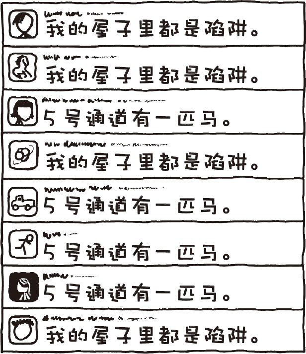
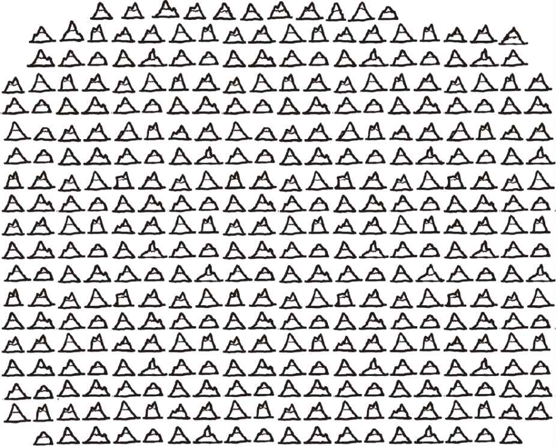

# 论Twitter的无穷性
###### TWITTER
### Q．世界上有多少独一无二的英语推文（Twitter状态）？如果全世界人民把它们都读出来要花多少时间？

——埃里克·H

***
>在遥远的北方有一个叫斯维斯约德（Svithjod）的地方，那里有一块大石头，它有100英里长，100英里高。每一千年都有一只小鸟来到这块巨石前，用石头磨砺自己的喙。当石头就这样被磨掉之后，永恒终才过了一天。  
>
——亨德里克·W．房龙

### A．推文只能有140个字符。而英语中有26个字母——如果你把空格也算进去的话是27个。如果利用这些字母，那么就有27140≈10200种可能的字符串。
但是在推文中你不止可以使用这些字符，所有的Unicode字符你都可以使用，而这加起来有超过100万个不同的字符。Twitter里Unicode字符算多少字的算法很复杂，但可能的字符串个数仍然高达10800种。

当然了，这些字符串中大多数都是毫无意义的多语种混搭，即使你把可使用的字符限定在26个英语字母中，也是充斥着像“ptikobj”这样无意义的词。但埃里克提的问题是用英语表达一些有意义的内容，那么有多少种可能性呢？

这个问题有点棘手。你的第一直觉大概是只允许使用英语里有的词。接下来你可能想把范围限制在合乎语法的句子里。

但这里有陷阱。比如说，如果你的名字正好是Mxyztplk的话，“Hi，I'm Mxyztplk”这句话在语法上就没问题。（说起来，就算你撒谎了，你的名字不是这个，这句话在语法上依然成立呀。）所以一个显然的问题就是，你不能把所有以“Hi，I'm…”开头的字符串当作一个独立的句子。对于一个普通的说英语的人来说，“Hi，I'm Mxyztplk”和“Hi，I'm Mxzkqklt”简直没有任何区别，因而它们不能被重复计数。但是“Hi，I'm xPoKeFaNx”这句话与之前那两句话是一眼就能看出不同的，哪怕“xPoKeFaNx”也无论如何不可能是一个英语单词。

所以我们用来衡量差异性的办法不管用了。所幸还有更好的办
法。

假设存在一种语言，它只有两个可用的句子，并且每条推文必须是这两个句子中的一句。这两个句子分别是：

* “5号通道有一匹马。”
* “我的屋子里都是陷阱。”

那么Twitter上看起来会是这个样子的：

这些消息看上去很长，但其中每一条的信息量只有一点——你所得知的只是某人选择发那条关于马的消息还是关于房子的消息。这本质上就是要么1要么0。虽然字母有许多，但对于一个看懂了语言模式的读者来说，这个语言的每一句话只含有1比特的信息。

这个例子蕴含了一个十分深刻的思想，那就是：信息，是与接收者对于信息内容的不确定性以及他们提前预测的能力息息相关的。[^1]

克劳德·香农——他几乎是以一己之力发明了现代信息理论——对于衡量一种语言的信息量有一个十分巧妙的方法。他给一组一组的受试者看普通的英语句子，只不过这些句子被随机在一个地方切断，然后他要求受试者猜出下一个出现的字母是什么。

  
`它威胁用信息把我们村子淹没！`

根据猜对的频率——以及严谨的数学分析——香农发现普通的写下来的英语句子的信息量是每个字母1～1.2比特。这意味着一个好的压缩算法能够把ASCII格式的英语文本——这种文本每一个字符占8比特——压缩到原来大小的八分之一。事实上，如果你用一款不错的压缩软件压缩一本txt电子书，你会发现结果基本上就是如此。

如果一段文本包含了n比特的信息，那么某种意义上来说这意味着它可以传达2n种不同的信息。这里用到了一些数学技巧（譬如，信息的长度以及“唯一解距离”这个概念），但我们至少可以知道所有有意义的推文的数量级在2（140×1.1）≈2×1046附近，而非之前所说的10200或10800。

那么全世界的人把这些都读出来要花多长时间呢？

朗读2×1046条推文大概需要一个人1047秒的时间，因而朗读完所有推文所需的时间大得惊人，以至于你可以不用纠结是让一个人去读还是让十亿人去读——因为不管是前者还是后者，在地球的有生之年里都不可能读完。

所以还是让我们回到那个鸟儿在石头上磨喙的故事吧。假设这只鸟每一千年都会磨掉一小片石头，在它离去的时候会把磨下来的这点儿尘埃颗粒带走。（一只正常的鸟儿磨掉的喙的量恐怕要比它能带走的石头量要多的，不过在现在这种情形下没有什么东西能用正常的思维来衡量，所以就先不管它，接着往下看吧。）

我们不妨假设你每天有16小时在大声朗读推文，而在你身后每一千年都有一只小鸟前来磨掉100英里长的山的微不足道的一小块尘埃。

当最终山被磨平时，永恒才刚过了第一天。

然后这座山又再次出现，然后这个循环继续进行，然后过了永恒的第二天。如此往复365个永恒日——每一个都有1032年这么长——然后一个永恒年才过去。

那只小鸟在100个永恒年里磨掉了36500座山，然后一个永恒世纪过去了。

但一个世纪还不够呢，一个千年还是不够。

读完所有的推文要花掉你一万个永恒年。

这段时间足够你旁观一遍从书写的发明一直到现在的人类的全史了，并且那只小鸟每磨掉一座山，你这里才刚过了一天。

140个字符看起来不是很多，不过我们是永远不会无话可说的。

[^1]:同时也隐约地暗示出五号通道有一匹马。
