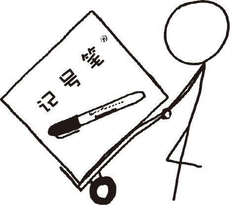

# 纸质版维基百科
###### UPDATING A PRINTED WIKIPEDIA
### Q．如果你要把整个英文版维基百科打印出来，那么你需要多少台打印机才能赶上网络版本的更新速度？

——马里安·科宁斯

***
### A．这么点就够了。

`如果你的男友/女友带你回家，你发现他/她的客厅里有一排打印机轰轰作响，你会怎么想？`

原来只要这么点儿打印机就够了！但在你打算自己打印一套实时更新的纸质版维基百科出来之前，让我们先看看打印机需要干些什么……以及这么做要花多少钱。

#### 打印维基百科
事实上曾有人考虑过把维基百科全部打出来这个想法。几年前，一个叫作罗布·马修斯的学生把维基百科上的所有“特色条目”都打印了出来，于是就有了一本一米多厚的书。

当然了，这些只是维基百科所有精华的九牛一毛，整个维基百科要比它大得多。一名维基百科用户Tompw建立了一个页面，计算整个英文维基百科如果全部打印出来要占多少地方。结论是它至少会填满好几十个书架。

要想赶上实时更新的速度可不容易。

#### 赶上更新速度
英文版维基百科现在每天有12.5万～15万次修改，相当于每分钟有90～100次。

我们可以试着定义一种方式，计算平均每次编辑的“字数”，但这会非常艰难，几乎不可能。还好我们并不需要这么做——我们可以估算每次需要再新打印一页的变化，虽然许多编辑修改可能需要好多页才能打印完——但很多编辑是回退操作，也就是说我们可以把很多已经打印好的纸再放回去。[^1]每次编辑要花费一张纸这个估算看上去挺合理的。

维基百科页面上一般是图文表格混杂，对于这样的内容，一台不错的喷墨打印机每分钟能够打印15页。也就是说只需要6台打印机就能在任何时刻跟上电子版的更新速度。

打印出来的纸张很快就会堆积起来。以罗布·马修斯打印出来的书作为参考，我自己又大致估算了一下现有的英文版维基百科的规模，根据“特色文章”的平均长度和所有文章的比值，我估计整个英文维基百科打印出来要有300立方米。

而如果你想赶上目前的更新编辑速度，你每个月都要打印300立方米的纸。

#### 每月花费50万美元
6台打印机并不多，但鉴于它们是在不间断地打印，成本一下子就上去了。

每天的电费倒是不贵——也就几美元吧。

纸张差不多每张1美分，这么说来一天要花掉约1000美元。你要雇人24小时管理这些打印机，不过雇人的成本还没纸张的花费高呢。

即使是打印机本身也不贵，除了吓人的更新周期。

但墨盒的花费将会成为你的噩梦。

#### 墨水
QualityLogic[^2]进行的一项研究指出，一个普通的喷墨打印机的实际墨水成本是从黑白的每张5美分到彩色的每张约30美分。这意味着你每天花掉的墨水钱要达到4～5位数。

你肯定会想买一个激光打印机。否则不出一两个月，这个项目就会耗费你50万美元。

但这还不是最糟糕的呢。

2012年1月18日，维基百科涂黑了所有的页面以抗议限制互联网自由的法案。如果有一天维基百科再次决定进行黑屏活动，然后你又想参与这一提议……

……你得买一大捆记号笔，然后把每张纸全部涂黑，而这全部都将由你一个人完成。

我还是用回我的电子版吧。

[^1]:这么做所需要的归档系统会让人脑袋炸掉。我正在拼命压抑冲动，不让自己着手设计一套这种系统。
[^2]:译注：全球资深的独立质量保证调查公司之一。
