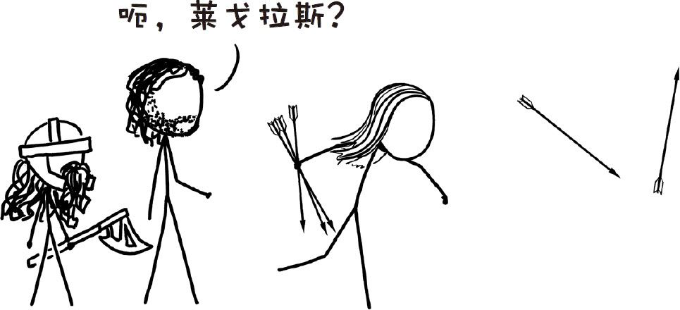
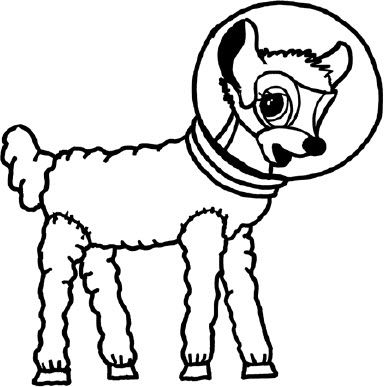
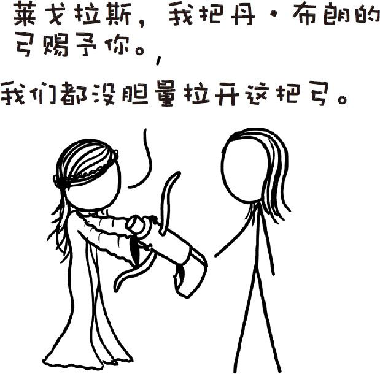
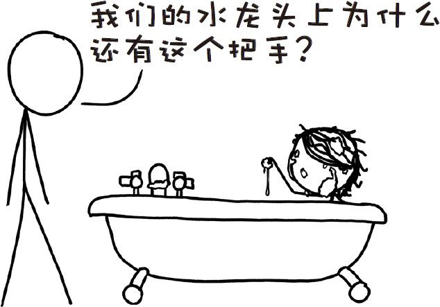

# 无重力射箭
###### WEIGHTLESS ARROW
### Q．假设有一个地方的大气条件和地球上的完全一致，但那里没有重力，如果我在那儿射出一支箭，那么这支箭要多久才会由于空气阻力而停下来？到最后这支箭会完全停下来并悬浮在半空中吗？

——马克·埃斯塔诺

***
### A．我们每个人都有这样的经历。
你现在正在一个巨大的空间站表面，准备用弓和箭朝某人射击。

和普通的物理问题相比，这次我们的思路要反一反。通常来说你会考虑重力而忽略空气阻力，但这次我们要忽略重力而考虑空气阻力。[^1]

就像你预期的那样，空气阻力会使箭支减速，最终在飞行了很远很远的距离后……箭支会停下来。还好在大部分飞行时间内，这支箭都不会对旁人造成太大的威胁。

让我们仔细看一下整个过程。

假设你以每秒85米的速度射出一支箭，这个速度差不多是棒球大联盟飞得最快的快球速度的2倍，和高端复合弓射出的每秒100米的箭相比还差一点。

射出的箭的速度很快就会降低，因为空气阻力正比于速度的平方，这意味着箭支在高速飞行时会受到相当大的阻力。

射出10秒后，箭支飞过了400米的距离，速度从起初的每秒85米降到了每秒25米，差不多相当于一个普通的人用手扔出的箭的速度。

在这个速度下，飞行的箭支危险性大大下降。

从猎人那儿我们知道，箭支速度的微小差异会极大影响到被射杀的猎物的体型。一支以每秒100米速度飞行的25克重的箭能够猎杀马鹿或者黑熊，而速度每秒70米的箭支可能都无法杀死一只鹿，或者，在我们的场景里，太空鹿。

如果箭支的速度进一步下降，它就更没危险性了……不过距离它停下来还远呢。

5分钟后，箭支已经飞出了大约1英里（约1.6千米），速度也下降到了步行速度。以这个速度飞行只会受到非常小的阻力，因而箭支会继续“滑行”，并缓慢地减速。

到了现在，这支箭飞出的距离已经超过地球上任何一支箭的射程了。高端的弓能在平地上将箭射出几百米，不过手持弓的最远射程世界纪录略高于1千米。

这个纪录由射手丹·布朗于1987年创立，他用一个几乎已经没有弓的样子的可怕装置将细长的金属杆射出了世界纪录。

随着时间越来越长，箭支的飞行速度越来越慢，此时流经箭支表面的气流开始发生变化。

空气的黏度很小，也就是说没有黏黏的感觉。这意味着飞过空气的物体受到的空气阻力来自于它们排开空气的动量——而不是来自于物体与空气分子之间的黏力。这像是你用手推过一浴缸的水而非蜂蜜。

几个小时后，箭支的飞行速度已经到了肉眼几乎无法分辨的程度。假设此时空气是相对静止的，那么现在空气对于箭支更像是蜂蜜那样黏糊糊的，而箭支也会慢慢地趋向停止。

箭支的外形细节会大幅影响最终的射程。箭支形状的细小差别会极大改变低速流过的空气的特性，但此时箭支至少已经飞出了好几千米，飞出个5千米或者10千米也是可以想象的。

现在问题来了：目前能够持续维持零重力的类地环境只存在于国际空间站。国际空间站最大的一个单元“希望号实验室”的长度也只有10米。

这意味着如果你真的打算做这个实验，箭支飞不出10米。之后这支箭要么就此停下来，要么就酿成大祸。

[^1]:而且你不太会没事儿去拿箭射宇航员，至少一个有学士学位的人不会这么干。
