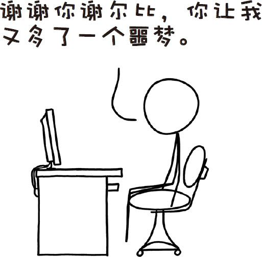
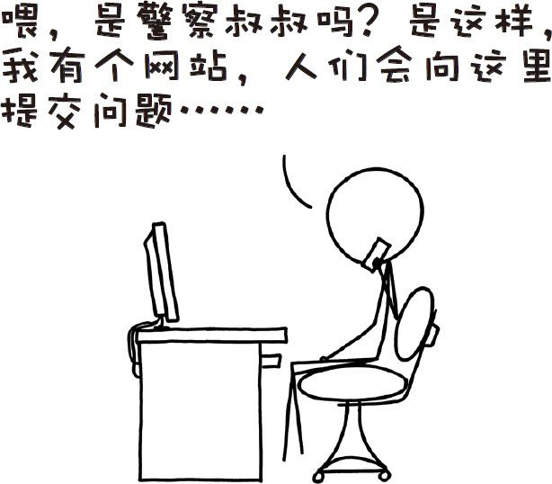

# 那些古怪而又让人忧心的问题合集一
###### WEIRD（AND WORRYING）QUESTIONSFROM THE WHAT IF？INBOX，#1
***
### Q．如果把牙齿的温度降到很低，有没有可能在喝到热咖啡的时候牙齿就崩碎了？

——谢尔比·赫伯特

### Q．美国每年有多少幢房子被大火烧毁？让这个数字大幅增长（比如上升15％）最简单的方法是什么？

——匿名提问者

