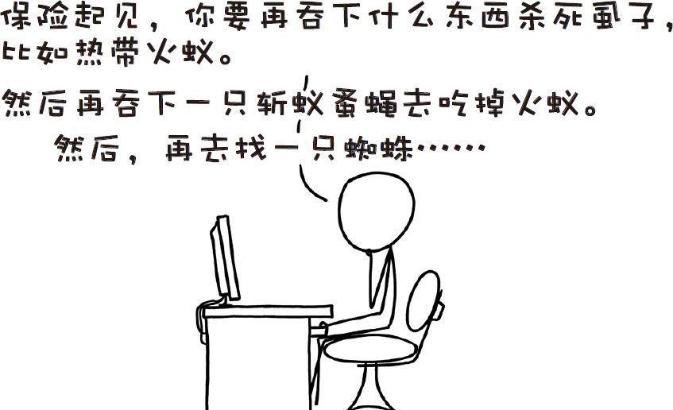

# 那些古怪而又让人忧心的问题合集十二
###### WEIRD（AND WORRYING）QUESTIONSFROM THE WHAT IF？INBOX，#12
***
### Q．如果我吞下一只携带莱姆病病毒的虱子会怎么样？胃酸能够杀死虱子和莱姆病毒吗？还是说我会从内到外染上莱姆病？

——克里斯托弗·福格尔

### Q．假设一架客机的共振频率相对恒定，那么需要多少只猫咪以什么频率一起喵喵叫才能使这架飞机坠毁呢？

——布里塔妮

