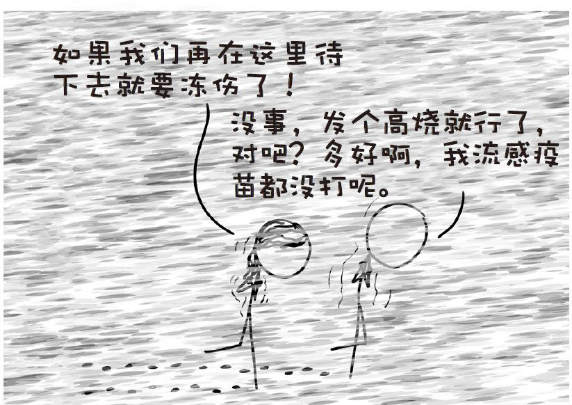
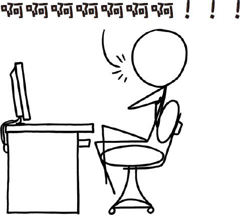

# 那些古怪而又让人忧心的问题合集五
###### WEIRD（AND WORRYING）QUESTIONSFROM THE WHAT IF？INBOX，#5
***
### Q．如果说全球变暖会使温度上升，超级火山爆发会使全球气温下降，那么两个灾害结合在一起是不是就互相抵消了？

——弗洛里安·赛德尔-舒尔茨

### Q．一个人要跑多快才能被切奶酪用的丝线在肚脐这里拦腰隔断？

——乔恩·梅里尔

