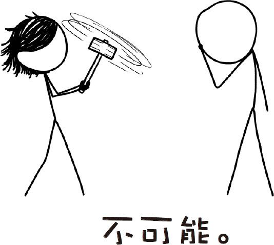

# 那些古怪而又让人忧心的问题合集七
###### WEIRD（AND WORRYING）QUESTIONSFROM THE WHAT IF？INBOX，#7
***
### Q．在电影《雷神》中，男主人公曾把他手中的锤子转得飞快，以至于产生了强大的龙卷风。这在现实中是可能的吗？

——达沃尔

### Q．如果你把一辈子亲吻的力气都省下来，并且都用到一次亲吻上，那么你能产生多大的吸力？

——乔纳森·林德斯特伦

### Q．需要多少射向美国的核导弹才能把美国彻底夷为平地？

——匿名提问者

