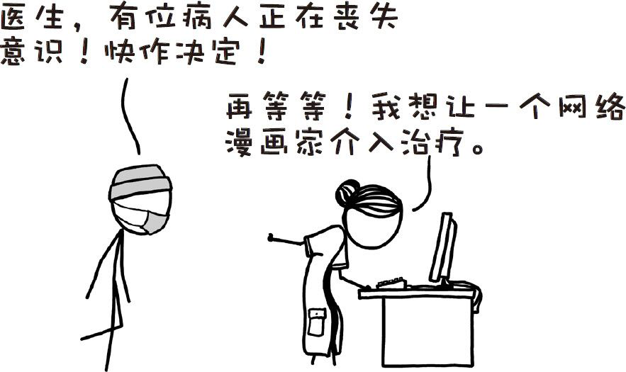
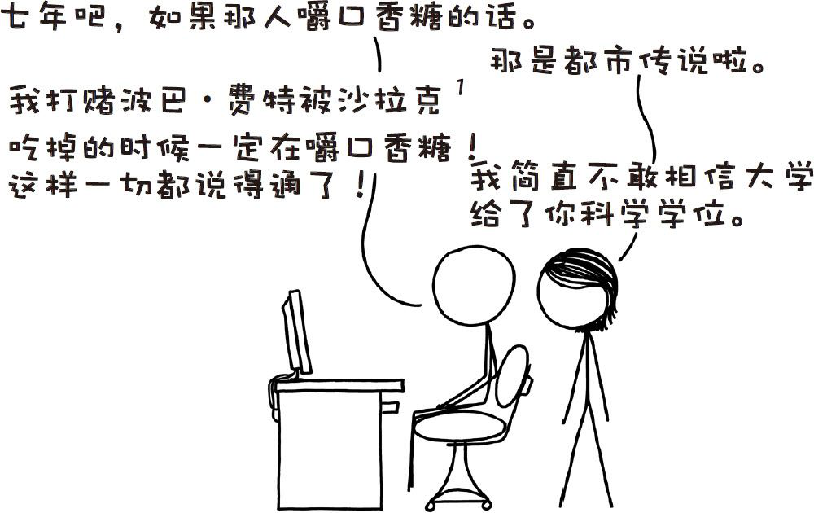

# 那些古怪而又让人忧心的问题合集八
###### WEIRD（AND WORRYING）QUESTIONSFROM THE WHAT IF？INBOX，#8
***
### Q．如果有一种毒药能够阻断肾小管的再吸收功能，但不影响过滤功能，那么服用这种毒药在短期内会产生什么影响？

——玛丽

### Q．如果捕蝇草可以吃人，那么一个人大约需要多久才会被捕蝇草完全液化并吸收呢？

——乔纳森·王

[^1]

[^1]:均为《星球大战》中人物。

