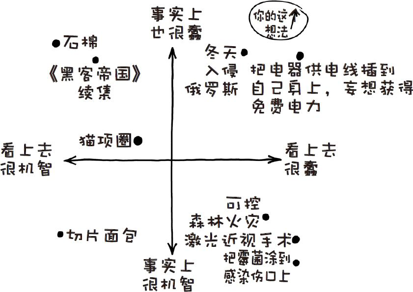
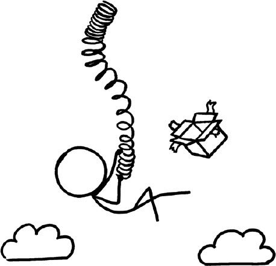

# 那些古怪而又让人忧心的问题合集九
###### WEIRD（AND WORRYING）QUESTIONSFROM THE WHAT IF？INBOX，#9
***
### Q．我可以通过沉入地表游泳池的水面的方法躲过海啸并活下来吗？

——克里斯·马斯卡

### Q．如果你在自由下坠的过程中降落伞突然失效了，但你有一个质量、张力等都恰到好处的“机灵鬼”螺旋弹簧，如果你把弹簧抛向空中，手握其中一端，通过这种方法能让你活下来吗？

——瓦拉达拉金·斯里尼瓦桑

