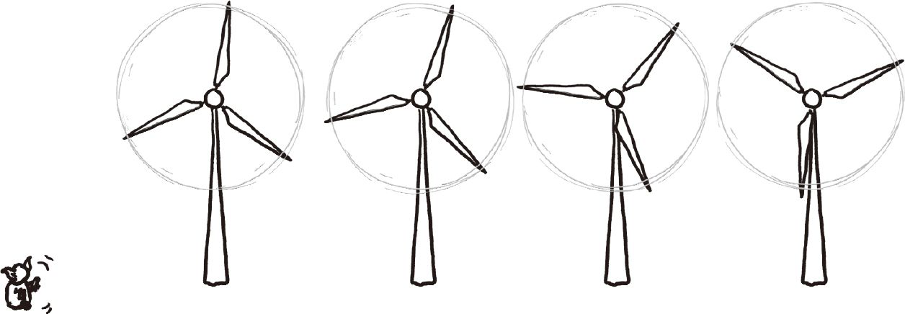
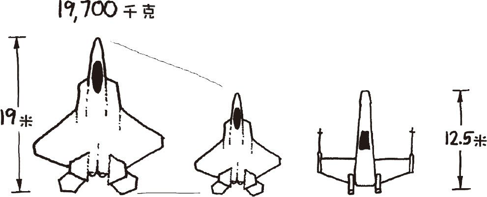
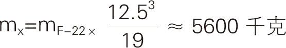
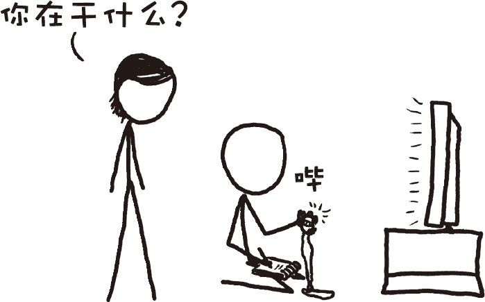
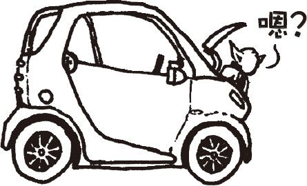
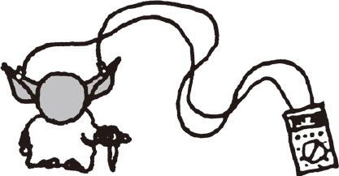

# 尤达大师
###### YODA
### Q．尤达大师的原力的输出功率有多大？

——瑞安·芬尼

***

### A．星战前传不在本文的讨论范围之内，你们懂的。
在《星球大战》原三部曲中，最能够展现尤达大师原力风采的当数他把卢克的X翼战机从沼泽里提出来了。就物理移动物体这一点而言，尤达此举无疑是整个三部曲中消耗能量最多的一次。

提升一个物体至一定高度所需的能量等于物体的质量乘以重力加速度乘以提升的高度。从尤达提起X翼战机一事中，我们可以猜出尤达最大输出能力的下限。

首先我们要知道一架战机有多重。X翼战机的重量从来没有官方的说法，但我们知道它的长度为12.5米。一架F-22战机长度为19米，质量19700千克，所以按比例算下来X翼战机的重量大约为5600千克。

接下来我们要知道提升的速度有多快。我又去看了一遍电影中这个场景，给X翼战机提出水面的场景记了个时。

战机的前起落架用了约3.5秒才从水中出来，我估算了一下起落架的长度大约为1.4米（基于《星球大战4：新希望》中一名机组成员从起落架前挤过的场景计算），因而X翼战机的提升速度为每秒0.39米。

最后我们要知道达戈巴星球上的重力加速度。我目测自己要卡在这个问题上了，因为就算科幻迷们再狂热，也不太会有《星球大战》中去过的每颗星球的地质特性的目录表，对吧？

不，我低估了影迷们的能力。乌奇百科上就有这么个目录表，从上面我们可以得知达戈巴的表面重力加速度为0.9倍地球重力加速度。算上之前得到的X翼战机的质量和提升的速度，我们可以计算出峰值输出：

这足够供应一整个街区的家庭用电了。19.2千瓦大致相当于25马力，差不多是Smart电动车的引擎功率。

按照目前的电价，尤达每小时发出的能量价值约为2美元。

但远距施力只是原力的其中一种形式。西斯大帝用来震击卢克的闪电又如何呢？这道闪电的物理本质始终没讲明白，但能够产生相似场景的特斯拉线圈的功率在10千瓦左右，表明大帝的输出功率和尤达相当。（这些特斯拉线圈一般用的是许多持续时间很短的脉冲，如果西斯大帝能够像电焊机那样一直维持电弧的话，输出功率将轻松突破百万兆瓦。）

那么卢克呢？我检验了一下他用原力把光剑从雪里拔出来的场景。具体的数字很难估算出来，但我进行了逐帧分析之后，得出的估计值是400瓦的峰值输出。这和尤达19千瓦的输出相比实在不足一提，而且持续时间也只有几分之一秒。

所以用尤达作为能量源看起来是最好的选择。不过随着全世界用电量迫近2太瓦，我们需要1亿个尤达才能满足供电需求。总之把所有的因素考虑在内，换用尤达发电很可能是得不偿失——但这绝对是一种绿色能源。

