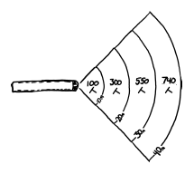
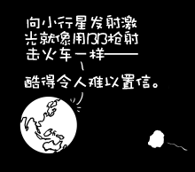

# BB枪
###### BB Gun
### Q．在《末日大决战》中，一位美国宇航局的家伙评论说，向小行星发射激光的计划就像“向货运列车发射BB弹”。要用BB枪阻止失控的货运列车需要什么代价？

——查尔斯·詹姆斯·奥基夫

***
### A．首先，记录在案的是，用激光拍摄小行星是使其偏离轨道的[好方法](http://proceedings.aip.org/resource/2/apcpcs/664/1/509_1?bypassSSO=1)。用BB枪停火车可能更难。

红色莱德弹簧活塞杠杆式气步枪以每秒100米的初速发射标准的0.177口径0.33g钢制BB弹。

GE Genesis系列I机车重12吨，速度约为45m/s。

如果你从近距离向机车前部发射一个BB弹，你每天会让它减速一英尺左右。

以每秒一枪的速度，要让火车停下来需要两天多的时间消耗将近200000个BB弹，到那时，它无论如何都会自己停下来。（根据[本页]关于列车阻力的公式，机车运动的络线微分方程的粗略计算表明，在没有制动器的平坦轨道上，机车将在10或15分钟内自行减速，从100英里/小时降至20英里/小时）。

很明显，红莱德并没有真正削减它的速度。

是时候涉入到气枪狂热者的恐怖世界了。

[战术版Drozd Blackbird](http://www.drozdmax.com/bb-machine-guns/tactical-edition-blackbird.html)是一种高端BB机枪（当然有BB机枪这种东西啊）。它以超过每秒200米的初速每分钟发射1200发子弹。在这些速度下，标准BB弹能够使人骨骼断裂。

不幸的是，即使在瞬间将600发子弹全部射向车头，也只会使列车的速度降低百分之一的一小部分。

一个人拿着BB枪是做不到的。但是如果我们有一支军队呢？

我们会给每个人一块两英尺乘四英尺的土地。这有点局促，但应该足够让他们在前面的人肩上形成一个弧形的空间来开火。如果我们将他们限制在轨道两侧列车前方45度的范围内，我们可以在10米范围内容纳大约100人，在20米范围内容纳300人，在30米范围内容纳550人，在40米范围内容纳750人。

大多数射手都能相当直接地击中火车。整合所有不同射击角度的动量表明，扇形排列对火车施加的冲量超过理想排列（每支枪都在火车正前方）的90%。

BB弹会受到很大阻力，所以更远的人射出的子弹会以更低的速度到达火车。[本页](http://www.swatairsoft.eu/37.html)给出了不同速度下BB弹上阻力的估算值。我太爱互联网了:-)。

考虑到所有这些，让我们看看当一群人带着BB机枪试图阻止火车时会发生什么。事实上，人有两只手臂，所以我们让他们都双持。

当`t=0`时，列车50米范围内的人（共2500人）触发，每秒释放100000个BB弹。让我们假设当火车向前行驶时，前面的人神奇地从铁轨上侧向飞走。这是不现实的，但我们不能让他们用他们的身体让火车慢下来，那样会作弊。

当这些人停止射击时，沿着轨道较远的人进入射程并开始射击。火车开得如此之快，以至于任何一个人在目标经过（或穿过）他们之前只能射击几十发。

在任何时候，空中都有45000个BB弹。但有一个问题：当钢球从火车前部反弹时，它们不会消失。他们飞回射击者（可能会射出他们的眼睛）并进入火线。在它的顶峰，这片弹跳云通过BB-BB碰撞偏转了近1%的射程。这是一个简化的结果，但它不会实质性地干扰我们的计算。

不幸的是，即使是这场钢铁冰雹，也需要几分钟和近两公里的轨道才能让火车停下来。这意味着我们需要超过10万名枪手在赛道上排队，为他们配备武器大约需要5000万美元。

我们可以做得更好，但我们必须放宽对BB枪的要求。

AK-47射出的子弹初速度为715米/秒，发射的子弹比钢制BB弹重25倍。子弹的速度如此之快，以至于它们穿透了火车的车身（这意味着它们传递动量的效率稍低，但这并不重要）。

计算表明，2500人每人双持两架AK-47就能在一秒半的时间内将我们失控的机车停在30米的范围内。任务完成了。

...好吧。

与钢球轴承相比，机枪弹药的阻力系数大大降低，这意味着我们可以从更远的距离射击。让我们把人群的深度从50米改为200米。

`t=0`时，有40000人开火。AK-47通常有一个30发弹匣，每秒发射10发子弹。不到三分之一秒，空中就有25万发子弹。毫无疑问，在人群面前，散弹会造成很多人死亡，但有了训练有素、纪律严明的射击队，大部分子弹实际上都能击中目标。

在`t=15 ms`时，机车已缓慢前进半米，并遇到子弹云的前缘。

在`t=30 ms`时，火车头每毫秒就会被六颗新子弹击中。

在`t=150 ms`时，机车向前爬行了大约6米，但它每毫秒吸收几百发子弹。这已经开始减缓它的前进势头（把它撕开，让我们假设它装满了某种轻质材料，可以均匀地分配子弹的冲击力）。

在`t=300 ms`左右时，整整25万发子弹在空中。大多数人用两把枪总共打出了六发子弹。有趣的是，前排射手的子弹偶尔会赶上后面射手较慢的子弹，并与之碰撞。虽然这种情况并不经常发生，但确实发生了。

火车头缓缓前进到`7 m`，`7.5 m`，`7.75 m`……然后又是`7.5 m`。

成功！

但枪手到目前为止只发射了大约12发子弹。他们的弹夹大部分还是满的。

在`t=1 s`时，已发射了近一百万发子弹。机车以大约100米/秒（220英里/小时）的速度向后滑动。在`t=2s`时，机车的后向加速度会减慢很多。这部分是因为它开始超出射手的射程。但这也是因为火车头几乎以音速行驶，子弹越来越难追上。当子弹追上货车时，它们的相对速度很小，以至于子弹不能再加速货车了。

此时，来自大气的阻力是机车运动的主导力。尾部从轨道上抬起，机车开始翻滚，最后分解成一团弹片和废子弹。

现在把那颗小行星带上来。

