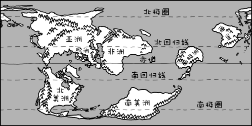
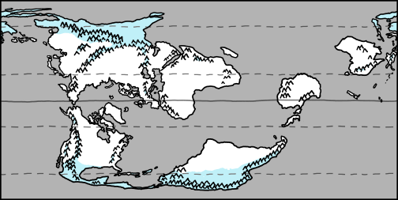
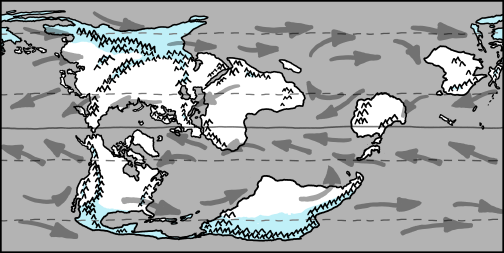
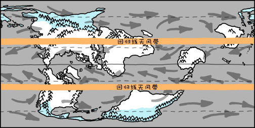
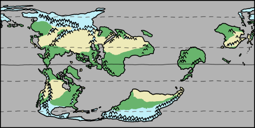
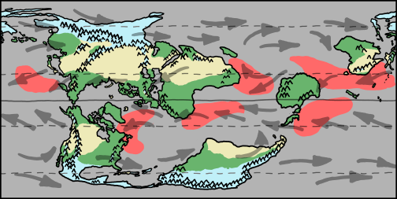
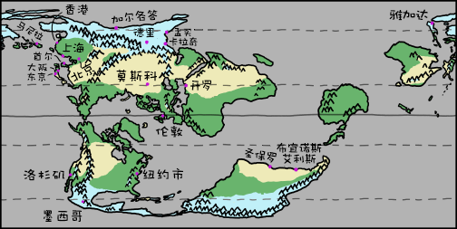
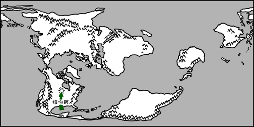

# 卡西尼地球
###### Cassini
### Q．如果陆地质量分布和现在一样,只是地球表面滑动90°,世界会变成什么样呢?

——索克

***
### A．这将深刻地改变我们的生物圈，特别是公共无线电。
索克问，如果地球表面滑动90度，我们目前的北极和南极赤道上会发生什么。我们不会改变地球轴的倾斜度：我们只是想象表面的排列方式不同。

  

我们将选择格林威治子午线作为我们新的赤道，将新的南北两极放在印度洋（0°N，90°E）和厄瓜多尔海岸（0°N，90°W）。印度、印度尼西亚和厄瓜多尔将成为极地，而欧洲、南极洲和阿拉斯加将成为热带。

沙漠和森林会在哪里？哪些区域会变得更好或更糟？

这东西很复杂。过一会儿，我们将开始用疯狂的猜测来重塑地球的地貌。但首先，先看一个简短的故事来说明这些东西是多么令人费解的复杂：

在撒哈拉南郊的乍得，有一个山谷叫做Bodélé Depression：它曾经是一个湖床，山谷地面上的干燥尘土充满了来自生活在那里的微生物的富营养物质。

从10月到3月，来自东部的风被夹在两个山脉之间。当地表风速超过每小时20英里时，它们开始从山谷中扬起灰尘。这些尘埃被吹向西边，一路吹过非洲，越过大西洋。

乍得一个小山谷的泥土[通过供应了超过50%的富营养的灰尘的方式向亚马逊雨林施肥](http://iopscience.iop.org/1748-9326/1/1/014005)。

至少，根据那项研究的结果是这样的。但如果是对的，这不会是一个疯狂的反常现象。这种复杂性随处可见。我们世界的基本组成部分也是疯狂的。

这就是为什么我们可以如此肯定像全球变暖一类的大规模模式，在这方面我们理解整体物理学得相当不错——能量输入，少量的能量流出，所以平均温度上升——但很难预测它将如何影响任何特定的地点或特定物种。

所以，即使我是一个气候专家（我绝对不是），我也没有办法肯定地回答这个问题。因为变量太多了。相反，想象一下，这个替代地球可能包含的一些东西的粗略草图。

首先，以下是我们重新洗牌后的世界地图：

  

（顺便说一下， 等矩形投影。这种类型的等矩形投影以南北子午线而不是赤道为中心，被特别称为卡西尼投影，因此我们替代地球的好名字可能是"卡西尼"。

让我们想象一下，这个替代地球发展了数百万年，生态系统和气候区已经稳定下来。然后有一天，我们醒来发现我们目前的文明已经神奇地运送到这里(包括城市和其他所有东西)。他们会发现什么？

旋转后地球的气候将在很大程度上取决于[海洋和大气热循环](http://eesc.columbia.edu/courses/ees/climate/lectures/gen_circ/index.html)的细节。我们会猜到其中的一些，但在让我们假设这个世界有类似于我们的极地。

因此，让我们在两极附近和山区添加一些冰和永久冻土：

  

接下来，我们应该填上一些绿地和沙漠。这些地方在很大程度上依赖于降雨，所以我们需要勾勒出一些风。

我们天气的主要驱动因素是太阳，太阳相比两极显著加热赤道附近的空气。热空气在赤道上升，然后向极地流动，较冷的空气沿着地表向赤道移动。这种循环被称为[哈得来环流](http://en.wikipedia.org/wiki/Hadley_cell)。

哈得来环流随季节在赤道的北部和南部移动。每年的这个时候，太阳光直射在地球10°N左右的上空，这就是飓风现在正在这个纬度附近形成的原因。

由于科里奥利效应，哈得来环流的表面风从东向西流动。再往北，在大多数温带地区，普遍的地表风是自西向东。（有时，两极周围也有从东到西的风。)

因此，让我们补充一些风轨迹——记住，在现实中，事情会因为和土地相互作用以及持续的高低压系统的位置而进一步复杂化。

下沉的空气是凉爽和干燥的，所以在哈得来环流的外缘下的土地往往是干旱的。这些区域，位于向极地倾斜30度的位置，被称为[回归线无风带](http://en.wikipedia.org/wiki/Horse_latitudes)。

赤道上升的空气携带着来自海洋的水分，然后凝结成雨，所以热带地区通常是湿润且生命里旺盛的。赤道附近的地区有时以季节性[季风周期](http://en.wikipedia.org/wiki/Monsoon)为主。

在温带地区，情况更加多变。那里的天气以急流和锋面的运动为主，严重依赖当地地理条件。美国大部分地区都处于这种地区。

考虑到上面一切，让我们补充一些干旱和郁郁葱葱的地区：

（气候可能很难预测，例如，在我们的世界，索马里和法属圭亚那都坐落在赤道上一个大陆的东海岸，似乎它们都应该受到热带海风。但法属圭亚那沿海是茂密的雨林，而索马里沿海是一个干旱的沙漠。这个解释涉及了季风周期。)

为了好玩， 这里有一个大胆的猜测， 飓风盆地将在哪里：

让我们仔细看看每个大陆。

**北美**的气候与以前相似，但南北翻转。加拿大北极省份现在是热带省份，而中美洲则成为了冰原和极地。飓风将威胁格陵兰岛、巴芬岛和加拿大沿海省份。来自巴芬湾和西北（原北）大西洋的热带湿气与从落基山脉流经美国的冷空气混合在一起，在哈德逊湾内陆的草原上形成了一个新的龙卷风湾。

**南美**有点像旧的欧洲。巴西海岸沿线凉爽温带，它大部分宽度都带有北方森林和草原。在南部，北方植被让位于极地冻土带，并最终让位于巨大的冰封的安第斯山，这些冰封的安第斯河切断了非洲大陆与冰冻的极地水域的连接。亚马逊河在我们世界上的载水量比接下来的七条最大河流总和还要多，但现在它已沦为类似于密西西比河的河流。

**亚洲**的翻转方式与北美相同，西伯利亚海岸面对着一片封闭的热带海洋。印度次大陆和北部（原东南亚）亚洲形成了新的西伯利亚。戈壁沙漠不再处于喜马拉雅山的雨影中，但并没有完全变成热带沙漠。

**欧洲**类似于旧的东南亚。英国和爱尔兰看起来像印尼的苏门答腊岛和婆罗洲岛。冰岛类似于我们的菲律宾。中欧是新几内亚，阿尔卑斯山是赤道上唯一拥有永久冰川的地方。

**非洲**的气温是90度，南部（原西部）非洲成为热带雨林，北部（原东部）非洲是干旱的沙漠。在我们的地球上，北美是唯一经常发生龙卷风的大陆，但在这个世界上，龙卷风在东非也变得很常见。

**澳洲**凉爽潮湿，北部（原西部）地区有森林。

**南极洲**显然是赢家。没有冰帽后，它比我们记忆中的小一点，但大部分被高原雨林覆盖。南部和西部的山区周围有高山地带。罗斯岛的麦克默多和斯科特基地的研究人员醒来后来到一个热带天堂。如果他们中有人怀念原来冰冻的荒地，他们一直都可以转移到哥斯达黎加。

现在，让我们看看世界上一些大的城市的情况：

有些城市变冷了。

**墨西哥**现在位于极地山脉的高处，被埋在冰盖下。

**雅加达**是新的斯瓦尔巴群岛，即使是对大多数挪威人来说，也就是一块荒凉的海岸岩石。

**加尔各答**和**德里**被冰封了，被喜马拉雅山脉与温暖的世界隔开。

**香港**、**马尼拉**、**卡拉奇**和**孟买**与我们的世界安克雷奇或雷克雅未克相似，海洋没有结冰，但肯定很冷。

一些城市仍然完全适合居住，尽管有一些变化：

**首尔**、**大阪**、**东京**、**上海**和**纽约**是受影响最小的城市之一，气候与以往大致相似。上海确实变冷了，但所有五个城市的季节性极端天气都变温和了——尤其是在首尔——而且非常潮湿。

**开罗**稍微向南移动。它现在被沿海大草原包围着，在尼罗河口周围发现了雨林点。虽然它离赤道更近，但实际上并没有变热。

**圣保罗**和**布宜诺斯艾利斯**稍微降温一点。他们现在位于南美洲的北部海岸，那里有加拿大式的纬度。他们的气候介于我们新英格兰和我们旧英格兰的气候之间。

**洛杉矶**凉爽温和。稳定的海风将水分吹进圣加布里埃尔山脉，使洛杉矶成为新美国雨量最大的地区之一。它非常类似于我们西雅图的潮湿版本。

一些城市变得更热了。

**莫斯科**非常炎热，非常干燥，气候条件位于我们的凤凰城和巴格达之间。在俄罗斯生存了几个世纪的俄罗斯人对辞职不屑一顾。

**伦敦**坐落在一个横跨赤道的热气腾腾的丛林中，气候通常与马尼拉相似。食物仍然平淡无奇，泰晤士河里满是食人鱼，这是地球上唯一老虎在攻击你时道歉的地方。

一开始，我提到了对公共电台的影响。要解释，让我们再考虑一个方案。也就是说，如果这种改变是在相当短的时间内在我们的地球上做出的呢？

我们假设所有的材料都神奇地四处移动，所以没有大规模的海啸或地震。即便如此，这肯定仍然是一场灾难。首先，冰帽会融化很久，然后新的冰帽才能形成，把海洋推高几百英尺。气候区的重新洗牌将对生物圈造成巨大冲击，导致食物链崩溃，并最终导致各级大规模灭绝。

但是，如果这种转变恰到好处——迈克尔湾正在发生——那么，随着墨西哥湾的海水开始变冷，密西西比河流速减慢，成为河口，该地区的野生动物将迁移到内陆。

有一天早上，明尼苏达州人醒来时看到漂浮的火蚁筏，接着是500万只迷路的饥饿鳄鱼...

...以一段令人痛心、出人意料地血腥的消息开始的《沃贝贡湖的消息》栏目,最终结果的是,这将成为*A Prairie Home Companion*的最后一次致命的广播。