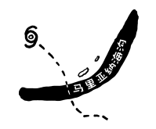

# 马里亚纳海沟爆炸
###### Mariana Trench Explosion
### Q．如果你在马里亚纳斯海沟底部爆炸了一枚核弹（比如沙皇邦巴）会怎样呢？

——埃文·塞林

***
### A．影响出乎意料的小——尤其当你拿它和仅仅放在海洋表面的核弹相比时。

埃文不是第一个想到在水下引爆核武器的人。事实上，我们已经试过很多次了。这就是它看起来的样子。

然而，大多数试验涉及小型炸弹或浅水。埃文的情况与此无关。

沙皇炸弹是有史以来引爆的最强大的核武器，重达5300万吨，马里亚纳海沟是海洋最深的部分，深至11公里。没有任何水下测试涉及到如此大的炸弹，也没有如此深的试爆地点。

1962年，物理学家弗里曼·戴森（Freeman Dyson）写了一份备忘录，讨论了八种可能的新型武器系统，所有这些武器系统看起来在不久的将来都是可能的，并概述了每种武器的潜在军事用途和危险性。这份备忘录已经解密，但从未发表过。弗里曼的儿子，科学史学家乔治·戴森，从他父亲那里得到了一份备忘录的纸质副本，并慷慨地拿给我看。

在备忘录中，弗里曼讨论的八个想法之一是使用千兆吨核武器作为波发生器。其中包括一段相当恐怖的文字，描述了北美海岸外一枚百万吨级水雷的爆炸：“尚未对破坏性影响进行定量研究。粗略估计表明，洪水将达到海平面以上200-300英尺的高度，或内陆200-300英里的距离，以先达到的限制为准。”

幸运的是，后来的研究描绘了一幅不那么可怕的画面。

核海浪领域的开创性工作是[水下爆炸产生的水波](http://www.dtic.mil/cgi-bin/GetTRDoc?Location=U2&doc=GetTRDoc.pdf&AD=ADA304244)，这是一份由Bernard Le Mehaute和Shen Wang为国防部编写的长达400页的报告。该报告于1996年出版，详尽地审查和总结了所有关于核爆炸产生的海浪的现有研究。

该报告概述了当核武器在水下爆炸时，它如何产生一个热气腔，然后坍塌。如果爆炸发生在地表附近，它可以在某些情况下产生一些相当大的波，这些波可能在爆炸地附近数百英尺高。

还是海洋爆炸点[^1]？

幸运的是，这些海浪与海啸有着根本的不同。事实证明，如果海浪很大，它们会很早破碎，并消耗大部分能量在大陆架上形成一个狭窄的冲浪区。这对一些船只来说是潜在的危险，但远没有直接核攻击那么严重。当海浪到达海岸时，它们并不会比一场大风暴的浪大。

但这些都是靠近地表的爆炸波。一枚核武器在水下深处引爆的表现略有不同。

马里亚纳海沟底部的爆炸将形成一个快速膨胀的球形热蒸汽腔。为了弄清楚它有多大，我们可以尝试1971年发表的[水下爆炸各种理论模型评估报告](http://www.dtic.mil/dtic/tr/fulltext/u2/737271.pdf)中的公式：

$$
\text{半径} = \left (\frac{3}{4\pi}\right )^\frac{1}{3}\left ( \frac{40 \% \times 53\text{百万吨TNT}}{\text{马里亚纳海沟压力}+\text{1个大气压}} \right)^\frac{1}{3}\approx580\text{米}
$$

气泡在几秒钟内就扩大到大约一公里宽。上面的水在一大片区域上隆起，虽然只是轻微隆起。然后头顶六英里的水的压力导致它崩溃。在十几秒内，气泡收缩到最小尺寸，然后“反弹”回来，再次向外膨胀。

它经历了三到四个周期的崩塌和膨胀，然后解体成——用1996年报告的话来说——“一团湍急的温水和爆炸碎片”。根据该报告，由于这种深水封闭气泡的产生和消散，“不会产生造成任何后果的波浪。”

“湍急的温水”实际上是相当可观的。上升的热柱在海洋中形成一个热点，比周围海水温度高出许多度——并持续一段时间。

今年早些时候，强热带风暴“桑武”经过了马里亚纳海沟。可以想象，我们核武器产生的深层热水柱足以将其强化为台风，就像墨西哥湾环流的深层暖水有时会导致飓风迅速加剧一样。除了来自水的热能外，“桑武”还可能喷出一股含有爆炸尘埃的水雾，并以放射性旋风的形式接近硫磺岛。

当然，这有点牵强。在没有和一个不太正确的台风相互作用的情况下，炸弹的总体影响并不像埃文想象的那样戏剧性。

... 但是

当这只猫输入方程式时，所有这些都会发生变化：

字面意思。

比方说，当我输入上述等式时，猫跳到我的桌子上，按住“0”键，这会插入六个额外的零：

$$
\text{半径} = \left (\frac{3}{4\pi}\right )^\frac{1}{3}\left ( \frac{40 \% \times 53000000\text{百万吨TNT}}{\text{马里亚纳海沟压力}+\text{1个大气压}} \right)^\frac{1}{3}\approx580\text{米}
$$

如果有足够的水，且模型保持不变，爆炸将扩展成70英里宽的气泡。

事实上，海洋并没有那么深。相反，它在地壳上吹出一个几十英里宽的洞，留下一个洞，透过这个洞，地幔的岩浆短暂发光。

大约在20世纪90年代初，科学家开始在路易斯安那州和得克萨斯州海岸下发现混杂着石化木材和沙子的杂乱区域。这些原来是被大规模海啸冲向大海的北美森林的遗迹。罪魁祸首是一颗彗星或小行星撞击尤卡坦河，造成大多数恐龙死亡。这些碎片在确定奇克苏鲁布 (Chicxulub) 撞击地点有6500万年历史的方面发挥了关键作用。[这本书](http://www.amazon.com/Crater-Doom-Princeton-Science-Library/dp/0691131031)对揭开这一谜团提供了一个精彩的描述。

53000000兆吨约为奇克苏鲁布撞击的能量。马里亚纳海沟中如此大小的爆炸产生了千米高的海浪，吞没了印度尼西亚、加利福尼亚和太平洋西北部的森林，以及中国大部分沿海地区和环太平洋其他地区。

大量的岩石和水被炸入太空。这些碎片环绕地球不到一小时。当大块的岩石落回大气层时，它们会被加热至发光——像流星一样——点燃全球的火风暴。这个洞充满了巨大的蒸汽柱和剧烈的震动。

马里亚纳海沟消失了，关岛和马里亚纳群岛也随之消失了。该地区现在的标志物是在太平洋水域下方有一块100公里宽的岩浆痕迹。

世界上大多数植物死亡，食物链完全崩溃。在饥荒和火灾之间，地球上的大多数生命都被消灭了。

这只该死猫！

[^1]:译注：ground zero 指原子弹爆炸点，本文讨论海底爆炸，作者此处使用了 ocean zero 调侃。