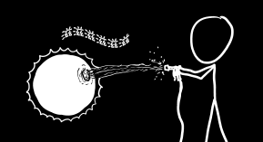
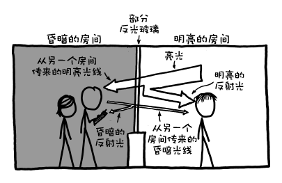

# 短回答环节
###### Short Answer Section
今天的文章中，我将对几位读者的问题作简短的回答。

***

### Q．如果一个巨大的水管对准在太阳上，太阳会持续多久？我六年级的弟弟亚当问我这个。

——奥斯汀·迪基

### A．你弟弟可能会惊讶地发现，水实际上会使太阳变得更热！

水是由氢气和氧气构成的，氢和氧是太阳热核反应的燃料。但更重要的是，额外的质量也使太阳更重。这更紧密地压在一起，使核聚变发生得更快。这意味着它会燃烧得更明亮，它的燃料得更快。

当你不断加水时，太阳将经历很多古怪的核聚变阶段。（有一个阶段，称为*氦闪光*，反应速率正比与温度的40次方，这可能是我在物理方程里见过最大的指数！)

但不管怎样，最终整个太阳都会自行坍塌，吹飞掉它的外层，变成黑洞。这个黑洞将继续吸收水，并向外发射X射线，直到最后市政水务部门注意到你一直在做什么，并停止向你服务。

***
### Q．如果你把手电筒（或激光）照射到单向镜玻璃制成的球体上会怎么样？

——蔡斯·蒙哥马利

### A．信不信由你，你都被骗了一辈子——这世界上根本没有单向镜玻璃。
玻璃要么让光线通过，要么反射它，但是没有玻璃让光线以一种方式通过，并以另一种方式反射它。警察局讯问室中的玻璃部分反光（两侧）。关键是囚犯侧的房间灯火通明，所以反射会盖住从观察者侧冲出少量的光线。

***
### Q．如果迈克尔·菲尔普斯能无限期地屏住呼吸，那么如果他竖直向下游直到达海洋中的最低点，然后竖直向上游，他需要多长时间？

——吉米·莫雷

### A．他很可能晕厥，死在100到400米之间。

人体处理压力的能力非常好。有了正确的准备，我们就能承受十几个大气压的压力。不同的人的身体系统会在不同的深度崩溃，但最棘手的限制之一是由[高压神经综合症](http://archive.rubicon-foundation.org/xmlui/handle/123456789/2661)造成的。在大约100米以下，潜水员将会变得紧张和兴奋（特别是当压力迅速增加），同时开始打瞌睡。原因可能是[对大脑的直接压力](http://jn.physiology.org/content/92/6/3309.full.pdf)。

但是，假设迈克尔菲尔普斯是免疫所有这些事情。在这种情况下，它只是成为一个速度问题。

水下游泳的记录并不多，但根据这家伙完成50米仰泳的速度，它可能需要迈克尔约...

$$
2\times\text{马里亚纳海沟的深度}\times\frac{23.1\textrm{秒}}{50\textrm{米}}\approx3\textrm{小时}
$$

...来完成这次旅行。

***
### Q．在第一部超人电影中，超人绕地球飞得如此之快，以至于它开始朝相反的方向旋转。这让时间倒转了[…]绕着地球飞行的人需要施加多少能量才能逆转地球的自转？

——艾丹·布莱克

### A．最近有人告诉我， 我一辈子都在曲解那一幕， 这让我大吃一惊。我喜欢他们采取的方式更好：

最近有人告诉我，我一辈子都在误解那一幕，这让我大吃一惊。我更喜欢他们的方式：

超人没有在地球上施加任何力量。他只是飞得足够快，可以回到过去。（我猜比光速快？漫画物理学。）地球改变了方向，因为我们看到时间在他旅行时倒流。这实际上与他飞行的方向无关。
现在我明白了，这更有意义。我的意思是，就像时间旅行者穿上红色斗篷和内衣一样有意义。

关于地球自转反转的讨论，以及这意味着什么，还要等下一篇文章。

***
### Q．你要以多快的速度开车闯红灯， 才能声称由于多普勒效应， 它看起来是绿色的？

——伊齐·特尼安斯基

### A．
$$
\frac{\text{红光波长}}{\text{绿光波长}}=\sqrt{\frac{1+\frac{\text{你的速度}}{\text{光速}}}{1-\frac{\text{车速}}{\text{光速}}}}
$$
$$
\textrm{车速}=\frac{\textrm{c}\times\left ( \textrm{红光波长}^2-\textrm{绿光波长}^2\right )}{\textrm{绿光波长}^2+\textrm{红光波长}^2}\approx\frac{1}{6}c
$$

***
### Q．如果你在波士顿（海平面）和墨西哥城（海拔8000英尺）之间开了一个传送门，会发生什么？

——杰克 G .

### A．伯努利原理为我们提供了空气流量的估算：
$$
\text{流速}=\sqrt{2\times\frac{\text{海平面大气压力}-\text{墨西哥城大气压力}}{\text{空气密度}}}=440\textrm{英里/时}
$$

这足够快，以至于可以把人行道从停车场上拆下来了。我建议我们把它放在肯德尔广场——麻省理工学院的人可能已经习惯了处理这种事情。

***
### Q．当我和妻子开始约会时，她曾一度邀请我过来吃晚饭。她的厨房里有一把叫Bauhaus的椅子，里面装满了洞，背部和座椅直径大约5-6毫米。在这个可爱的晚餐，我被迫释放了一小部分气体，并松了一口气，我设法非常离散做这件事。结果发现，我坐的椅子把成功的沉默变成了完美而响亮的长笛音符。我们都（幸运地）感到惊讶和惊讶，我经常想知道这样的事情发生的可能性有多大。我们把椅子保留了五年，但尽管费力地尝试着，还是无法复制。

——R. D.

### A．这...其实不是问题

但谢谢你的分享！
