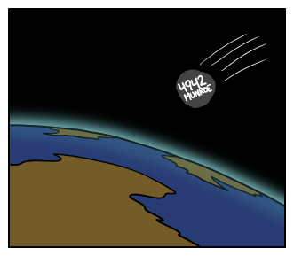

# 500 英里每小时
###### 译自: what-if.xkcd.com
### Q? 如果风速达到 500 英里每小时，会把人卷起来吗？

——Grey Flynn，7 岁，马萨诸塞州斯通汉姆

***
### A? 绝对会！

有些事情不像电影里那样。中枪不会真的让人向后飞。太空真空也不会让你的皮肤爆开。

但强风绝对能把人吹起来。事实上，如果你站在停车场里，风不只会把你吹起来，还会把路面从地上掀掉！

它还不至于把你的皮肤剥下来。人类可以在 500 mph 的风爆中存活，这很重要，因为飞行员有时需要在这种速度下从飞机中弹射。

1940 年代，美国政府把飞行员放进风洞，研究他们对强风的反应。你有没有好奇过，一个人的脸在 457 mph 风中会怎样？你可以看当年风洞测试的视频。（那次测试在 NASA 兰利研究中心进行，我在靠画网络漫画谋生前曾在那里工作。）

看起来并不舒服，我都不知道脸颊能那样乱拍，但飞行员似乎活下来了。

幸运的是，他被绑在椅子上。在那种风里他不可能站起来！如果他试图站起，会沿风洞向后飞出去。

强风非常有力。J. F. R. McIlveen 在《Weather》期刊的一篇论文中展示了如何计算风对人体的作用力。第 2 页的计算说明了在各种风速下你必须倾斜多少才能站稳。

当风速超过约 120 mph，不管你倾斜多远，都不可能站稳；你会开始向后滑过地面，然后很快头脚翻滚起来。

你不一定会被抛得很高。如果风完全水平，你会沿地表翻滚，不断撞击地面。不过，如果有任何上升气流，你很容易被抬起并带走。

好消息是，500 mph 的风很罕见。最强飓风风速约为 200 mph，阵风可达 250 mph。龙卷风能达到 300 mph。300 离 500 还很远；500 mph 风的力量比 300 mph 强好几倍。

你有几种方式可能体验到超过 500 mph 的风。其一是站在一座正在喷发的火山顶上。1980 年圣海伦火山爆发时，火山灰柱以 700 mph 向外喷出，接近音速。

另一种方式是触发超级飓风。超级飓风是一种奇特的飓风，500 mph 的风围绕一个只有几英里宽的紧密涡旋旋转。

超级飓风现在无法在地球上存在。它们形成需要约 50°C 的海洋温度。不管我们把地球变暖多少，短期内都不会达到这么高。

不过，有一种方式可能产生这种风暴。

6500 万年前，一颗小行星或彗星，碰巧大小接近最近命名的 4942 Munroe，撞上墨西哥，在地壳上打了个洞，留下熔岩海。当海水回流填满洞口时，会因接触熔融岩石而被加热。这可能创造了超级飓风形成的条件。有篇论文认为，这些风暴可能把大量尘埃和碎屑抬升到高层大气，从而促成全球冬季和恐龙灭绝。

简言之，Grey 的问题答案是肯定的：500 mph 的风会把你吹到空中。但别担心这个。你更该担心制造出 500 mph 风的东西。很可能那才是会杀死你的东西。

