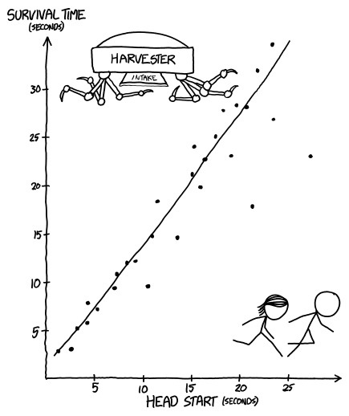

# 平行宇宙 What If
###### Alternate Universe What Ifs
### Q．来自一个可怕平行宇宙的报道

***
### A．本周：摘录一些写自另一个世界的《What If》文章。谢天谢地，我们并不生活在那个世界：

> ……而且大多数潜水设备在浸入人血时运行得相对良好。不过，由于血液密度（1.06 kg/L）远高于淡水（1.00 kg/L），也略高于海水（1.03 kg/L），水肺潜水配重必须调整。出于显而易见的原因，2006 年后制造的大多数设备都被设计成可以应对这种情况……

> ……我们都听过这个冷知识：据说普通人平均每秒吃掉 4 只蜘蛛。这个统计具有误导性；它基于一项[研究](http://www.pnas.org/content/92/10/4382.full.pdf)，考察的是蜘蛛流最密集地区的蜘蛛摄入峰值速率。全球平均速率可能更接近每秒 1 只蜘蛛（显然，睡着时高于醒着时）……

> ……假设美式橄榄球的平均死亡率是每场 1.2 名球员。这略高于英式足球的平均值，但比排球中的死亡率低一个数量级。

> ……“[种群瓶颈](https://en.wikipedia.org/wiki/Population_bottleneck)”这个概念最近经常出现在新闻里。让我们看看过去人类种群瓶颈的一些例子，这应该能帮助我们理解当前局面在性质上有何不同，以及糟糕得多的地方……

> 根据[职业安全与健康管理局](https://www.osha.gov/)的一份报告， workplace 伤害的十大主要原因如下：
>
> - 雷击
> - 未知
> - 捕食
> - 背叛
> - 诅咒（古代 + 现代）
> - 蚂蚁咬伤
> - 坠落
> - 蜘蛛咬伤
> - 咬伤（其他）
> - 自然原因

> ……虽然一面人类大小的镜子能够防御月光这个想法直觉上说得通，但实际上它只会制造出第二个月亮。任意一对月亮之间的相互作用，在这里也就是真实月球和镜中“虚拟”月球之间，会发生在两者之间的几何中点。

> 在这里，那个点位于你手中镜子的表面，这清楚地说明了为什么这是一个如此糟糕的……

> ……虽然没有关于白金汉宫附近新建筑布局的第一手记述，但查看卫星影像能让我们大致了解变化。尽管这些图像显然因为威斯敏斯特极端多变的气温而严重扭曲，但伦敦塔似乎完好无损，周围环绕着一系列同心圆，估计由……的残骸构成。

> ……在这些计算中，我们会假设一头球形奶牛，虽然剩下的大多数“奶牛”实际上更接近扁球体……

> ……虽然[鹏鸟](https://en.wikipedia.org/wiki/Roc_(mythology))显然能毫不费力地举起并搬运成年人，但即使最大的鹏鸟也很难举起一辆典型的 1200 千克轿车。一个鸟群通过协同抬升完成这件事是有可能的，但它们转而采取从上方向汽车投下巨石（通常为 50 到 100 千克）的方式。这就是为什么大多数通勤者坚持走隧道，尽管隧道里显然有蛇和……

