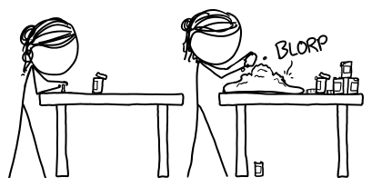
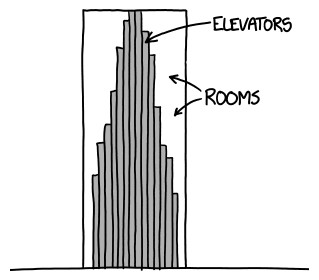
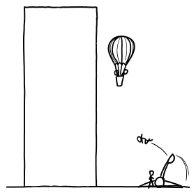
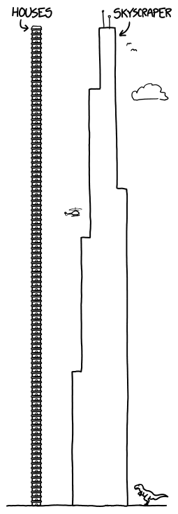
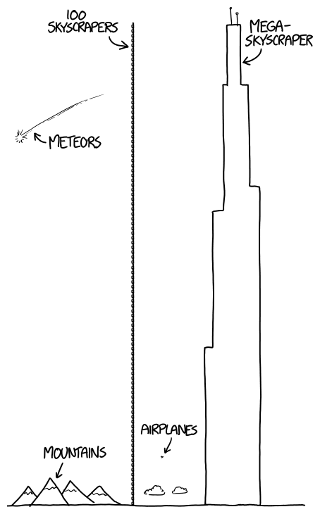
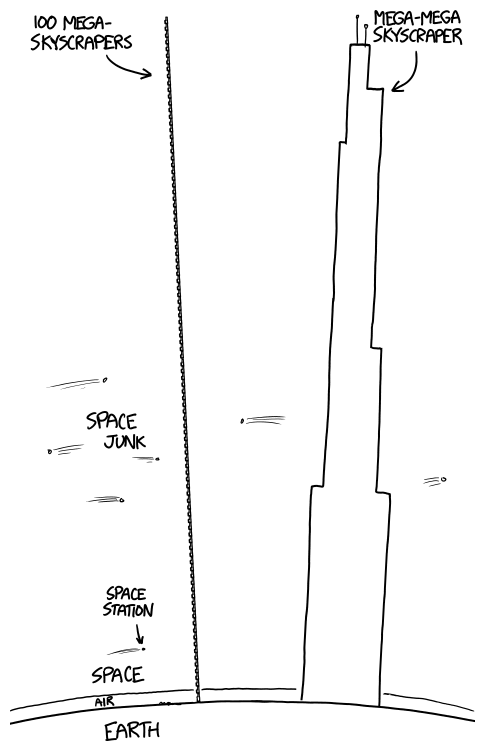
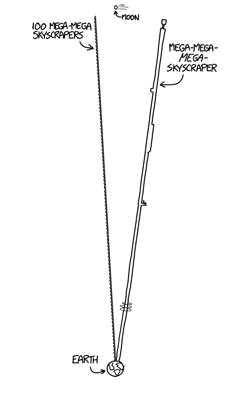
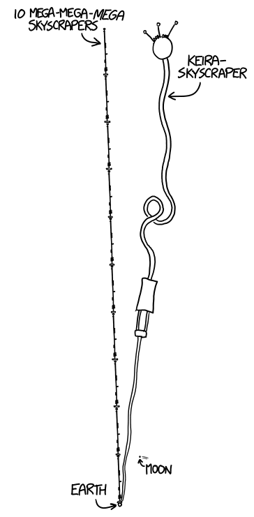
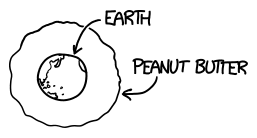

# 十亿层大楼
###### Billion-Story Building
### Q．我 4 岁半的女儿坚持说她想要一栋十亿层的大楼。结果我发现，不仅很难让她理解这个尺寸，我也完全解释不清为了实现它还得克服哪些困难。

——Keira，经 Steve Brodovicz 转述，宾夕法尼亚州 Media

***
### A．Keira：

如果你把一栋楼造得太大，上面的部分会很重，把下面的部分压扁。

你有没有试过用花生酱搭一座塔？搭一个小小的很容易，比如饼干上一座黏糊糊的小城堡。它会结实到足以站住。但如果你想搭一座真正很大的城堡，整个东西就会像煎饼一样被压扁。

楼房也会发生同样的事。我们造的楼很结实，但我们没法造一栋一直通到太空的楼，否则上面的部分会把下面压扁。

我们可以把楼造得相当高。最高的楼接近 1 千米高；如果我们愿意，可能还能造出 2 千米甚至 3 千米高的楼，而且它们仍然能承受自己的重量站住。再高就可能麻烦了。

不过，高楼除了重量以外，还会有其他问题。

一个问题是风。高处的风非常强，楼房必须非常结实，才能抵抗风。

另一个大问题，令人意外地，是电梯。高楼需要电梯，因为没人想爬几百层楼梯。如果你的楼有很多层，你就需要很多不同的电梯，因为会有太多人同时进出。如果楼造得太高，整栋楼都会被电梯占满，普通房间就没有地方了。

也许你能想出办法，在不用太多电梯的情况下把人送到他们的楼层。也许你可以造一个占据 10 层楼的巨型电梯。或者造一些像过山车一样运行的高速电梯。或者用热气球把人送到房间。或者用投石机把他们发射上去。

电梯和风都是大问题，但最大的问题会是钱。

要造一栋真正很高的楼，就得有人花很多钱，而没人想要一栋高楼想到愿意付那笔钱。一栋高达许多英里的楼会花掉数十亿美元。十亿美元是非常多的钱！如果你有十亿美元，你可以[租一艘巨型飞船](http://www.spacex.com/about/capabilities)，[拯救全世界濒危狐猴](http://birdandmoon.tumblr.com/post/78504716512/this-weekend-i-found-myself-chatting-with-a-lemur)，[给每个美国人一美元](http://xkcd.com/980/huge/#x=-7462&y=-6705&z=6)，而且还会剩下一些。大多数人不认为几英里高的巨塔重要到值得花这么多钱。

如果你真的变得很富有，能自己付钱造一座通往太空的塔，并且解决了所有那些工程问题，你在造一栋 *十亿* 层高楼时仍然会遇到麻烦。十亿层实在太多了。

一栋大型摩天楼可能有大约 100 层，也就是说，它相当于 100 座小房子那么高。

如果你把 100 栋摩天楼摞在一起，做成一栋超级摩天楼，它会到达通往太空路程的一半：

这栋摩天楼仍然只有 10000 层，远远少于你想要的十亿层！那 100 栋摩天楼每栋都有 100 层，所以整栋超级摩天楼有 100 乘以 100，也就是 10000 层。

但你说你想要一栋有 1,000,000,000 层的摩天楼。我们把 100 栋超级摩天楼摞起来，做成超级超级摩天楼：

这栋超级超级摩天楼会从地球伸出去很远，远到飞船会撞上它。如果空间站正朝这座塔飞来，他们可以用火箭转向避开[^1]。坏消息是，太空里到处都是坏掉的飞船、卫星和垃圾碎片，它们都在随机飞来飞去。如果你造一栋超级超级摩天楼，飞船碎片最终会撞上它。

不管怎样，一栋超级超级摩天楼也只有 100 乘以 10000，也就是 1,000,000 层。这仍然比你想要的 1,000,000,000 小得多！

我们再把 100 栋超级超级摩天楼摞起来，做成一栋超级超级超级摩天楼：

这栋超级超级超级摩天楼会高到顶端几乎擦到月球。

但它也只有 100,000,000 层！要达到 1,000,000,000 层，我们还得把 10 栋超级超级超级摩天楼摞在一起，做成一栋 Keira 摩天楼：

Keira 摩天楼几乎不可能建成。你必须阻止它撞上月球，被地球引力撕开，或者倒下来砸向地球，像杀死恐龙的巨大陨石一样。

不过，有些工程师确实有一个有点像你的塔的想法，叫作[太空电梯](http://en.wikipedia.org/wiki/Space_elevator)。它没有你的塔那么高（太空电梯只会伸到去月球路程的一部分），但已经很接近了！

有些人认为我们能建造太空电梯，另一些人认为这是疯狂想法。我们现在还不能建，是因为有一些问题我们还不知道怎么解决，比如怎样让这座塔足够结实，以及怎样把电力送上去让电梯运行。如果你真的想建一座巨大的塔，你可以去了解他们正在研究的一些问题，最终成为想出解决办法的人之一。也许有一天，你 *真的* 能建一座通往太空的巨塔。

不过，我很确定它不会是花生酱做的。

[^1]:他们反复躲你的塔之后大概会很烦，所以你也许应该在他们经过时，用轨道炮从窗户里发射燃料和零食给他们。
