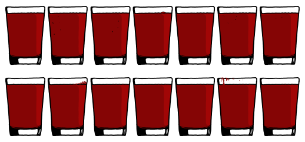
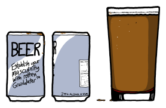

# 血液酒精
###### Blood Alcohol
### Q．喝醉酒的人的血，能把你喝醉吗？

——菲奥娜·伯恩

***
### A．你得喝下很多血才行。

一个人体内大约有5升血，也就是14杯。

如果你的血液酒精浓度超过约0.5%，你就很有可能死亡。曾经有少数人在血液酒精浓度超过1%的情况下活了下来，但LD50——也就是会导致50%的人死亡的水平——是[0.40](http://www.nellis.af.mil/shared/media/document/AFD-110211-015.pdf)（0.4%）。

如果某人的血液酒精浓度是0.40，而你在短时间内喝光了他全部14杯血（嘿，反正他有50%的概率会死），你会吐出来：

你不会因为酒精而吐；你只是会因为正在喝血而吐。如果你不知怎么避免了呕吐，那么你总共会摄入20克乙醇，这大约相当于一品脱啤酒里的酒精量。（感谢Conor Braman以及其他读者指出原先计算中少了一个零。）

根据你的体重不同，喝下这么多血可能会把你自己的血液酒精浓度提高到约0.05。这个水平低到在许多司法辖区你仍然可以合法开车，但如果你真的开车，事故风险已经高到原来的两倍。

如果你的血液酒精浓度是0.05，这意味着对方血液里的酒精只有1/8进入了你的血液。假设在你喝完这些血之后，有人杀了你并喝了*你的*血（这才公平嘛），那个人的血液酒精浓度会变成0.006。如果这个过程重复约25次，最后一个人的血液里剩下的乙醇分子就不到8个了。再重复几轮之后，可能一个也不剩；他们喝的就只是普通的血了。（按顺势疗法的标准，这仍然很浓。）像个失败者一样。

不管里面有没有酒精，喝14杯血都不会是什么愉快的事。关于这个主题的医学文献不多，但来自网络论坛帖子的轶事证据表明，任何正常人只要试图喝下超过约一品脱的血，就会呕吐：

如果你长期定期喝血，体内积累的铁可能会导致[铁过载](http://en.wikipedia.org/wiki/Iron_overload)。这种综合征有时会影响反复接受输血的人，而它也是少数几种正确疗法是[放血](http://en.wikipedia.org/wiki/Bloodletting)的疾病之一。（其他还包括[真性红细胞增多症](http://en.wikipedia.org/wiki/Polycythemia_vera)和[迟发性皮肤卟啉症](http://en.wikipedia.org/wiki/Porphyria_cutanea_tarda)。）

喝下一个人的血大概不会导致铁过载。但它*可能*让你感染血源性疾病。大多数这类疾病由病毒引起，而这些病毒不能在胃里存活；但在你喝血的时候，它们很容易通过你口腔或喉咙里的划伤进入你的血液。

你可能通过饮用感染者的血液染上的疾病包括乙型和丙型肝炎、HIV、汉坦病毒和埃博拉。我不是医生，而且我尽量不在这些文章里给出医学建议。不过，我可以很有把握地说，你不该喝埃博拉患者的血。

话虽如此，喝血或吃血并不是闻所未闻。它在许多文化中都是禁忌，但英国人会吃“黑布丁”，它主要由血制成；世界各地也有类似菜肴。东非的马赛牧民曾经主要靠牛奶生活，但有时也会喝[血](http://digitalcommons.calpoly.edu/cgi/viewcontent.cgi?article=1005&context=honors)，从牛身上取血后与牛奶混合，做成某种极端版蛋白质奶昔。

所以结论是：想通过喝别人的血来喝醉会非常困难，很可能相当恶心，而且可能让你感染严重疾病。

到头来，在酒精来得及对你做什么之前，血本身就已经会先把你的身体搞得一团糟。

