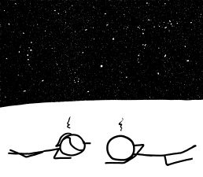
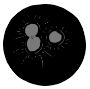

# 保龄球
###### 译自: what-if.xkcd.com
### Q? 我听说，如果把地球缩小到保龄球大小，它会比保龄球还光滑。我的问题是，如果把一个保龄球放大到地球大小，它会是什么样？

——Seth C.

***
### A? 一个优质、专业级保龄球比地球更光滑。

Bad Astronomy 的 Phil Plait 研究过“地球比台球更光滑”的说法。他根据公开的台球圆度公差得出结论：地球更光滑，但没那么圆。不过，他找不到关于台球表面坑洼大小和形状的信息。

幸运的是，有人会对保龄球表面进行数字扫描。

这些扫描（以及各种球面粗糙度测量）告诉我们，高端保龄球相当光滑。如果放大到地球尺度，隆起和凹凸会有 10 到 200 米高，峰与峰之间相距 1 到 3 千米：

按地球标准，这相当平滑；我们最高的山比它高 40 倍。

这个保龄球世界会是什么样？我们把它叫作“Lebowski”。

首先，保龄球密度比岩石低很多，所以 Lebowski 的表面重力只有地球的四分之一：

它一开始也没有大气。

指孔会有大约一千千米宽、几千千米深。

在地球上，这么大的洞会暴露熔融内部。但 Lebowski 没有熔融内部。

地核热有两个原因：一是它仍在发出形成时所有尘埃塌缩留下的热，二是里面有放射性金属。Lebowski 两者都没有，所以它的核心一开始是冷的。

这些洞大到无法靠自身抵抗重力保持敞开。在这个尺度上，保龄球里的聚合物会更像液体。在大约半小时内，洞会以慢动作坍塌。

坍塌时，洞周围的材料会被加热到发光。洞的中心会有一股白热的焦化碳氢化合物喷流向外喷入太空。

结束后，Lebowski 会留下巨大的伤疤，每一道都标记着一个深渊坍塌形成熔融海的位置。

现在，多亏这个问题，每当我看月球时，我都会注意到宁静海、澄海和危海，然后想到：指孔。

不过这只是，比如说，我的看法，老兄。
