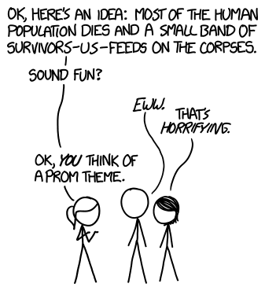

# 同类相食
###### Cannibalism
### Q．如果人类只靠同类相食，能存活多久？

——奎因·谢弗

***
### A．全世界大约有500万亿卡路里的人肉。如果能冷冻或以其他方式保存，这些能量至少从纯热量角度看，足够让[一小群繁殖人口](http://www.newscientist.com/article/dn1936-magic-number-for-space-pioneers-calculated.html#.U8a1mo2gFSE)存活数百万年。

只吃肉听起来营养上很糟糕，但缺少蔬菜不一定会杀死你。人可以靠高肉食或全肉食饮食生存，尤其是如果他们吃内脏和骨髓这类东西；这些部位含有更多维生素和营养物质，而典型西方饮食中较狭窄的哺乳动物骨骼肌和脂肪范围里缺少它们。

第二次世界大战期间，美国经历过肉类短缺，因为大量食物被转供海外士兵和盟友。作为回应，美国政府决定鼓励美国人多吃内脏和其他动物身体部位。他们雇用了世界上一些最优秀的人类学家、心理学家、社会科学家和食品科学家，想办法改变美国人的饮食习惯。

这个项目提出的想法之一，是把这些食物重新包装成*多样肉*。（更多内容见玛丽·罗奇那本很好笑的书[Gulp: Adventures on the Alimentary Canal](http://www.amazon.com/Gulp-Adventures-Alimentary-Mary-Roach/dp/0393081575)。）[Google Books搜索](https://books.google.com/ngrams/graph?content=variety+meats&year_start=1800&year_end=2008&corpus=17&smoothing=3)显示，这个短语在那一时期突然出现在美国书籍中，而[英国书籍](https://books.google.com/ngrams/graph?content=variety+meats&year_start=1800&year_end=2008&corpus=18&smoothing=3)里没有出现这种模式。战争结束后，这些研究努力大多被搁置，但这篇[2002年的文章](https://books.google.com/ngrams/graph?content=variety+meats&year_start=1800&year_end=2008&corpus=15&smoothing=3)试图拼凑出他们学到了什么。

关于营养缺乏，我们有很多[不理解](http://www.nature.com/news/nutrition-vitamins-on-trial-1.15459)的东西；而且说得委婉点，关于什么饮食健康或不健康，争议也很多。但不管在奎因的设想中我们会不会获得哪些营养，我们都会面对一个更大的问题：受污染的食物。即使你把肉煮熟，在你一路吃完整个人类种群遗体的过程中，也很难避免接触各种疾病。

在人口足够小的群体里，每一次暴发都是一次大流行；用不了多久，就会有什么东西把你们消灭掉。

还有一些显而易见的实际问题。除非你是[极少数人](https://en.wikipedia.org/wiki/Nuclear_briefcase)之一，否则你没办法杀死大多数活人，同时不让其中一些人先杀死你。

让我们考虑另一种情景，可能更接近奎因想象的内容：如果一半人口吃掉另一半人口呢？（再想想，我其实完全不知道奎因具体在想什么，而且我不确定自己想知道。）

如果普通人体重50千克，每天吃几千卡路里，那么——[根据Ryan North的说法](http://www.topatoco.com/merchant.mvc?Screen=PROD&Store_Code=TO&Product_Code=QW-PERSON&Category_Code=QW)——一个人含有的肉足以喂饱另一个人大约一个月。

如果每个月都有一半人口吃掉另一半，在倒数第二个人被最后一个人吃掉之前，我们可以进行32个月的同类相食。（这对计算机科学学生来说应该很合理，因为“70亿”刚好大到无法放进32位整数。）

吃掉吃过人的人是个坏主意。首先，这是个坏主意，因为你在*吃人。你为什么要吃人！？* 但它也很糟，因为这是一种传播[朊病毒疾病](http://www.cdc.gov/ncidod/dvrd/prions/)的有效方式。

另一方面，大多数朊病毒疾病潜伏期很长，所以在一个你每个月有50%概率被吃掉的世界里，它可能反而不是最要紧的问题。

最后，我们还得决定哪一轮吃谁。我们可以打一架，或者，为了公平，我们可以两两配对抛硬币。如果这样做，结果会字面意义上成为……

……终结一切[锦标赛对阵表](https://en.wikipedia.org/wiki/Bracket_(tournament))的锦标赛对阵表。
