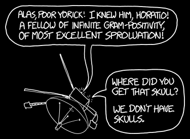

# 遥远的死亡
###### Distant Death
### Q．离地球最远的地球事物死亡记录是多少？

——来自新西兰的 Amy

***
### A．万圣节快到了，我猜现在是适合回答[死亡相关问题](../Facebook_Of_The_Dead)的季节。

人类死亡地点离地球最远的纪录约为 167 千米[^1]。当时联盟 11 号上的三名宇航员 Vladislav Volkov、Viktor Patsayev 和 Georgi Dobrovolsky 在返回地球时遭遇[失压事故](http://history.nasa.gov/SP-4209/ch8-2.htm)。他们当时的速度约为 7755 米/秒，这也是任何人类死亡时达到过的最高前进速度。

Volkov、Patsayev 和 Dobrovolsky 是唯一死在太空中的人。其他所有致命太空事故，以及顺便说一句，其他任何形式的人类死亡，都发生在距离地表 70 千米以内[^2]。

但人类并不保持这个纪录。

首先，有很多实验动物死在太空里。不过说实话，我没法让自己去收集它们的统计数据。我的意思是，至少那些死去的人类飞行员都是自愿参加，并且理解自己身上发生了什么。所以，我要直接跳到 Amy 问题真正答案所涉及的生物：微生物。

航天器会携带细菌，虽然我们会在发射前和发射过程中尽力给它们灭菌。灭菌很重要，因为我们不想用地球细菌污染另一颗行星或卫星。这有两个重要原因，一个伦理上的，一个实际上的。伦理原因是，我们不想意外引入会扰乱和/或摧毁本土生态系统的地球生命。实际原因是，如果我们在其他星球上发现生命，我们不想费力判断它到底是不是来自某个探测器的污染。

但给航天器灭菌很难。NASA 有一名员工专门负责这项任务，而且她可能拥有史上最棒的职位头衔：*行星保护官*[^3]。

行星保护官负责避免航天器污染，虽然偶尔也会出现[问题](http://www.space.com/13783-nasa-msl-curiosity-mars-rover-planetary-protection.html)。

一项关于月球任务的 [2008 年研究](http://www.lpi.usra.edu/meetings/leagilewg2008/pdf/4029.pdf)估计，每艘航天器携带 1.98x1011 个可存活微生物。像“旅行者”和“先锋”这样最终飞往深空的航天器，也没有被完全灭菌，官方行星保护策略是“尽量别撞上任何行星”。

“旅行者”当然携带了大量细菌孢子。如果我们把 2008 年论文中的数字当作“旅行者”可能携带微生物数量的一个非常粗略估计，就可以试着算算其中还有多少可能活着。

有些微生物可以在真空中存活很长时间。[一项研究](http://www.sciencedirect.com/science/article/pii/0273117794904480)发现，在太空中待了六年的大多数细菌都活了下来，但前提是有阴影保护它们免受太阳紫外线照射。其他研究也认为，辐射是主要需要担心的因素，而航天器内部的辐射环境很复杂。结论是，我们并不确定细菌能在深空存活多久。

但我们仍然可以回答 Amy 问题的一部分。如果我们假设“旅行者”上每 1000 个细菌孢子里有 1 个属于耐太空品种，而这些耐受孢子中每 10 个有 1 个位于紫外线照不到的位置，那么“旅行者”上仍然会有约 1000 万个可存活细菌孢子。

如果它们像某项研究中那样，每六年死亡 30%，那么 50 年后仍会有 100 万个活着，并以每 10 分钟 1 个的速度死亡。另一方面，2008 年那项研究的作者推测，微生物可能在极长时间里避开宇宙射线击中；[其他来源](http://www.ncbi.nlm.nih.gov/pmc/articles/PMC99004/#B109)也推测它们可以存活数千年，甚至数百万年。但没人真正知道。

对我们的“旅行者”细菌来说，早期死亡率会更高，因为有些孢子处在更暴露的位置；而更受保护的孢子死亡率会低得多。今天，“旅行者 1 号”和“旅行者 2 号”上完全可能仍有成千上万个细菌孢子活着，在死寂太空中安静潜伏。每隔几小时、几天或几个月，其中一个就会退化到不再可存活。

而每一个，都会创下一个新的“死亡地点离地球最远的地球事物”纪录。

[^1]:误差约一千米。
[^2]:我笔记中的阴森清单：“哥伦比亚”号机组死于略高于 60 千米处，[Pyotr Dolgov](http://en.wikipedia.org/wiki/Pyotr_Dolgov) 死于大约 24 千米，[James Zwayer](http://roadrunnersinternationale.com/weaver_sr71_bailout.html) 死于 23 千米，[Michael J. Adams](http://en.wikipedia.org/wiki/Michael_J._Adams) 死于 20 千米，[Ying Chin Wang](http://myplace.frontier.com/~anneled/ColdWar.html) 死于 20 千米，[Rudolf Anderson](http://en.wikipedia.org/wiki/Rudolf_Anderson) 死于 18 到 23 千米之间。[Jack Weeks](http://www.habu.org/a-12/06932.html) 大概死在海面以上 20 到 0 千米之间的某处。
[^3]:另一个竞争这个头衔的人是 Philip M. Breedlove，他的职位头衔是 *[盟军最高司令](http://en.wikipedia.org/wiki/Supreme_Allied_Commander#NATO)*。
